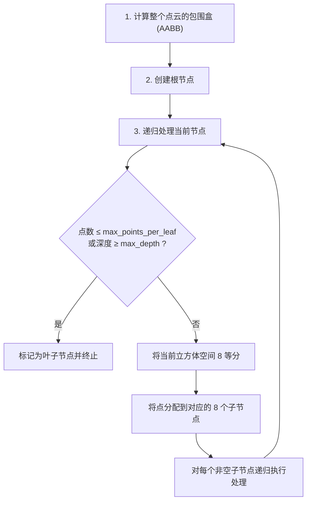

# 三维点云处理：Octree 八叉树——自适应空间细分与高效体素操作

在上一章中，KD-Tree 通过交替坐标轴划分实现了 $O(\log N)$ 的邻域搜索。然而，KD-Tree 的划分方式并不感知空间中点的密度分布——它在每个维度上都等量地进行中位数划分。

**Octree（八叉树）** 采用了不同的策略：将空间递归地**八等分**，仅在有数据存在的子空间中继续细分。这种"有数据才细分"的策略使得 Octree 天然适合三维点云的层次化表达、压缩存储和体素化处理。

---

## 一、Octree 的结构原理

### 1.1 八分递归

Octree 的每个节点代表一个立方体空间区域（Axis-Aligned Bounding Box, AABB）。一个有子节点的内部节点拥有恰好 $2^3 = 8$ 个子节点，分别对应该立方体被三个正交平面切分后的八个子立方体。


<svg viewBox="0 0 400 240" width="100%" style="background-color: transparent; font-family: sans-serif; margin: 20px auto; display: block; overflow: visible;">
  <g transform="translate(200, 110)" stroke="currentColor" stroke-width="1.5" fill="none">
  <path d="M -80,-20 L 0,-60 L 80,-20 L 0,20 Z" fill="rgba(100, 100, 100, 0.05)" />
  <path d="M -80,-20 L 0,-60 L 80,-20 L 0,20 Z" stroke-dasharray="3 3" opacity="0.5" />
  <line x1="-80" y1="-20" x2="80" y2="20" stroke-dasharray="3 3" opacity="0.5" />
  <line x1="0" y1="-60" x2="0" y2="100" stroke-dasharray="3 3" opacity="0.5" />
  <path d="M 0,-80 L 80,-40 L 0,0 L -80,-40 Z" fill="rgba(22, 119, 255, 0.08)" stroke="#1677ff" stroke-width="2" />
  <path d="M -80,40 L 0,80 L 80,40" stroke="#1677ff" stroke-width="2" />
  <line x1="-80" y1="-40" x2="-80" y2="40" stroke="#1677ff" stroke-width="2" />
  <line x1="80" y1="-40" x2="80" y2="40" stroke="#1677ff" stroke-width="2" />
  <line x1="0" y1="0" x2="0" y2="80" stroke="#1677ff" stroke-width="2" />
  <line x1="0" y1="-80" x2="0" y2="-60" stroke="#1677ff" stroke-width="1.5" stroke-dasharray="2 2" />
  <line x1="-40" y1="-60" x2="40" y2="-20" stroke="#1677ff" stroke-width="1" />
  <line x1="40" y1="-60" x2="-40" y2="-20" stroke="#1677ff" stroke-width="1" />
  <line x1="-40" y1="-20" x2="-40" y2="60" stroke="#1677ff" stroke-width="1" />
  <line x1="-80" y1="0" x2="0" y2="40" stroke="#1677ff" stroke-width="1" />
  <line x1="40" y1="-20" x2="40" y2="60" stroke="#1677ff" stroke-width="1" />
  <line x1="80" y1="0" x2="0" y2="40" stroke="#1677ff" stroke-width="1" />
  <path d="M 0,0 L 40,-20 L 80,0 L 40,20 Z" fill="rgba(82, 196, 26, 0.4)" stroke="#52c41a" stroke-width="1.5" />
  <path d="M 0,0 L 40,20 L 40,60 L 0,40 Z" fill="rgba(82, 196, 26, 0.4)" stroke="#52c41a" stroke-width="1.5" />
  <path d="M 40,20 L 80,0 L 80,40 L 40,60 Z" fill="rgba(82, 196, 26, 0.4)" stroke="#52c41a" stroke-width="1.5" />
  <text x="40" y="28" font-size="11" fill="#52c41a" text-anchor="middle">右上前 (101)</text>
  <text x="-40" y="28" font-size="10" fill="currentColor" opacity="0.8" text-anchor="middle">左上前</text>
  <text x="40" y="-30" font-size="10" fill="currentColor" opacity="0.8" text-anchor="middle">右上后</text>
  <text x="-40" y="-30" font-size="10" fill="currentColor" opacity="0.8" text-anchor="middle">左上后</text>
  <text x="0" y="105" font-size="12" fill="currentColor" text-anchor="middle">正交三面切割 -> 生成 8 个子空间 (Octants)</text>
  </g>
</svg>

  8 个子节点 = {000, 001, 010, 011, 100, 101, 110, 111}
  每个二进制位对应 xyz 坐标是否在父节点中心的上方(1)或下方(0)

### 1.2 节点数据结构

```python
from dataclasses import dataclass, field
import numpy as np
from typing import List, Optional


@dataclass
class OctreeNode:
    """八叉树节点"""

    # 空间范围：该节点表示的立方体
    center: np.ndarray          # 立方体中心 (3,)
    half_size: float            # 立方体半边长

    # 节点数据
    points: List[np.ndarray] = field(default_factory=list)  # 该节点包含的点
    point_indices: List[int] = field(default_factory=list)  # 点在原始数组中的索引

    # 子节点 (恰好 8 个或 0 个)
    children: List[Optional['OctreeNode']] = field(default_factory=lambda: [None] * 8)

    # 节点类型
    is_leaf: bool = True
    depth: int = 0

    @property
    def size(self):
        """节点立方体边长"""
        return 2 * self.half_size


def get_child_index(center, half_size, point):
    """
    确定点落入哪个子节点。

    八分索引编码:
      第 0 位 (位掩码 1): x > center[0] ? 1 : 0
      第 1 位 (位掩码 2): y > center[1] ? 1 : 0
      第 2 位 (位掩码 4): z > center[2] ? 1 : 0

    返回 0~7 的整数索引。
    """
    child_idx = 0
    if point[0] > center[0]:
        child_idx |= 1  # 设置第 0 位
    if point[1] > center[1]:
        child_idx |= 2  # 设置第 1 位
    if point[2] > center[2]:
        child_idx |= 4  # 设置第 2 位
    return child_idx


def get_child_center(parent_center, parent_half_size, child_index):
    """计算指定子节点的中心坐标"""
    child_half = parent_half_size / 2
    offset = np.array([
        child_half if (child_index & 1) else -child_half,
        child_half if (child_index & 2) else -child_half,
        child_half if (child_index & 4) else -child_half,
    ])
    return parent_center + offset
```

---

## 二、Octree 的构建

### 2.1 构建算法




<svg viewBox="0 0 600 200" width="100%" style="background-color: transparent; font-family: sans-serif; margin: 20px 0; overflow: visible;">
  <!-- Level 0 -->
  <g transform="translate(40, 20)">
  <text x="70" y="10" text-anchor="middle" font-size="13" fill="currentColor">1. 第 0 层 (根节点)</text>
  <rect x="10" y="25" width="120" height="120" fill="none" stroke="currentColor" stroke-width="1.5" />
  <circle cx="30" cy="40" r="3" fill="#1677ff" />
  <circle cx="45" cy="50" r="3" fill="#1677ff" />
  <circle cx="35" cy="110" r="3" fill="#1677ff" />
  <circle cx="100" cy="100" r="3" fill="#1677ff" />
  <circle cx="110" cy="115" r="3" fill="#1677ff" />
  <text x="70" y="165" text-anchor="middle" font-size="11" fill="var(--vp-c-text-2)">整片区域作为一个根节点<br/>包含所有的点云数据</text>
  </g>
  <!-- Level 1 -->
  <g transform="translate(230, 20)">
  <text x="70" y="10" text-anchor="middle" font-size="13" fill="currentColor">2. 第 1 层划分</text>
  <rect x="10" y="25" width="120" height="120" fill="none" stroke="currentColor" stroke-width="1.5" />
  <line x1="70" y1="25" x2="70" y2="145" stroke="#52c41a" stroke-width="1.5" />
  <line x1="10" y1="85" x2="130" y2="85" stroke="#52c41a" stroke-width="1.5" />
  <circle cx="30" cy="40" r="3" fill="#1677ff" />
  <circle cx="45" cy="50" r="3" fill="#1677ff" />
  <circle cx="35" cy="110" r="3" fill="#1677ff" />
  <circle cx="100" cy="100" r="3" fill="#1677ff" />
  <circle cx="110" cy="115" r="3" fill="#1677ff" />
  <text x="70" y="165" text-anchor="middle" font-size="11" fill="var(--vp-c-text-2)">区域被四分为 4 个单元<br/>仅含点的单元会继续分割</text>
  </g>
  <!-- Level 2 -->
  <g transform="translate(420, 20)">
  <text x="70" y="10" text-anchor="middle" font-size="13" fill="currentColor">3. 第 2 层 (自适应划分)</text>
  <rect x="10" y="25" width="120" height="120" fill="none" stroke="currentColor" stroke-width="1.5" />
  <line x1="70" y1="25" x2="70" y2="145" stroke="currentColor" stroke-width="1" opacity="0.4" />
  <line x1="10" y1="85" x2="130" y2="85" stroke="currentColor" stroke-width="1" opacity="0.4" />
  <line x1="40" y1="25" x2="40" y2="85" stroke="#722ed1" stroke-width="1.2" />
  <line x1="10" y1="55" x2="70" y2="55" stroke="#722ed1" stroke-width="1.2" />
  <line x1="100" y1="85" x2="100" y2="145" stroke="#722ed1" stroke-width="1.2" />
  <line x1="70" y1="115" x2="130" y2="115" stroke="#722ed1" stroke-width="1.2" />
  <circle cx="30" cy="40" r="3" fill="#1677ff" />
  <circle cx="45" cy="50" r="3" fill="#1677ff" />
  <circle cx="35" cy="110" r="3" fill="#1677ff" />
  <circle cx="100" cy="100" r="3" fill="#1677ff" />
  <circle cx="110" cy="115" r="3" fill="#1677ff" />
  <text x="70" y="165" text-anchor="middle" font-size="11" fill="var(--vp-c-text-2)">多于阈值个点的单元<br/>再次进行局部精细分割</text>
  </g>
</svg>


### 2.2 构建实现

```python
def build_octree(points, max_points_per_leaf=32, max_depth=10):
    """
    递归构建 Octree。

    :param points: N x 3 的 NumPy 点云数组
    :param max_points_per_leaf: 叶子节点最大点数
    :param max_depth: 最大递归深度
    :return: OctreeNode (根节点)
    """
    if points.shape[0] == 0:
        return None

    # 1. 计算完整包围盒
    min_bound = np.min(points, axis=0)
    max_bound = np.max(points, axis=0)
    center = (min_bound + max_bound) / 2.0
    half_size = np.max(max_bound - min_bound) / 2.0 * 1.01  # 稍微放大避免边界问题

    # 2. 创建根节点
    root = OctreeNode(
        center=center,
        half_size=half_size,
        depth=0
    )

    # 3. 初始化根节点的点列表
    indices = list(range(points.shape[0]))
    root.points = [p for p in points]
    root.point_indices = indices

    # 4. 递归构建
    _build_recursive(root, points, max_points_per_leaf, max_depth)

    return root


def _build_recursive(node, all_points, max_per_leaf, max_depth):
    """递归构建子树"""
    if node.depth >= max_depth:
        return
    if len(node.points) <= max_per_leaf:
        return

    # 八等分
    node.is_leaf = False
    child_points = [[] for _ in range(8)]
    child_indices = [[] for _ in range(8)]

    for i, pt in enumerate(node.points):
        child_idx = get_child_index(node.center, node.half_size, pt)
        child_points[child_idx].append(pt)
        child_indices[child_idx].append(node.point_indices[i])

    # 递归构建每个非空子节点
    for idx in range(8):
        if len(child_points[idx]) == 0:
            continue

        child_center = get_child_center(node.center, node.half_size, idx)
        child = OctreeNode(
            center=child_center,
            half_size=node.half_size / 2,
            points=child_points[idx],
            point_indices=child_indices[idx],
            depth=node.depth + 1
        )
        node.children[idx] = child
        _build_recursive(child, all_points, max_per_leaf, max_depth)
```

---

## 三、Octree 的搜索算法

### 3.1 K 近邻搜索

```python
def octree_knn_search(root, query_point, k=1):
    """
    基于 Octree 的 K 近邻搜索。

    策略：
    1. 从根开始，定位 query_point 所在的叶子节点
    2. 以该叶子中的点初始化 K 近邻集合
    3. 向外扩张搜索：检查相邻节点（通过计算节点包围盒到查询点的最小距离）
    """
    import heapq

    best_heap = []  # (-distance, point_index, point)

    def _point_to_node_min_dist(query, node):
        """
        计算查询点到节点包围盒的理论最小距离。
        如果查询点在包围盒内部，则距离为 0。
        """
        d2 = 0.0
        for dim in range(3):
            lower = node.center[dim] - node.half_size
            upper = node.center[dim] + node.half_size
            if query[dim] < lower:
                d2 += (lower - query[dim]) ** 2
            elif query[dim] > upper:
                d2 += (query[dim] - upper) ** 2
            # else: 查询点在这个维度上位于包围盒内部，距离贡献为 0
        return np.sqrt(d2)

    def _search(node):
        if node is None:
            return

        # 剪枝：如果节点包围盒到查询点的最小距离大于当前第 K 近的距离，跳过
        worst_dist = -best_heap[0][0] if len(best_heap) >= k else np.inf
        node_min_dist = _point_to_node_min_dist(query_point, node)
        if node_min_dist >= worst_dist:
            return

        if node.is_leaf:
            # 检查叶子节点中的所有点
            for pt, pt_idx in zip(node.points, node.point_indices):
                dist = np.linalg.norm(pt - query_point)
                heapq.heappush(best_heap, (-dist, pt_idx, pt))
                if len(best_heap) > k:
                    heapq.heappop(best_heap)
        else:
            # 按子节点到查询点的距离排序，优先搜索最近的子节点
            child_distances = []
            for child_idx, child in enumerate(node.children):
                if child is not None:
                    min_d = _point_to_node_min_dist(query_point, child)
                    child_distances.append((min_d, child))
            child_distances.sort(key=lambda x: x[0])

            for _, child in child_distances:
                # 再次检查剪枝条件
                cur_worst = -best_heap[0][0] if len(best_heap) >= k else np.inf
                if _point_to_node_min_dist(query_point, child) < cur_worst:
                    _search(child)

    _search(root)

    # 提取排序结果
    result = sorted(best_heap, key=lambda x: -x[0])
    distances = np.array([-r[0] for r in result])
    indices = np.array([r[1] for r in result])
    return distances, indices
```

### 3.2 半径搜索

```python
def octree_radius_search(root, query_point, radius):
    """
    基于 Octree 的半径搜索。
    返回所有距离 ≤ radius 的点。
    """
    results = []

    def _point_to_node_max_dist(query, node):
        """计算查询点到节点包围盒的理论最大距离"""
        corners = []
        for dx in [-1, 1]:
            for dy in [-1, 1]:
                for dz in [-1, 1]:
                    corner = node.center + node.half_size * np.array([dx, dy, dz])
                    corners.append(np.linalg.norm(corner - query))
        return max(corners)

    def _search(node):
        if node is None:
            return

        # 全包含快速通道：如果包围盒完全在球内，直接添加所有点
        max_d = _point_to_node_max_dist(query_point, node)
        if max_d <= radius and node.is_leaf:
            for pt, pt_idx in zip(node.points, node.point_indices):
                results.append((pt_idx, np.linalg.norm(pt - query_point), pt))
            return

        # 剪枝
        min_d = 0.0
        for dim in range(3):
            lower = node.center[dim] - node.half_size
            upper = node.center[dim] + node.half_size
            if query_point[dim] < lower:
                min_d += (lower - query_point[dim]) ** 2
            elif query_point[dim] > upper:
                min_d += (query_point[dim] - upper) ** 2
        if np.sqrt(min_d) > radius:
            return

        if node.is_leaf:
            for pt, pt_idx in zip(node.points, node.point_indices):
                dist = np.linalg.norm(pt - query_point)
                if dist <= radius:
                    results.append((pt_idx, dist, pt))
        else:
            for child in node.children:
                _search(child)

    _search(root)
    results.sort(key=lambda x: x[1])
    return ([r[0] for r in results],
            [r[1] for r in results],
            [r[2] for r in results])
```

---

## 四、Open3D 中的 Octree

```python
import open3d as o3d
import numpy as np


def open3d_octree_demo():
    """演示 Open3D 内置 Octree 功能"""
    # 创建点云
    pcd = o3d.geometry.PointCloud()
    pcd.points = o3d.utility.Vector3dVector(np.random.randn(5000, 3) * 2)

    # 构建 Octree（最大深度 8）
    octree = o3d.geometry.Octree(max_depth=8)
    octree.convert_from_point_cloud(pcd, size_expand=0.01)

    print(f"Octree 根节点: origin={octree.origin}, size={octree.size}")

    # 遍历叶子节点
    def count_leaves(node, node_info):
        if isinstance(node, o3d.geometry.OctreeLeafNode):
            if len(node.indices) > 0:
                print(f"  叶子节点 [{node_info.origin}], "
                      f"size={node_info.size}, "
                      f"点数={len(node.indices)}")

    print("\n叶子节点列表:")
    octree.traverse(count_leaves)

    # 定位某个点所在的叶子节点
    query_point = pcd.points[0]
    leaf, node_info = octree.locate_leaf_node(query_point)
    print(f"\n查询点 {query_point} 所在的叶子节点: origin={node_info.origin}")

    return octree
```

---

## 五、Octree 的核心应用

### 5.1 体素化下采样 (Voxel Downsampling)

```python
def octree_voxel_downsample(pcd, voxel_size=0.1):
    """
    利用 Octree 进行体素化质心下采样。
    每个体素内的所有点合并为质心。
    """
    points = np.asarray(pcd.points)

    # 计算体素索引
    min_bound = np.min(points, axis=0)
    voxel_indices = np.floor((points - min_bound) / voxel_size).astype(np.int32)

    # 按体素索引分组
    voxel_dict = {}
    for i, vi in enumerate(voxel_indices):
        key = tuple(vi)
        if key not in voxel_dict:
            voxel_dict[key] = []
        voxel_dict[key].append(i)

    # 每个体素取质心
    down_points = []
    down_colors = []
    has_colors = pcd.has_colors()
    colors = np.asarray(pcd.colors) if has_colors else None

    for key, indices in voxel_dict.items():
        cluster_pts = points[indices]
        down_points.append(np.mean(cluster_pts, axis=0))
        if has_colors:
            down_colors.append(np.mean(colors[indices], axis=0))

    down_pcd = o3d.geometry.PointCloud()
    down_pcd.points = o3d.utility.Vector3dVector(np.array(down_points))
    if has_colors:
        down_pcd.colors = o3d.utility.Vector3dVector(np.array(down_colors))

    print(f"[Voxel Downsample] {len(pcd.points)} → {len(down_points)} 点")
    return down_pcd


# Open3D 内置的体素下采样:
# pcd_down = pcd.voxel_down_sample(voxel_size=0.1)
```

### 5.2 多分辨率分析（LOD）

Octree 天然支持多级细节层次（Level of Detail, LOD）：

```
  LOD 层次                    可视化效果                  点数
  ───────────────────────────────────────────────────────────
  LOD 0 (深度 0)              ┌──────────┐                 1 个质心
                              │    ★     │
                              └──────────┘
  LOD 1 (深度 2)              ┌──┬──┬──┬──┐                ~64 个质心
                              │★ │  │ ★│  │
                              └──┴──┴──┴──┘
  LOD 2 (深度 5)              ┌┬┬┬┬┬┬┬┬┐                 ~32K 个点
                              ├┼┼┼┼┼┼┼┼┤
                              └┴┴┴┴┴┴┴┴┘
```

```python
def extract_lod(octree, max_depth):
    """从 Octree 中提取指定深度的 LOD 点集"""
    points = []

    def _collect(node, node_info):
        if isinstance(node, o3d.geometry.OctreeInternalNode):
            if node_info.depth >= max_depth:
                points.append(node_info.origin)
            # 如果未到目标深度，traverse 会继续深入子节点

    # 重建 Octree 的 LOD 提取
    # （注：此处为示意，Open3D 的 Octree.traverse 会自动处理深度）
    return np.array(points)
```

### 5.3 点云压缩与序列化

Octree 的结构可以用二进制流高效编码：每个内部节点用 8 bits 表示哪些子节点非空，叶子节点存储点数据。这使得 Octree 成为点云压缩标准（如 MPEG G-PCC）的核心数据结构。

```
  二进制编码示意 (每个节点一个字节):

  根节点:  11100000  → 子节点 0,1,2 非空
  节点 0:  10100000  → 子节点 0,2 非空
  节点 1:  00000000  → 叶子节点（全0表示无子节点）
  ...

  这种编码方式在存储和网络传输中极其高效。
```

---

## 六、Octree vs KD-Tree 详细对比


<svg viewBox="0 0 600 200" width="100%" style="background-color: transparent; font-family: sans-serif; margin: 20px 0; overflow: visible;">
  <!-- Octree (Left) -->
  <g transform="translate(60, 20)">
  <text x="100" y="0" text-anchor="middle" font-size="14" fill="currentColor">Octree (空间等分)</text>
  <rect x="10" y="15" width="180" height="130" fill="none" stroke="currentColor" stroke-width="1.5" />
  <line x1="55" y1="15" x2="55" y2="145" stroke="#1677ff" stroke-width="1.2" />
  <line x1="10" y1="47.5" x2="190" y2="47.5" stroke="#1677ff" stroke-width="1.2" />
  <line x1="100" y1="15" x2="100" y2="145" stroke="#1677ff" stroke-width="1.2" />
  <line x1="145" y1="15" x2="145" y2="145" stroke="#1677ff" stroke-width="1.2" />
  <line x1="10" y1="80" x2="190" y2="80" stroke="#1677ff" stroke-width="1.2" />
  <line x1="10" y1="112.5" x2="190" y2="112.5" stroke="#1677ff" stroke-width="1.2" />
  <g fill="currentColor" opacity="0.6">
  <circle cx="20" cy="25" r="2.5" /><circle cx="30" cy="30" r="2.5" /><circle cx="25" cy="40" r="2.5" />
  <circle cx="75" cy="35" r="2.5" /><circle cx="80" cy="90" r="2.5" />
  <circle cx="160" cy="120" r="2.5" /><circle cx="170" cy="130" r="2.5" />
  </g>
  <text x="100" y="165" text-anchor="middle" font-size="11" fill="var(--vp-c-text-2)">空间均匀等分，不管点如何分布<br/>存在空节点，查询更直接</text>
  </g>
  <!-- KD-Tree (Right) -->
  <g transform="translate(340, 20)">
  <text x="100" y="0" text-anchor="middle" font-size="14" fill="currentColor">KD-Tree (数据自适应)</text>
  <rect x="10" y="15" width="180" height="130" fill="none" stroke="currentColor" stroke-width="1.5" />
  <g fill="currentColor" opacity="0.6">
  <circle cx="30" cy="30" r="2.5" />
  <circle cx="50" cy="100" r="2.5" />
  <circle cx="95" cy="80" r="2.5" />
  <circle cx="140" cy="45" r="2.5" />
  <circle cx="160" cy="120" r="2.5" />
  </g>
  <line x1="95" y1="15" x2="95" y2="145" stroke="#52c41a" stroke-width="1.5" />
  <text x="102" y="27" font-size="9" fill="#52c41a">第一劈</text>
  <line x1="10" y1="65" x2="95" y2="65" stroke="#722ed1" stroke-width="1.2" />
  <text x="15" y="60" font-size="8" fill="#722ed1">第二劈 (左)</text>
  <line x1="95" y1="80" x2="190" y2="80" stroke="#722ed1" stroke-width="1.2" />
  <text x="145" y="75" font-size="8" fill="#722ed1">第二劈 (右)</text>
  <text x="100" y="165" text-anchor="middle" font-size="11" fill="var(--vp-c-text-2)">按点云中位数自适应切分<br/>无空节点，树高度保持平衡</text>
  </g>
</svg>


| 特性 | Octree | KD-Tree |
|------|--------|---------|
| **划分策略** | 空间八等分（固定） | 数据中位数（自适应） |
| **平衡性** | 空间平衡，数据可能不平衡 | 数据平衡（树高 $O(\log N)$） |
| **空洞处理** | 空区域被合并跳过 | 不处理空洞 |
| **最近邻搜索** | $O(\log N)$（需处理跨体素） | $O(\log N)$（剪枝更优） |
| **半径搜索** | 可直接跳过大片空白区域 | 依赖剪枝策略 |
| **体素操作** | 天然适配 | 不适合 |
| **增删点** | 需局部重构 | 树的旋转/重构更复杂 |
| **压缩存储** | 优秀（二进制编码） | 一般 |

---

## 总结

Octree 是三维点云处理中"空间驱动"的索引结构，其核心优势在于：

1. **自适应密度**：只有含数据的区域才会被继续细分，避免了 KD-Tree 在稀疏区域的浪费。
2. **体素操作天然适配**：体素下采样、体素融合、碰撞检测等。
3. **多分辨率表达**：通过控制遍历深度，可获取不同精度的 LOD。
4. **高效压缩**：8-bit 子节点掩码 + 叶子数据 = 极简的二进制序列化。

对于大规模非均匀分布的点云（如室外 LiDAR 扫描数据），Octree 往往是比 KD-Tree 更优的选择。

下一章将进入聚类算法模块，从**聚类算法简介**开始，学习如何在点云中自动发现物体和区域。
