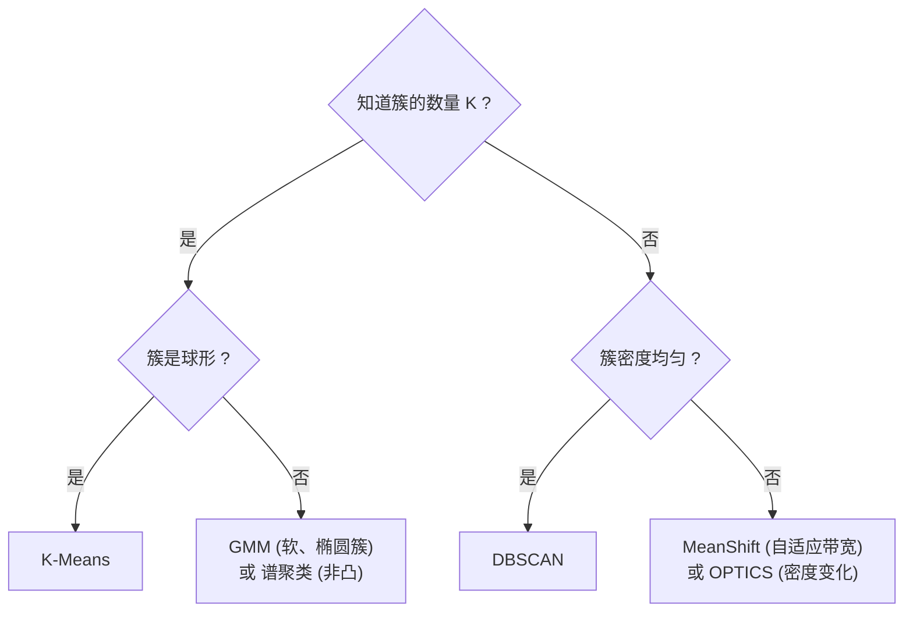

# 三维点云处理：聚类算法简介——从相似度到点云分割

在前几章中，我们学习了 PCA 的特征分析与空间索引结构。从本章开始，我们将进入三维点云处理中最直观的应用之一——**聚类（Clustering）**，即自动将点云中的点划分为若干个有意义的子集（物体或区域）。

聚类是自动驾驶中物体检测（车辆、行人、路障的前景提取）、三维场景理解（房间分割、家具识别）、以及点云预处理（噪声剔除、超体素生成）等任务的基础。

---

## 一、什么是聚类？

### 1.1 形式化定义

给定 $N$ 个数据点 $\{p_1, p_2, \ldots, p_N\}$ 和一个相似度/距离度量 $d(\cdot, \cdot)$，聚类的目标是找到一种划分 $\{C_1, C_2, \ldots, C_K\}$，使得：

- **内聚性（Cohesion）**：同一簇内的点尽可能相似（距离小）
- **分离性（Separation）**：不同簇之间的点尽可能不相似（距离大）

```
  良好聚类                      不良聚类

  ●●●     ○○○                   ●●○     ○●●
  ●●●     ○○○                   ○●○     ●○●
  ●●●     ○○○                   ○○●     ●●○

  簇内紧密，簇间分离            簇内松散，簇间混杂
```

### 1.2 点云聚类的三维特性

点云聚类与一般数据聚类的关键区别在于：**点的空间邻近性往往已经暗示了物体的归属关系**。

<svg viewBox="0 0 600 200" width="100%" style="background-color: transparent; font-family: sans-serif; margin: 20px 0; overflow: visible;">
  <!-- Left Side: Original LiDAR Point Cloud -->
  <g transform="translate(40, 20)">
  <rect x="0" y="20" width="220" height="130" fill="rgba(100, 100, 100, 0.05)" stroke="var(--vp-c-divider)" stroke-width="1.5" rx="6" />
  <text x="110" y="10" text-anchor="middle" font-size="13" fill="currentColor">原始 LiDAR 点云 (俯视图)</text>
  <!-- Building facade (top) -->
  <path d="M 30,40 Q 110,35 190,40" fill="none" stroke="var(--vp-c-text-3)" stroke-width="1.5" stroke-dasharray="2 2" />
  <text x="110" y="55" text-anchor="middle" font-size="10" fill="var(--vp-c-text-3)">建筑立面 (点云线段)</text>
  <!-- Car A (center) -->
  <rect x="80" y="70" width="60" height="22" rx="3" fill="var(--vp-c-text-3)" opacity="0.3" />
  <text x="110" y="84" text-anchor="middle" font-size="10" fill="currentColor">前方车辆 🚗</text>
  <!-- Car B (left bottom) -->
  <rect x="30" y="105" width="40" height="20" rx="3" fill="var(--vp-c-text-3)" opacity="0.3" />
  <text x="50" y="118" text-anchor="middle" font-size="9" fill="currentColor">侧方车辆</text>
  <!-- Pedestrian (right bottom) -->
  <circle cx="160" cy="115" r="4.5" fill="var(--vp-c-text-3)" />
  <text x="160" y="130" text-anchor="middle" font-size="9" fill="var(--vp-c-text-3)">行人</text>
  </g>
  <!-- Arrow -->
  <g transform="translate(285, 20)">
  <line x1="0" y1="85" x2="30" y2="85" stroke="currentColor" stroke-width="2" marker-end="url(#clustering-arrow)" />
  </g>
  <!-- Right Side: Clustering Result -->
  <g transform="translate(340, 20)">
  <rect x="0" y="20" width="220" height="130" fill="rgba(100, 100, 100, 0.05)" stroke="var(--vp-c-divider)" stroke-width="1.5" rx="6" />
  <text x="110" y="10" text-anchor="middle" font-size="13" fill="currentColor">聚类结果</text>
  <!-- Building facade clustered (purple) -->
  <path d="M 30,40 Q 110,35 190,40" fill="none" stroke="#722ed1" stroke-width="3" />
  <rect x="90" y="44" width="40" height="12" rx="2" fill="rgba(114, 46, 209, 0.15)" />
  <text x="110" y="53" text-anchor="middle" font-size="8" fill="#722ed1">背景 (建筑)</text>
  <!-- Car A clustered (blue) -->
  <rect x="80" y="70" width="60" height="22" rx="3" fill="rgba(22, 119, 255, 0.15)" stroke="#1677ff" stroke-width="2" />
  <text x="110" y="84" text-anchor="middle" font-size="10" fill="#1677ff">车辆 A</text>
  <!-- Car B clustered (orange) -->
  <rect x="30" y="105" width="40" height="20" rx="3" fill="rgba(250, 140, 22, 0.15)" stroke="#fa8c16" stroke-width="2" />
  <text x="50" y="118" text-anchor="middle" font-size="9" fill="#fa8c16">车辆 B</text>
  <!-- Pedestrian clustered (green) -->
  <circle cx="160" cy="115" r="5" fill="#52c41a" />
  <text x="160" y="130" text-anchor="middle" font-size="9" fill="#52c41a">行人</text>
  </g>
  <!-- Definition of arrow -->
  <defs>
  <marker id="clustering-arrow" viewBox="0 0 10 10" refX="6" refY="5" markerWidth="6" markerHeight="6" orient="auto">
  <path d="M 0 1.5 L 8 5 L 0 8.5 z" fill="currentColor" />
  </marker>
  </defs>
</svg>

---

## 二、距离与相似度度量

### 2.1 点云中常用的距离

| 距离度量 | 公式 | 适用场景 |
|----------|------|----------|
| **欧氏距离** | $d(p, q) = \|p - q\|_2$ | 通用三维空间距离 |
| **曼哈顿距离** | $d(p, q) = \sum_i \|p_i - q_i\|$ | 体素网格/城市街道 |
| **马氏距离** | $d(p, q) = \sqrt{(p-q)^T \Sigma^{-1} (p-q)}$ | 考虑数据分布形状 |
| **余弦相似度** | $\cos(p, q) = \frac{p \cdot q}{\|p\| \|q\|}$ | 方向敏感（法向量聚类） |
| **测地距离** | 沿表面最短路径长度 | 弯曲表面上的点 |

### 2.2 距离选择的重要性

```
  相同数据，不同距离度量的聚类结果

  欧氏距离聚类                马氏距离聚类
  (忽视相关性)                (考虑协方差)

    ○ ○                        ○ ○
   ○   ○                      ○   ○
  ○  ●  ○                   ○   ●   ○
   ○   ○                      ○   ○
    ○ ○                        ○ ○

  圆形决策边界                椭圆形决策边界（适应各向异性分布）
```

---

## 三、聚类算法的主要范式

### 3.1 五大范式概览

| 范式 | 划分式 (Partitioning) | 层次式 (Hierarchical) | 密度式 (Density-Based) | 模型式 (Model-Based) | 谱聚类 (Spectral) |
| :--- | :--- | :--- | :--- | :--- | :--- |
| **代表算法** | K-Means<br/>K-Medoids | Agglomerative<br/>Divisive | DBSCAN<br/>MeanShift<br/>OPTICS | GMM (EM)<br/>混合模型 | Spectral Clustering |

### 3.2 各范式的核心思想

#### 划分式聚类 (Partitioning)
将数据迭代地分配到 $K$ 个簇中，优化簇内误差平方和。代表：**K-Means**。
> 优点：简单高效；缺点：需预设 $K$，对非球形分布效果差。

#### 层次聚类 (Hierarchical)
自底向上（凝聚）或自顶向下（分裂）地构建簇的树状结构。
> 优点：不需预设 $K$，可得到任意粒度的结果；缺点：$O(N^2 \log N)$ 或更高。

```
  凝聚层次聚类的树状图 (Dendrogram)

  距离
    ▲
  6 ┤                              ┌─────────┐
    │                    ┌─────────┤         │
  4 ┤          ┌─────────┤         │         │
    │    ┌─────┤         │         │         │
  2 ┤  ┌─┤     │         │         │         │
    │  │ │     │         │         │         │
  0 ┼──┴─┴─────┴─────────┴─────────┴─────────┴──► 样本
      1  2     3    4     5    6     7    8

  在任意高度划线即可获得对应数量的簇
```

#### 密度聚类 (Density-Based)
将簇定义为被低密度区域分隔的高密度区域。代表：**DBSCAN**、**MeanShift**。
> 优点：可发现任意形状的簇、自动确定 $K$；缺点：参数敏感（半径 $\epsilon$）。

#### 模型式聚类 (Model-Based)
假设数据由若干概率模型生成，通过最大化似然估计模型参数。代表：**GMM（高斯混合模型）**。
> 优点：软聚类（每个点有归属概率）、簇可以是椭圆形；缺点：需预设 $K$。

#### 谱聚类 (Spectral)
将数据之间的相似度构建为图，利用图的 Laplacian 矩阵的特征向量进行降维后再聚类。
> 优点：对非凸数据分布效果极佳；缺点：计算复杂 $O(N^3)$。

---

## 四、聚类质量评估指标

### 4.1 内部指标（无真值标签）

| 指标 | 公式 | 物理含义 |
|------|------|----------|
| **轮廓系数 (Silhouette)** | $s(i) = \frac{b(i) - a(i)}{\max(a(i), b(i))}$ | $a$: 簇内平均距离; $b$: 到最近簇的平均距离 |
| **Davies-Bouldin 指数** | $\frac{1}{K}\sum_{i}\max_{j \neq i}\frac{\sigma_i + \sigma_j}{d(c_i, c_j)}$ | 越小越好 |
| **Calinski-Harabasz 指数** | $\frac{\text{tr}(B_K)}{\text{tr}(W_K)} \cdot \frac{N-K}{K-1}$ | $B_K$: 簇间散布; $W_K$: 簇内散布 |

### 4.2 外部指标（有真值标签）

| 指标 | 说明 |
|------|------|
| **Rand 指数** | 正确决策比例（点对在同一簇 vs 不同簇） |
| **NMI (归一化互信息)** | 聚类标签与真值标签的互信息 |
| **V-Measure** | 同质性与完整性的调和平均 |

---

## 五、点云聚类的工程考虑

### 5.1 预处理：下采样 + 地面分割

在实际点云聚类流程中，通常先进行预处理：

```python
def preprocess_for_clustering(pcd, voxel_size=0.05):
    """
    聚类前的标准预处理流水线。

    1. 体素下采样 (降低点数)
    2. 统计滤波 (去除离群点)
    3. 可选: 地面分割 (去除地面点，保留前景物体)
    """
    # 1. 体素下采样
    pcd_down = pcd.voxel_down_sample(voxel_size)
    print(f"下采样: {len(pcd.points)} → {len(pcd_down.points)}")

    # 2. 统计滤波
    pcd_filtered, _ = pcd_down.remove_statistical_outlier(
        nb_neighbors=20, std_ratio=2.0
    )
    print(f"滤波: {len(pcd_down.points)} → {len(pcd_filtered.points)}")

    return pcd_filtered
```

### 5.2 聚类算法选择决策树



---

## 六、本章预告

接下来的章节将逐一深入以下聚类算法在点云处理中的具体实现：

| 章节 | 算法 | 核心创新 |
|------|------|----------|
| 第 11 章 | **K-Means** | Lloyd 迭代、Elkan 加速、K-Means++ 初始化 |
| 第 12 章 | **GMM 高斯混合模型** | 概率软聚类、各向异性协方差 |
| 第 13 章 | **EM 期望最大化** | GMM 的参数估计理论基础 |
| 第 14 章 | **谱聚类** | 图 Laplacian、非凸数据聚类 |
| 第 15 章 | **MeanShift & DBSCAN** | 密度驱动、自动确定簇数 |

---

## 总结

聚类是无监督学习中最基础也最实用的技术之一。在三维点云处理中，它是物体检测、场景分割和语义标注的前置步骤。选择合适的聚类算法需要综合考虑：

1. **先验知识**：是否已知簇的数量 $K$？
2. **几何特性**：簇是球形还是任意形状？密度是否均匀？
3. **计算资源**：点云规模多大？是否需要实时处理？
4. **输出需求**：需要硬聚类（每个点只属于一个簇）还是软聚类（每个点有归属概率）？

下一章我们将从最经典的 **K-Means** 开始，进行详细的算法推导与代码实现。
