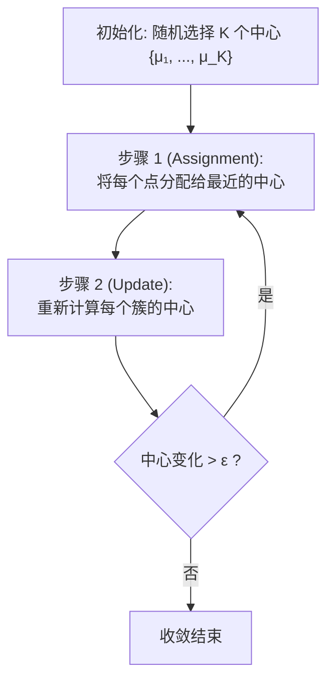

# 三维点云处理：K-Means 聚类——原理推导、代码详解与点云应用

K-Means 是最经典、最广泛使用的划分式聚类算法。尽管它诞生于 1957 年（Stuart Lloyd 在 Bell 实验室），至今仍是点云预处理、颜色量化和初始物体分割的首选工具之一。

---

## 一、K-Means 的问题定义与优化目标

### 1.1 优化目标

给定 $N$ 个点 $\{p_1, \ldots, p_N\} \subset \mathbb{R}^d$ 和预设的簇数 $K$，K-Means 的目标是最小化**簇内平方误差和（Within-Cluster Sum of Squares, WCSS）**：

$$\min_{C, \mu} \sum_{k=1}^K \sum_{p_i \in C_k} \|p_i - \mu_k\|_2^2$$

其中：
- $C_k \subset \{1, \ldots, N\}$ 是第 $k$ 个簇的点索引集合
- $\mu_k \in \mathbb{R}^d$ 是第 $k$ 个簇的中心（质心）

<svg viewBox="0 0 600 200" width="100%" style="background-color: transparent; font-family: sans-serif; margin: 20px 0; overflow: visible;">
  <!-- Left Side: Initial State -->
  <g transform="translate(40, 20)">
  <rect x="0" y="20" width="220" height="130" fill="rgba(100, 100, 100, 0.05)" stroke="var(--vp-c-divider)" stroke-width="1.5" rx="6" />
  <text x="110" y="10" text-anchor="middle" font-size="13" fill="currentColor">初始随机质心</text>
  <!-- Grey points -->
  <g fill="var(--vp-c-text-3)" opacity="0.6">
  <circle cx="30" cy="40" r="3" /><circle cx="45" cy="50" r="3" /><circle cx="35" cy="65" r="3" />
  <circle cx="110" cy="90" r="3" /><circle cx="120" cy="110" r="3" /><circle cx="95" cy="100" r="3" />
  <circle cx="180" cy="45" r="3" /><circle cx="160" cy="60" r="3" /><circle cx="170" cy="75" r="3" />
  </g>
  <!-- Centroids -->
  <polygon points="50,40 52,47 59,48 54,53 56,60 50,56 44,60 46,53 41,48 48,47" fill="#f5222d" />
  <text x="50" y="35" text-anchor="middle" font-size="9" fill="#f5222d">μ₁</text>
  <polygon points="120,60 122,67 129,68 124,73 126,80 120,76 114,80 116,73 111,68 118,67" fill="#1677ff" />
  <text x="120" y="55" text-anchor="middle" font-size="9" fill="#1677ff">μ₂</text>
  <polygon points="150,110 152,117 159,118 154,123 156,130 150,126 144,130 146,123 141,118 148,117" fill="#52c41a" />
  <text x="150" y="105" text-anchor="middle" font-size="9" fill="#52c41a">μ₃</text>
  </g>
  <!-- Arrow -->
  <g transform="translate(285, 20)">
  <line x1="0" y1="85" x2="30" y2="85" stroke="currentColor" stroke-width="2" marker-end="url(#kmeans-arrow)" />
  </g>
  <!-- Right Side: Converged State -->
  <g transform="translate(340, 20)">
  <rect x="0" y="20" width="220" height="130" fill="rgba(100, 100, 100, 0.05)" stroke="var(--vp-c-divider)" stroke-width="1.5" rx="6" />
  <text x="110" y="10" text-anchor="middle" font-size="13" fill="currentColor">迭代收敛后的聚类</text>
  <!-- Red Cluster -->
  <g fill="#f5222d">
  <circle cx="30" cy="40" r="3" /><circle cx="45" cy="50" r="3" /><circle cx="35" cy="65" r="3" />
  <polygon points="36,45 38,52 45,53 40,58 42,65 36,61 30,65 32,58 27,53 34,52" fill="#f5222d" />
  <text x="36" y="38" text-anchor="middle" font-size="9" fill="#f5222d">μ₁</text>
  </g>
  <!-- Blue Cluster -->
  <g fill="#1677ff">
  <circle cx="110" cy="90" r="3" /><circle cx="120" cy="110" r="3" /><circle cx="95" cy="100" r="3" />
  <polygon points="108,95 110,102 117,103 112,108 114,115 108,111 102,115 104,108 99,103 106,102" fill="#1677ff" />
  <text x="108" y="88" text-anchor="middle" font-size="9" fill="#1677ff">μ₂</text>
  </g>
  <!-- Green Cluster -->
  <g fill="#52c41a">
  <circle cx="180" cy="45" r="3" /><circle cx="160" cy="60" r="3" /><circle cx="170" cy="75" r="3" />
  <polygon points="170,55 172,62 179,63 174,68 176,75 170,71 164,75 166,68 161,63 168,62" fill="#52c41a" />
  <text x="170" y="48" text-anchor="middle" font-size="9" fill="#52c41a">μ₃</text>
  </g>
  <!-- Partition boundaries -->
  <line x1="80" y1="20" x2="80" y2="150" stroke="currentColor" stroke-dasharray="3 3" opacity="0.3" />
  <line x1="80" y1="80" x2="220" y2="80" stroke="currentColor" stroke-dasharray="3 3" opacity="0.3" />
  </g>
  <!-- Definition of arrow -->
  <defs>
  <marker id="kmeans-arrow" viewBox="0 0 10 10" refX="6" refY="5" markerWidth="6" markerHeight="6" orient="auto">
  <path d="M 0 1.5 L 8 5 L 0 8.5 z" fill="currentColor" />
  </marker>
  </defs>
</svg>

### 1.2 为什么是 $L_2$ 范数？

使用欧氏距离平方有一个关键性质：**质心 $\mu_k$ 的最优解恰好是簇内点的算术平均**。

证明：对目标函数关于 $\mu_k$ 求导：
$$\frac{\partial}{\partial \mu_k} \sum_{p_i \in C_k} \|p_i - \mu_k\|^2 = -2 \sum_{p_i \in C_k} (p_i - \mu_k) = 0$$

$$\implies \mu_k^* = \frac{1}{|C_k|} \sum_{p_i \in C_k} p_i$$

---

## 二、Lloyd 迭代算法

### 2.1 标准算法流程

K-Means 通过交替执行以下两步直到收敛：



### 2.2 收敛性分析

Lloyd 迭代保证收敛——因为：

1. **Assignment 步骤**不增加目标函数值（每个点选择最近的质心）。
2. **Update 步骤**也不增加目标函数值（算术平均是簇内距离平方和的最小值点）。
3. 目标函数有下界（0），且每次迭代单调不增 → 收敛。

> ⚠️ 但注意：Lloyd 迭代收敛到的是**局部最优**而非全局最优。不同的初始质心可能收敛到不同的局部极小值。

### 2.3 基础 Python 实现

```python
import numpy as np


def kmeans_basic(points, k, max_iters=100, tol=1e-4, seed=None):
    """
    基础 K-Means 实现 (Lloyd 迭代)。

    :param points: N x d 的输入点集
    :param k: 簇的数量
    :param max_iters: 最大迭代次数
    :param tol: 收敛容限
    :param seed: 随机种子
    :return: (labels, centroids, n_iters)
    """
    if seed is not None:
        np.random.seed(seed)

    N, d = points.shape

    # 1. 随机初始化：从数据中选择 K 个点作为初始质心
    init_indices = np.random.choice(N, k, replace=False)
    centroids = points[init_indices].copy().astype(np.float64)

    labels = np.zeros(N, dtype=np.int32)

    for iteration in range(max_iters):
        # ── 步骤 1: 分配 (Assignment) ──
        # 计算每个点到所有质心的距离平方
        # ||p_i - μ_j||² = ||p_i||² + ||μ_j||² - 2 p_i · μ_j
        pts_norm_sq = np.sum(points ** 2, axis=1).reshape(-1, 1)     # N x 1
        cen_norm_sq = np.sum(centroids ** 2, axis=1).reshape(1, -1)   # 1 x K
        dists_sq = pts_norm_sq + cen_norm_sq - 2 * points @ centroids.T  # N x K
        dists_sq = np.maximum(dists_sq, 0)  # 避免极小负值（舍入误差）

        new_labels = np.argmin(dists_sq, axis=1)

        # ── 步骤 2: 更新 (Update) ──
        new_centroids = np.zeros_like(centroids)
        for j in range(k):
            mask = (new_labels == j)
            if mask.sum() > 0:
                new_centroids[j] = points[mask].mean(axis=0)
            else:
                # 空簇: 保留原质心或重新初始化
                new_centroids[j] = centroids[j]

        # ── 收敛检查 ──
        shift = np.linalg.norm(new_centroids - centroids, axis=1).max()
        centroids = new_centroids
        labels = new_labels

        if shift < tol:
            print(f"[K-Means] 在第 {iteration+1} 轮收敛 (shift={shift:.6f})")
            break
    else:
        print(f"[K-Means] 达到最大迭代次数 {max_iters}")

    return labels, centroids, iteration + 1
```

---

## 三、K-Means++ 初始化策略

### 3.1 随机初始化的缺陷

随机从数据中选择初始质心存在严重问题：如果两个初始质心碰巧十分接近，会导致收敛到极差的局部最优解。

```
  随机初始化的两种极端情况

  ✅ 良好初始化                    ❌ 不良初始化

  ●₁                                ●₁●₂
    ○ ○ ○                            ○ ○ ○
       ○                                ○
     ○    ○  ●₂                      ○     ○
                                        ○  ○
     ○    ○                          ○     ○
        ○                               ○
   ●₃ ○  ○ ○                           ○ ○ ○

  质心分散在各簇中                  两个质心挤在同一簇
  快速收敛到全局最优                收敛极慢，可能拆分自然簇
```

### 3.2 K-Means++ 算法

K-Means++ 的初始化策略：**让初始质心尽可能分散**。

1. 随机选择第一个质心 $\mu_1$。
2. 对 $j = 2, \ldots, K$：
   - 对每个点 $p_i$，计算其到**最近已有质心**的距离 $D(p_i)$
   - 以概率 $\propto D(p_i)^2$ 选择下一个质心
3. 使用选出的 $K$ 个质心运行标准 Lloyd 迭代。

```python
def kmeans_plusplus_init(points, k, seed=None):
    """
    K-Means++ 初始化。

    :return: (centroids, labels) 初始质心和初始分配
    """
    if seed is not None:
        np.random.seed(seed)

    N, d = points.shape
    centroids = np.zeros((k, d), dtype=np.float64)

    # 1. 随机选择第一个质心
    first_idx = np.random.randint(N)
    centroids[0] = points[first_idx]

    # 2. 依次选择剩余质心
    for j in range(1, k):
        # 计算每个点到最近已有质心的距离平方
        dists_sq = np.full(N, np.inf)
        for c in range(j):
            d2 = np.sum((points - centroids[c]) ** 2, axis=1)
            dists_sq = np.minimum(dists_sq, d2)

        # 以概率正比于 D(p_i)² 选择下一个质心
        probs = dists_sq / dists_sq.sum()
        cumulative = np.cumsum(probs)
        r = np.random.random()
        next_idx = np.searchsorted(cumulative, r)
        centroids[j] = points[next_idx]

    return centroids


def kmeans_plusplus(points, k, max_iters=100, tol=1e-4, seed=None):
    """带 K-Means++ 初始化的 K-Means"""
    centroids = kmeans_plusplus_init(points, k, seed)

    # 后续与 kmeans_basic 相同的 Lloyd 迭代...
    # （此处省略，实际项目中将初始化部分替换即可）
    return kmeans_basic(points, k, max_iters, tol, seed)
```

---

## 四、在点云处理中的应用

### 4.1 基于空间坐标的点云分割

直接将 K-Means 应用于点的 $(x, y, z)$ 坐标，可用于粗略的空间分割：

```python
def spatial_kmeans_segmentation(pcd, k=5):
    """
    基于空间位置的 K-Means 点云分割。

    适用场景: 场景中的物体在空间上明显分离（如室内家具）。
    """
    points = np.asarray(pcd.points)
    labels, centroids, _ = kmeans_plusplus(points, k=k, seed=42)

    # 为每个簇分配颜色
    import matplotlib.pyplot as plt
    colors = plt.cm.tab10(labels / k)[:, :3]

    segmented_pcd = o3d.geometry.PointCloud()
    segmented_pcd.points = o3d.utility.Vector3dVector(points)
    segmented_pcd.colors = o3d.utility.Vector3dVector(colors)

    return segmented_pcd, labels, centroids
```

### 4.2 颜色量化 (Color Quantization)

将点云的 RGB 颜色空间聚类为 $K$ 个主色调，实现颜色压缩或基于颜色的分割：

```python
def color_kmeans_quantization(pcd, k=8):
    """
    对点云的颜色进行 K-Means 量化。

    将 RGB 值聚类为 K 种主色，每个点替换为最近的簇中心颜色。
    常用于点云的颜色去噪和风格化渲染。
    """
    colors = np.asarray(pcd.colors)  # N x 3, 每行 (R,G,B)
    labels, palette, _ = kmeans_plusplus(colors, k=k)

    # 每个点的颜色替换为所属簇的质心颜色
    quantized_colors = palette[labels]

    quantized_pcd = o3d.geometry.PointCloud()
    quantized_pcd.points = pcd.points
    quantized_pcd.colors = o3d.utility.Vector3dVector(quantized_colors)

    return quantized_pcd, palette
```

### 4.3 法向量辅助聚类

将空间坐标 $(x, y, z)$ 和法向量 $(n_x, n_y, n_z)$ 拼接为 6D 特征进行聚类，可以更好地区分不同朝向的平面：

```python
def spatial_normal_kmeans(pcd, k=5, normal_weight=0.5):
    """
    结合空间位置和法向量的 K-Means 聚类。

    :param normal_weight: 法向量维度在距离计算中的权重
    """
    points = np.asarray(pcd.points)
    # 确保点云有法向量
    if not pcd.has_normals():
        pcd.estimate_normals(search_param=o3d.geometry.KDTreeSearchParamKNN(30))
    normals = np.asarray(pcd.normals)

    # 构建 6D 特征向量
    features = np.hstack([
        points,                              # (x, y, z)
        normal_weight * normals              # (nx, ny, nz) * weight
    ])

    labels, centroids, _ = kmeans_plusplus(features, k=k)
    return labels, centroids
```

---

## 五、K-Means 的局限性与改进

### 5.1 主要局限性


<svg viewBox="0 0 600 220" width="100%" style="background-color: transparent; font-family: sans-serif; margin: 20px 0; overflow: visible;">
  <!-- Non-spherical (Left) -->
  <g transform="translate(10, 20)">
  <rect x="0" y="20" width="170" height="130" fill="rgba(100, 100, 100, 0.05)" stroke="var(--vp-c-divider)" stroke-width="1.5" rx="6" />
  <text x="85" y="10" text-anchor="middle" font-size="13" fill="currentColor">1. 非球形分布</text>
  <circle cx="85" cy="80" r="18" fill="none" stroke="currentColor" stroke-dasharray="2 2" stroke-width="1.5" opacity="0.6" />
  <circle cx="85" cy="80" r="42" fill="none" stroke="currentColor" stroke-dasharray="2 2" stroke-width="1.5" opacity="0.6" />
  <line x1="85" y1="30" x2="85" y2="140" stroke="#f5222d" stroke-width="2" stroke-dasharray="4 4" />
  <g opacity="0.8">
  <circle cx="85" cy="62" r="3" fill="#f5222d" /><circle cx="67" cy="80" r="3" fill="#f5222d" /><circle cx="85" cy="98" r="3" fill="#f5222d" />
  <circle cx="85" cy="38" r="3" fill="#f5222d" /><circle cx="43" cy="80" r="3" fill="#f5222d" /><circle cx="85" cy="122" r="3" fill="#f5222d" />
  <circle cx="55" cy="50" r="3" fill="#f5222d" /><circle cx="55" cy="110" r="3" fill="#f5222d" />
  <circle cx="103" cy="80" r="3" fill="#1677ff" />
  <circle cx="127" cy="80" r="3" fill="#1677ff" />
  <circle cx="115" cy="50" r="3" fill="#1677ff" /><circle cx="115" cy="110" r="3" fill="#1677ff" />
  </g>
  <text x="85" y="165" text-anchor="middle" font-size="11" fill="#f5222d">被直线割裂为半圆，无法识别环状</text>
  </g>
  <!-- Different Sizes (Middle) -->
  <g transform="translate(205, 20)">
  <rect x="0" y="20" width="170" height="130" fill="rgba(100, 100, 100, 0.05)" stroke="var(--vp-c-divider)" stroke-width="1.5" rx="6" />
  <text x="85" y="10" text-anchor="middle" font-size="13" fill="currentColor">2. 尺寸悬殊</text>
  <circle cx="50" cy="80" r="35" fill="none" stroke="currentColor" stroke-dasharray="2 2" stroke-width="1.5" opacity="0.3" />
  <circle cx="130" cy="80" r="10" fill="none" stroke="currentColor" stroke-dasharray="2 2" stroke-width="1.5" opacity="0.3" />
  <line x1="95" y1="30" x2="95" y2="140" stroke="#f5222d" stroke-width="2" stroke-dasharray="4 4" />
  <circle cx="30" cy="70" r="3" fill="#f5222d" /><circle cx="45" cy="90" r="3" fill="#f5222d" /><circle cx="55" cy="60" r="3" fill="#f5222d" />
  <circle cx="35" cy="85" r="3" fill="#f5222d" /><circle cx="65" cy="75" r="3" fill="#f5222d" />
  <circle cx="80" cy="75" r="3" fill="#1677ff" /><circle cx="85" cy="90" r="3" fill="#1677ff" />
  <circle cx="125" cy="78" r="3" fill="#1677ff" /><circle cx="133" cy="83" r="3" fill="#1677ff" /><circle cx="130" cy="74" r="3" fill="#1677ff" />
  <text x="85" y="165" text-anchor="middle" font-size="11" fill="#f5222d">大簇的一部分被错分给小簇</text>
  </g>
  <!-- Different Densities (Right) -->
  <g transform="translate(400, 20)">
  <rect x="0" y="20" width="190" height="130" fill="rgba(100, 100, 100, 0.05)" stroke="var(--vp-c-divider)" stroke-width="1.5" rx="6" />
  <text x="95" y="10" text-anchor="middle" font-size="13" fill="currentColor">3. 密度分布不均</text>
  <circle cx="40" cy="80" r="15" fill="none" stroke="currentColor" stroke-dasharray="2 2" stroke-width="1.5" opacity="0.3" />
  <circle cx="130" cy="80" r="35" fill="none" stroke="currentColor" stroke-dasharray="2 2" stroke-width="1.5" opacity="0.3" />
  <line x1="85" y1="30" x2="85" y2="140" stroke="#f5222d" stroke-width="2" stroke-dasharray="4 4" />
  <circle cx="35" cy="75" r="2.5" fill="#f5222d" /><circle cx="45" cy="85" r="2.5" fill="#f5222d" />
  <circle cx="40" cy="72" r="2.5" fill="#f5222d" /><circle cx="32" cy="82" r="2.5" fill="#f5222d" />
  <circle cx="46" cy="76" r="2.5" fill="#f5222d" />
  <circle cx="75" cy="70" r="2.5" fill="#f5222d" /><circle cx="80" cy="90" r="2.5" fill="#f5222d" />
  <circle cx="110" cy="65" r="2.5" fill="#1677ff" /><circle cx="130" cy="95" r="2.5" fill="#1677ff" />
  <circle cx="150" cy="70" r="2.5" fill="#1677ff" /><circle cx="140" cy="85" r="2.5" fill="#1677ff" />
  <text x="95" y="165" text-anchor="middle" font-size="11" fill="#f5222d">稀疏簇边缘点被硬分配给密集簇</text>
  </g>
</svg>


### 5.2 改进方向

| 改进 | 方法 | 解决的问题 |
|------|------|------------|
| **初始化** | K-Means++ | 随机初始化的不稳定性 |
| **加速** | Elkan 三角不等式 | 大量冗余距离计算 |
| **大数据** | Mini-Batch K-Means | 百万级以上样本的计算瓶颈 |
| **非球形** | Kernel K-Means | 非球形分布的聚类 |
| **自动 K** | Gap Statistic / Elbow Method | 人工设定 K 的问题 |

### 5.3 肘部法则（Elbow Method）

如何选择 $K$？画出 WCSS 随 $K$ 变化的曲线：


<svg viewBox="0 0 500 220" width="100%" style="background-color: transparent; font-family: sans-serif; margin: 20px 0; overflow: visible;">
  <line x1="50" y1="180" x2="450" y2="180" stroke="currentColor" stroke-width="1.5" marker-end="url(#elbow-axis-arrow)" />
  <text x="460" y="184" font-size="12" fill="currentColor">K (簇数)</text>
  <line x1="50" y1="180" x2="50" y2="25" stroke="currentColor" stroke-width="1.5" marker-end="url(#elbow-axis-arrow)" />
  <text x="45" y="15" font-size="12" fill="currentColor" text-anchor="middle">WCSS (簇内平方和)</text>
  <path d="M 80,45 L 140,85 L 200,135 L 260,150 L 320,158 L 380,163" fill="none" stroke="#1677ff" stroke-width="2.5" />
  <circle cx="80" cy="45" r="4" fill="#1677ff" /><text x="80" y="195" text-anchor="middle" font-size="10" fill="var(--vp-c-text-2)">1</text>
  <circle cx="140" cy="85" r="4" fill="#1677ff" /><text x="140" y="195" text-anchor="middle" font-size="10" fill="var(--vp-c-text-2)">2</text>
  <circle cx="200" cy="135" r="5" fill="#f5222d" /><text x="200" y="195" text-anchor="middle" font-size="10" fill="#f5222d">3</text>
  <circle cx="260" cy="150" r="4" fill="#1677ff" /><text x="260" y="195" text-anchor="middle" font-size="10" fill="var(--vp-c-text-2)">4</text>
  <circle cx="320" cy="158" r="4" fill="#1677ff" /><text x="320" y="195" text-anchor="middle" font-size="10" fill="var(--vp-c-text-2)">5</text>
  <circle cx="380" cy="163" r="4" fill="#1677ff" /><text x="380" y="195" text-anchor="middle" font-size="10" fill="var(--vp-c-text-2)">6</text>
  <path d="M 270,105 L 210,130" fill="none" stroke="#f5222d" stroke-width="1.5" marker-end="url(#elbow-callout-arrow)" />
  <rect x="265" y="85" width="115" height="28" rx="4" fill="rgba(245, 34, 45, 0.08)" stroke="#f5222d" stroke-width="1" />
  <text x="322" y="102" text-anchor="middle" font-size="11" fill="#f5222d">肘部 (最佳 K = 3)</text>
  <defs>
  <marker id="elbow-axis-arrow" viewBox="0 0 10 10" refX="6" refY="5" markerWidth="5" markerHeight="5" orient="auto">
  <path d="M 0 1.5 L 8 5 L 0 8.5 z" fill="currentColor" />
  </marker>
  <marker id="elbow-callout-arrow" viewBox="0 0 10 10" refX="6" refY="5" markerWidth="5" markerHeight="5" orient="auto">
  <path d="M 0 1.5 L 8 5 L 0 8.5 z" fill="#f5222d" />
  </marker>
  </defs>
</svg>


```python
def elbow_method(points, k_range=range(1, 11)):
    """肘部法则：计算不同 K 下的 WCSS"""
    wcss_values = []
    for k in k_range:
        labels, centroids, _ = kmeans_plusplus(points, k=k)
        wcss = sum(
            np.sum((points[labels == j] - centroids[j]) ** 2)
            for j in range(k)
        )
        wcss_values.append(wcss)
        print(f"  K={k}: WCSS={wcss:.2f}")
    return wcss_values
```

---

## 六、完整示例：K-Means 点云场景分割

```python
import numpy as np
import open3d as o3d


def kmeans_scene_segmentation(pcd, k_range=(2, 8)):
    """
    使用 K-Means 对点云场景进行分割，自动选择最佳 K。
    """
    points = np.asarray(pcd.points)
    N = points.shape[0]

    # 如果点云过大，先下采样
    if N > 50000:
        pcd = pcd.voxel_down_sample(voxel_size=0.02)
        points = np.asarray(pcd.points)
        print(f"下采样后点数: {len(points)}")

    # 肘部法则选 K
    print("运行肘部法则...")
    wcss_vals = elbow_method(points, range(k_range[0], k_range[1] + 1))

    # 计算肘部位置（最大曲率点）
    from numpy import diff
    k_vals = list(range(k_range[0], k_range[1] + 1))
    deltas = -diff(wcss_vals)  # WCSS 的一阶差分
    best_k = k_vals[np.argmax(diff(deltas)) + 1]
    print(f"\n最佳 K = {best_k}")

    # 执行最终分割
    labels, centroids, _ = kmeans_plusplus(points, k=best_k, seed=42)

    # 可视化
    import matplotlib.pyplot as plt
    colors = plt.cm.tab20(labels % 20 / 20)[:, :3]
    segmented = o3d.geometry.PointCloud()
    segmented.points = o3d.utility.Vector3dVector(points)
    segmented.colors = o3d.utility.Vector3dVector(colors)

    return segmented, labels, centroids
```

---

## 总结

| 概念 | 要点 |
|------|------|
| **优化目标** | 最小化簇内平方误差和 $\sum_k \sum_{i \in C_k} \|p_i - \mu_k\|^2$ |
| **Lloyd 迭代** | 交替执行 Assignment（分配最近质心）和 Update（重算质心） |
| **收敛性** | 单调收敛到局部最优解，不保证全局最优 |
| **K-Means++** | 距离加权随机采样初始化，显著减少坏局部最优 |
| **时间复杂度** | $O(N K d \cdot \text{iters})$，通常 iters $\ll N$ |
| **空间复杂度** | $O(N + K d)$ |

K-Means 虽然简单，但在点云处理中有着广泛的实际应用。然而，它无法处理各向异性的簇（椭圆形簇）——这正是下一章 **GMM 高斯混合模型聚类** 所要解决的问题，它允许每个簇拥有自己的协方差矩阵，从而可以拟合任意方向的椭球形分布。
