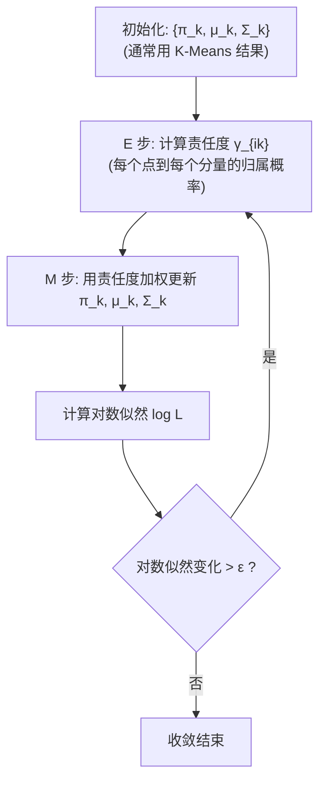

# 三维点云处理：GMM 高斯混合模型聚类——概率软聚类与协方差自适应

K-Means 将每个点硬性地分配给最近质心所在的簇，这等价于假设每个簇是各向同性的球形分布（所有方向方差相同）。然而，真实点云中的物体往往呈现各向异性的分布——比如一辆汽车在长度方向伸展很远但在高度方向很薄。

**高斯混合模型（Gaussian Mixture Model, GMM）** 通过为每个簇分配独立的协方差矩阵，允许每个簇呈现任意的椭球形分布，从而实现更灵活、更精确的聚类。

---

## 一、从 K-Means 到 GMM：思维跃迁

### 1.1 K-Means 的概率视角

K-Means 可以看作是 GMM 的一个特例——当所有簇的协方差矩阵都是 $\sigma^2 I$（各向同性、方差相同），且 $\sigma^2 \to 0$ 时的极限情况：

```
  K-Means (硬聚类)               GMM (软聚类)

    ●₁                              ●₁
    ○ ○ ○                         ○ ○ ○
      ○      ●₂                      ○   (σ₂)
   ●₂           ○                  ●₂       ○
      ○  ●₃                        (σ₁) ○  ●₃
    ○ ○ ○                         ○ ○ ○ (σ₃)

  每个点"属于"一个簇            每个点"可能属于"多个簇
  决策边界: Voronoi 多边形       决策边界: 二次曲线
  簇形状: 球形                   簇形状: 任意椭球形
```

### 1.2 GMM 的生成模型

GMM 假设数据由以下过程生成：

1. 以概率 $\pi_k$（混合系数）选择第 $k$ 个高斯分量。
2. 从该分量的高斯分布 $\mathcal{N}(\mu_k, \Sigma_k)$ 中采样一个数据点。

概率密度函数为：

$$p(x \mid \Theta) = \sum_{k=1}^K \pi_k \cdot \mathcal{N}(x \mid \mu_k, \Sigma_k)$$

其中 $\Theta = \{\pi_k, \mu_k, \Sigma_k\}_{k=1}^K$，且 $\sum_{k=1}^K \pi_k = 1$，$\pi_k \geq 0$。

---

## 二、协方差矩阵的三种参数化

### 2.1 自由度与形状的权衡

在三维点云中，每个高斯分量的协方差矩阵 $\Sigma_k \in \mathbb{R}^{3 \times 3}$ 有 6 个自由度（对称矩阵）。根据不同需求，可以选择不同的约束形式：

| 协方差类型 | 参数形式 | 自由参数数 | 簇形状 | 示意 |
|------------|----------|------------|--------|------|
| **Spherical** | $\sigma_k^2 I$ | $3 \times 1$ | 球形 | `○` |
| **Diagonal** | $\text{diag}(\sigma_{k1}^2, \ldots, \sigma_{kd}^2)$ | $3 \times d$ | 轴对齐椭圆 | `⬭` |
| **Tied** | $\Sigma$（全簇共享） | $d(d+1)/2$ | 相同椭球形 | `⬭ ⬭ ⬭` |
| **Full** | $\Sigma_k$（各自独立） | $3 \times d(d+1)/2$ | 任意椭球形 | `⬭ ⬮ ⬯` |

<svg viewBox="0 0 600 160" width="100%" style="background-color: transparent; font-family: sans-serif; margin: 20px 0; overflow: visible;">
  <!-- Spherical -->
  <g transform="translate(100, 70)">
  <circle cx="0" cy="0" r="45" fill="rgba(22, 119, 255, 0.15)" stroke="#1677ff" stroke-width="2.5" />
  <circle cx="0" cy="0" r="3" fill="#1677ff" />
  <text x="0" y="65" text-anchor="middle" font-size="14" fill="currentColor">Spherical</text>
  <text x="0" y="85" text-anchor="middle" font-size="12" fill="var(--vp-c-text-2)">(各向同性圆/球)</text>
  </g>
  <!-- Diagonal -->
  <g transform="translate(300, 70)">
  <ellipse cx="0" cy="0" rx="60" ry="30" fill="rgba(82, 196, 26, 0.15)" stroke="#52c41a" stroke-width="2.5" />
  <circle cx="0" cy="0" r="3" fill="#52c41a" />
  <text x="0" y="65" text-anchor="middle" font-size="14" fill="currentColor">Diagonal</text>
  <text x="0" y="85" text-anchor="middle" font-size="12" fill="var(--vp-c-text-2)">(轴对齐椭圆/椭球)</text>
  </g>
  <!-- Full -->
  <g transform="translate(500, 70)">
  <g transform="rotate(-25)">
  <ellipse cx="0" cy="0" rx="65" ry="25" fill="rgba(245, 34, 45, 0.15)" stroke="#f5222d" stroke-width="2.5" />
  <circle cx="0" cy="0" r="3" fill="#f5222d" />
  </g>
  <text x="0" y="65" text-anchor="middle" font-size="14" fill="currentColor">Full</text>
  <text x="0" y="85" text-anchor="middle" font-size="12" fill="var(--vp-c-text-2)">(任意方向椭圆/椭球)</text>
  </g>
</svg>

> 对于三维点云，Full 协方差意味着每个簇有 6 个独立参数（$\Sigma_{xx}, \Sigma_{yy}, \Sigma_{zz}, \Sigma_{xy}, \Sigma_{xz}, \Sigma_{yz}$），能捕捉任意朝向的椭球体。

---

## 三、EM 算法求解 GMM

### 3.1 为什么不能直接用 MLE？

如果有"完整数据"（每个点属于哪个高斯分量是已知的），MLE 有闭式解。但在聚类问题中，我们只有"不完整数据"（只有点的坐标，没有分量标签）——这就是**隐变量**问题。

**EM 算法（Expectation-Maximization）** 正是为求解这类含隐变量的 MLE 而设计的。

### 3.2 E 步（Expectation）：计算后验概率

给定当前参数 $\Theta^{(t)}$, 计算每个点属于每个分量的后验概率（责任度）：

$$\gamma_{ik} = P(z_i = k \mid x_i, \Theta^{(t)}) = \frac{\pi_k \cdot \mathcal{N}(x_i \mid \mu_k, \Sigma_k)}{\sum_{j=1}^K \pi_j \cdot \mathcal{N}(x_i \mid \mu_j, \Sigma_j)}$$

其中 $\gamma_{ik}$ 称为**责任度（Responsibility）**，表示"第 $k$ 个高斯分量对点 $i$ 的生成负多少责任"。

### 3.3 M 步（Maximization）：更新参数

利用责任度加权更新所有参数：

$$\mu_k^{(t+1)} = \frac{\sum_{i=1}^N \gamma_{ik} x_i}{\sum_{i=1}^N \gamma_{ik}}$$

$$\Sigma_k^{(t+1)} = \frac{\sum_{i=1}^N \gamma_{ik} (x_i - \mu_k)(x_i - \mu_k)^T}{\sum_{i=1}^N \gamma_{ik}}$$

$$\pi_k^{(t+1)} = \frac{1}{N} \sum_{i=1}^N \gamma_{ik}$$

### 3.4 算法流程



---

## 四、Python 实现

```python
import numpy as np
from scipy.stats import multivariate_normal


def gmm_em(points, k, covariance_type='full', max_iters=100,
           tol=1e-3, init_labels=None, seed=None):
    """
    使用 EM 算法训练高斯混合模型。

    :param points: N x d 输入数据
    :param k: 高斯分量数量
    :param covariance_type: 'spherical' | 'diag' | 'tied' | 'full'
    :param max_iters: 最大 EM 迭代次数
    :param tol: 对数似然收敛阈值
    :param init_labels: 初始标签（如 K-Means 结果），None 则随机初始化
    :param seed: 随机种子
    :return: (weights, means, covariances, responsibilities, log_likelihoods)
    """
    N, d = points.shape
    if seed is not None:
        np.random.seed(seed)

    # ── 1. 初始化 ──
    if init_labels is None:
        init_labels = np.random.randint(0, k, size=N)

    weights = np.zeros(k)
    means = np.zeros((k, d))
    covariances = []

    for j in range(k):
        mask = (init_labels == j)
        if mask.sum() == 0:
            mask = np.random.choice(N, max(1, N // k), replace=False)
        weights[j] = mask.sum() / N
        means[j] = points[mask].mean(axis=0)
        diff = points[mask] - means[j]
        cov = (diff.T @ diff) / mask.sum()
        covariances.append(cov + 1e-6 * np.eye(d))  # 正则化防止奇异

    log_likelihoods = []

    for iteration in range(max_iters):
        # ── E 步: 计算责任度 ──
        responsibilities = np.zeros((N, k))

        for j in range(k):
            try:
                rv = multivariate_normal(mean=means[j], cov=covariances[j])
                responsibilities[:, j] = weights[j] * rv.pdf(points)
            except np.linalg.LinAlgError:
                # 协方差矩阵退化了，重新加正则化
                covariances[j] += 1e-4 * np.eye(d)
                rv = multivariate_normal(mean=means[j], cov=covariances[j])
                responsibilities[:, j] = weights[j] * rv.pdf(points)

        # 对数似然：log p(X|Θ) = Σ_i log( Σ_k π_k N(x_i|μ_k,Σ_k) )
        total_likelihood = responsibilities.sum(axis=1)
        log_likelihood = np.sum(np.log(total_likelihood + 1e-300))
        log_likelihoods.append(log_likelihood)

        # 归一化得到真正的后验概率
        responsibilities /= total_likelihood[:, np.newaxis]

        # ── M 步: 更新参数 ──
        N_k = responsibilities.sum(axis=0)  # 每个分量的有效点数

        weights = N_k / N
        means = (responsibilities.T @ points) / N_k[:, np.newaxis]

        # 更新协方差矩阵
        covariances = []
        for j in range(k):
            diff = points - means[j]
            weighted_diff = responsibilities[:, j][:, np.newaxis] * diff
            cov_j = (weighted_diff.T @ diff) / N_k[j]
            cov_j += 1e-6 * np.eye(d)
            covariances.append(cov_j)

        # ── 收敛检查 ──
        if iteration > 1:
            improvement = log_likelihood - log_likelihoods[-2]
            if abs(improvement) < tol:
                print(f"[GMM EM] 第 {iteration+1} 轮收敛 (ΔLL={improvement:.6f})")
                break
    else:
        print(f"[GMM EM] 达到最大迭代次数 {max_iters}")

    return weights, means, covariances, responsibilities, log_likelihoods


def gmm_predict(responsibilities):
    """将责任度转化为硬聚类标签"""
    return np.argmax(responsibilities, axis=1)
```

---

## 五、模型选择：多少个高斯分量？

### 5.1 BIC（贝叶斯信息准则）

$$BIC = k \cdot \ln(N) - 2 \ln(\hat{L})$$

其中：
- $k$ = 自由参数数量
- $N$ = 数据点数
- $\hat{L}$ = 最大化的似然值

**规则**：选择使 BIC 最小的 $K$。BIC 天然倾向于简单模型（参数少）。

### 5.2 参数计数

| 协方差类型 | 参数数量 $k$ |
|------------|-------------|
| Spherical | $K(d + 2) - 1$ |
| Diagonal | $K(2d + 1) - 1$ |
| Tied | $Kd + d(d+1)/2 + K - 1$ |
| Full | $K(1 + d + d(d+1)/2) - 1$ |

对于三维点云 $(d=3)$，Full 协方差下每个分量有 $1 + 3 + 6 = 10$ 个参数。

---

## 六、GMM 在点云处理中的优势

### 6.1 各向异性物体分割

<svg viewBox="0 0 600 240" width="100%" style="background-color: transparent; font-family: sans-serif; margin: 20px 0; overflow: visible;">
  <!-- Original Car Point Cloud (Left) -->
  <g transform="translate(100, 50)">
  <rect x="-65" y="-20" width="130" height="40" rx="6" fill="rgba(100, 100, 100, 0.08)" stroke="currentColor" stroke-dasharray="4 4" stroke-width="1.5" />
  <text x="0" y="5" text-anchor="middle" font-size="13" fill="currentColor">🚗 车身散点</text>
  <text x="0" y="140" text-anchor="middle" font-size="14" fill="currentColor">原始点云 (俯视图)</text>
  </g>
  <!-- K-Means split (Middle) -->
  <g transform="translate(300, 50)">
  <circle cx="-30" cy="0" r="42" fill="rgba(22, 119, 255, 0.12)" stroke="#1677ff" stroke-width="2" stroke-dasharray="3 3" />
  <circle cx="30" cy="0" r="42" fill="rgba(250, 173, 20, 0.12)" stroke="#faad14" stroke-width="2" stroke-dasharray="3 3" />
  <line x1="0" y1="-55" x2="0" y2="55" stroke="#f5222d" stroke-width="2" stroke-dasharray="5 5" />
  <text x="0" y="70" text-anchor="middle" font-size="12" fill="#f5222d">Voronoi 割裂线</text>
  <text x="0" y="140" text-anchor="middle" font-size="14" fill="currentColor">K-Means (球形假设)</text>
  <text x="0" y="165" text-anchor="middle" font-size="12" fill="#f5222d">错误地切分了长条形车身</text>
  </g>
  <!-- GMM ellipse (Right) -->
  <g transform="translate(500, 50)">
  <ellipse cx="0" cy="0" rx="72" ry="28" fill="rgba(82, 196, 26, 0.15)" stroke="#52c41a" stroke-width="3" />
  <text x="0" y="5" text-anchor="middle" font-size="13" fill="#52c41a">🚗 车身单簇</text>
  <text x="0" y="140" text-anchor="middle" font-size="14" fill="currentColor">GMM (Full 协方差)</text>
  <text x="0" y="165" text-anchor="middle" font-size="12" fill="#52c41a">用各向异性椭圆正确包裹</text>
  </g>
</svg>

### 6.2 点云超体素生成

```python
def gmm_supervoxel(pcd, k=50, covariance_type='full'):
    """
    使用 GMM 生成点云超体素（软分割）。
    每个点获得对所有超体素的责任度。
    """
    points = np.asarray(pcd.points)

    # 可选：加入法向量和颜色特征
    features = points  # 或 np.hstack([points, normals, colors])

    weights, means, covs, resp, lls = gmm_em(
        features, k=k, covariance_type=covariance_type
    )

    labels = gmm_predict(resp)
    return labels, resp, means
```

---

## 七、GMM vs K-Means 对比总结

| 维度 | K-Means | GMM |
|------|---------|-----|
| **聚类类型** | 硬聚类（hard） | 软聚类（soft），每个点有归属概率 |
| **簇形状** | 各向同性球形 | 任意椭球形（取决于协方差类型） |
| **决策边界** | 线性（Voronoi 图） | 二次曲线 |
| **不确定性** | 无 | 通过责任度量化归属不确定性 |
| **初始化敏感** | 是（K-Means++ 缓解） | 是（常用 K-Means 初始化） |
| **计算复杂度** | $O(NKd)$ | $O(NKd^2)$（Full 协方差时 $O(NKd^2)$） |
| **能否生成新样本** | 否 | 是（生成式模型） |
| **小簇处理** | 空簇可以丢弃 | 通过正则化防止奇异性 |

---

## 八、使用 scikit-learn 一行实现

```python
from sklearn.mixture import GaussianMixture

# sklearn 的 GMM 实现，用于点云聚类
def sklearn_gmm_segmentation(pcd, k=5, covariance_type='full'):
    points = np.asarray(pcd.points)
    gmm = GaussianMixture(
        n_components=k,
        covariance_type=covariance_type,  # 'full', 'tied', 'diag', 'spherical'
        init_params='kmeans',             # 用 K-Means 初始化
        n_init=5,                         # 多次运行选最佳
        reg_covar=1e-6,                   # 协方差正则化
        max_iter=200,
        random_state=42
    )
    labels = gmm.fit_predict(points)
    return labels, gmm
```

---

## 总结

GMM 是 K-Means 的概率推广，核心区别在于：

1. **软聚类**：每个点可以部分属于多个簇，量化为责任度 $\gamma_{ik}$。
2. **协方差自适应**：每个簇可以有自己的椭球形形状，而不仅仅是一个球。
3. **生成式模型**：训练后可以采样生成新数据点——这对于点云补全和数据增强很有价值。

然而，GMM 仍然需要预设 $K$。下一章将详细讲解 **EM 算法** 的通用数学框架，以及它与其他迭代优化算法的关系类比。
