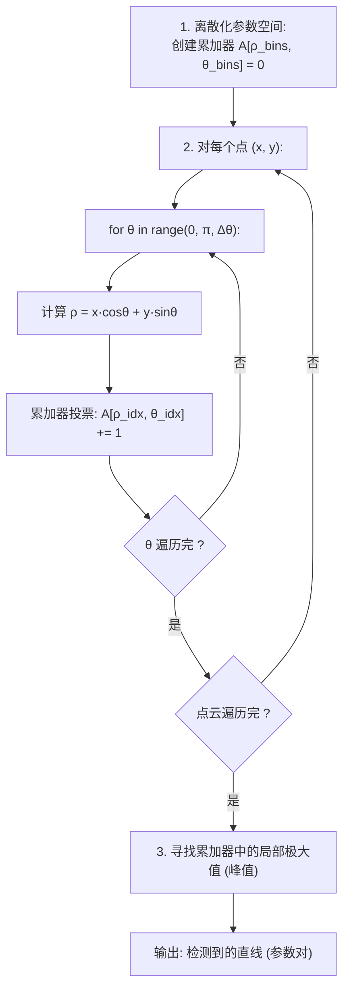

# 三维点云处理：霍夫变换——基于投票机制的鲁棒几何基元检测

最小二乘法对离群点敏感——一个飞点就可能将拟合的平面拉歪。**霍夫变换（Hough Transform）** 采用完全不同的策略：它让每个数据点对"可能生成它的参数"进行**投票**，在参数空间中找出得票最多的候选——这些就是最可能的几何基元。

---

## 一、投票范式的直觉

### 1.1 从数据点到参数空间的映射

霍夫变换的核心思想是**对偶性**：图像空间中的一个点对应于参数空间中的一条曲线（或曲面），而参数空间中的一个点对应于图像空间中的一个几何形状。

```
  图像空间 vs 参数空间的对偶关系

  图像空间 (x-y)                  参数空间 (m-b) 或 (ρ-θ)

  直线: y = mx + b              点: (m, b)

    y ▲                            b ▲
      │  ·                         │         (m₁,b₁)
      │    ·                       │       ·    斜率 m₁
      │  ·   ·                     │    ·        经过 3 个点
      │    ·                      │  ·
      │  ·   ·                    │       ·    斜率 m₂
      └────────────► x           │    ·        经过 2 个点
                                 └─────────────► m

  共线的 3 个点 → 在参数空间中 3 条线交于一点 (m₁, b₁)
  交点处的累加器值 = 3 (最高) → 检测到一条直线穿过 3 个点
```

### 1.2 为什么使用极坐标参数化？

在 $y = mx + b$ 的参数化中，垂直线对应 $m \to \infty$，这在参数空间中无法表示。极坐标参数化解决了这个问题：

$$\rho = x \cos\theta + y \sin\theta$$

其中 $\rho \in [0, \rho_{\max}]$ 是原点到直线的垂直距离，$\theta \in [0, \pi)$ 是垂线与 $x$ 轴的夹角。

```
  直线的极坐标表示

      y ▲
        │  ╱
        │ ╱ 直线
        │╱
        ├─────── ρ (原点到直线的垂直距离)
       ╱│
      ╱ │
     ╱θ │
    ╱   │
   ─────┴──────────► x
    O

  参数: (ρ, θ)
  ρ ≥ 0, θ ∈ [0, π)
```

---

## 二、二维霍夫变换直线检测

### 2.1 标准算法



```python
import numpy as np


def hough_lines_2d(points_2d, theta_res=180, rho_res=200):
    """
    2D 霍夫变换直线检测。

    :param points_2d: N x 2 的点集 (x, y)
    :param theta_res: θ 的分辨率（份数）
    :param rho_res: ρ 的分辨率（份数）
    :return: accumulator, (thetas, rhos), peaks
    """
    x, y = points_2d[:, 0], points_2d[:, 1]

    # 参数空间范围和离散化
    max_rho = np.sqrt(np.max(x)**2 + np.max(y)**2)
    thetas = np.linspace(0, np.pi, theta_res)
    rhos = np.linspace(-max_rho, max_rho, rho_res)

    d_theta = thetas[1] - thetas[0]
    d_rho = rhos[1] - rhos[0]

    # 投票累加器
    accumulator = np.zeros((rho_res, theta_res), dtype=np.int32)

    # 对每个点投票
    cos_thetas = np.cos(thetas)
    sin_thetas = np.sin(thetas)

    for i in range(len(points_2d)):
        rho_values = x[i] * cos_thetas + y[i] * sin_thetas
        rho_indices = ((rho_values + max_rho) / d_rho).astype(np.int32)
        # 边界限制
        rho_indices = np.clip(rho_indices, 0, rho_res - 1)
        accumulator[rho_indices, np.arange(theta_res)] += 1

    return accumulator, thetas, rhos


def find_peaks(accumulator, threshold_ratio=0.3, min_distance=10):
    """
    在累加器矩阵中寻找局部峰值。

    :param accumulator: 累加器矩阵
    :param threshold_ratio: 峰值阈值（相对于最大值）
    :param min_distance: 峰值之间的最小距离（抑制重复检测）
    """
    from scipy.ndimage import maximum_filter
    threshold = accumulator.max() * threshold_ratio

    # 局部极大值检测
    local_max = maximum_filter(accumulator, size=min_distance) == accumulator
    peaks_mask = (accumulator >= threshold) & local_max

    peak_indices = np.argwhere(peaks_mask)
    peak_values = accumulator[peaks_mask]

    # 按票数降序排列
    sort_idx = np.argsort(peak_values)[::-1]
    return peak_indices[sort_idx], peak_values[sort_idx]
```

---

## 三、三维空间中的霍夫变换

### 3.1 三维平面检测

一个平面可以用其法向量的极坐标参数化：

$$x \cos\theta \sin\phi + y \sin\theta \sin\phi + z \cos\phi = \rho$$

```
  三维平面的球坐标参数化

        z ▲
          │  n (法向量)
          │ ╱
          │╱ φ
          ├────────► y
         ╱
        ╱ θ
       ╱
      x

  参数: (ρ, θ, φ)
  ρ ≥ 0: 原点到平面的距离
  θ ∈ [0, 2π): 方位角
  φ ∈ [0, π/2]: 极角
```

但三维霍夫变换需要 3D 累加器 $[\rho_{\text{bins}}, \theta_{\text{bins}}, \phi_{\text{bins}}]$，内存需求为 $O(n_\rho \cdot n_\theta \cdot n_\phi)$。对于高分辨率，内存消耗可能极大（$1000 \times 360 \times 180 \times 4$ 字节 $\approx$ 247 MB）。

### 3.2 优化策略：随机霍夫变换（RHT）

随机霍夫变换不遍历所有参数组合，而是随机采样最小点集来估计参数：

```python
def randomized_hough_3d_plane(points, max_iters=5000, inlier_threshold=0.05,
                              min_inliers=100, theta_bins=180, phi_bins=90,
                              rho_bins=200):
    """
    随机霍夫变换检测三维平面。

    思想: 随机采样 3 个点确定一个平面，对该参数组合投票。

    :param points: N x 3 点云
    :return: 检测到的平面列表 [(ρ, θ, φ, n_inliers), ...]
    """
    N = points.shape[0]
    max_dist = np.linalg.norm(np.max(points, axis=0) - np.min(points, axis=0))

    accumulator = np.zeros((rho_bins, theta_bins, phi_bins), dtype=np.int32)

    thetas = np.linspace(0, 2 * np.pi, theta_bins)
    phis = np.linspace(0, np.pi / 2, phi_bins)
    rhos = np.linspace(0, max_dist, rho_bins)

    for _ in range(max_iters):
        # 随机采样 3 个点
        idx = np.random.choice(N, 3, replace=False)
        sample = points[idx]

        # 计算平面法向量
        v1 = sample[1] - sample[0]
        v2 = sample[2] - sample[0]
        normal = np.cross(v1, v2)
        norm = np.linalg.norm(normal)
        if norm < 1e-10:
            continue
        normal = normal / norm

        # 将法向量转为球坐标 (ρ, θ, φ)
        rho = np.abs(np.dot(normal, sample[0]))
        theta = np.arctan2(normal[1], normal[0])  # [-π, π] → [0, 2π)
        if theta < 0:
            theta += 2 * np.pi
        phi = np.arccos(np.abs(normal[2]))  # [0, π/2]

        # 累加器索引
        rho_idx = int(rho / max_dist * (rho_bins - 1))
        theta_idx = int(theta / (2 * np.pi) * (theta_bins - 1))
        phi_idx = int(phi / (np.pi / 2) * (phi_bins - 1))

        accumulator[rho_idx, theta_idx, phi_idx] += 1

    # 寻找峰值
    peaks = find_3d_peaks(accumulator, threshold_ratio=0.1)

    return [(rhos[p[0]], thetas[p[1]], phis[p[2]], accumulator[p[0], p[1], p[2]])
            for p in peaks]
```

---

## 四、三维霍夫变换的常见应用

### 4.1 球面检测

球面的参数空间为 $(c_x, c_y, c_z, r)$。给定一个点 $p_i$，它在 4D 参数空间中投票给所有"可以生成该点"的球面参数。

然而，使用**法向量辅助**可以将投票轴大大缩减：点的法向量方向指向球心，因此对于点 $p_i$ 和其法向量 $n_i$，球心位于 $c = p_i + r \cdot n_i$，只需在 $r$ 维度扫描：

```python
def hough_sphere_with_normals(points, normals, r_range=(0.1, 2.0), r_bins=100,
                              spatial_bins=50):
    """
    法向量辅助的霍夫球面检测。

    利用法向量方向指向球心的性质，每个点只在射线 p + r·n 上投票。

    :param points: N x 3
    :param normals: N x 3
    :return: 检测到的球体列表
    """
    N = points.shape[0]
    min_bound = np.min(points, axis=0) - r_range[1]
    max_bound = np.max(points, axis=0) + r_range[1]

    # 3D 累加器用于球心位置
    accumulator = np.zeros((spatial_bins, spatial_bins, spatial_bins),
                           dtype=np.int32)

    r_min, r_max = r_range
    dr = (r_max - r_min) / r_bins

    for i in range(N):
        for r_step in range(r_bins):
            r = r_min + r_step * dr
            center_hypothesis = points[i] + r * normals[i]

            # 转为累加器索引
            ci = np.clip(
                ((center_hypothesis - min_bound) /
                 (max_bound - min_bound) * spatial_bins).astype(int),
                0, spatial_bins - 1
            )
            accumulator[ci[0], ci[1], ci[2]] += 1

    return accumulator
```

### 4.2 圆柱检测

圆柱的参数空间为 $(c_x, c_y, c_z, a_x, a_y, a_z, r)$（中心轴上的一个点 + 轴方向 + 半径），是一个 7 维空间。实践中通常将问题分解为：

1. 用霍夫变换检测圆柱轴方向（从法向量在高斯球上的分布中找大圆）。
2. 在投影平面上检测圆心和半径。

---

## 五、霍夫变换的优缺点

| 优点 | 缺点 |
|------|------|
| 对噪声和部分遮挡极其鲁棒 | 参数空间维度高时计算量爆炸 |
| 可同时检测多个几何基元 | 离散化精度与内存的矛盾 |
| 不需要点云的分割预处理 | 对参数分辨率敏感 |
| 可检测中断/不连续的形状 | 峰值检测可能遗漏或假阳性 |

### 5.1 参数选择指南

<svg viewBox="0 0 600 200" width="100%" style="background-color: transparent; font-family: sans-serif; margin: 20px 0; overflow: visible;">
  <!-- Too Coarse (Left) -->
  <g transform="translate(40, 20)">
  <text x="70" y="10" text-anchor="middle" font-size="13" fill="currentColor">1. 太粗 (低分辨率)</text>
  <rect x="10" y="25" width="120" height="120" fill="none" stroke="currentColor" stroke-width="1.5" />
  <line x1="70" y1="25" x2="70" y2="145" stroke="currentColor" stroke-width="1" />
  <line x1="10" y1="85" x2="130" y2="85" stroke="currentColor" stroke-width="1" />
  <rect x="10" y="25" width="60" height="60" fill="rgba(245, 34, 45, 0.4)" stroke="#f5222d" stroke-width="1.5" />
  <circle cx="35" cy="50" r="3" fill="#f5222d" /><circle cx="45" cy="58" r="3" fill="#f5222d" />
  <circle cx="28" cy="40" r="3" fill="#f5222d" /><circle cx="52" cy="42" r="3" fill="#f5222d" />
  <text x="70" y="165" text-anchor="middle" font-size="11" fill="var(--vp-c-text-2)">两条直线在同一单元相加<br/>合并为一个峰值（混叠）</text>
  </g>
  <!-- Moderate (Middle) -->
  <g transform="translate(230, 20)">
  <text x="70" y="10" text-anchor="middle" font-size="13" fill="currentColor">2. 适中 (合理分辨率)</text>
  <rect x="10" y="25" width="120" height="120" fill="none" stroke="currentColor" stroke-width="1.5" />
  <line x1="40" y1="25" x2="40" y2="145" stroke="currentColor" stroke-width="1" />
  <line x1="70" y1="25" x2="70" y2="145" stroke="currentColor" stroke-width="1" />
  <line x1="100" y1="25" x2="100" y2="145" stroke="currentColor" stroke-width="1" />
  <line x1="10" y1="55" x2="130" y2="55" stroke="currentColor" stroke-width="1" />
  <line x1="10" y1="85" x2="130" y2="85" stroke="currentColor" stroke-width="1" />
  <line x1="10" y1="115" x2="130" y2="115" stroke="currentColor" stroke-width="1" />
  <rect x="40" y="25" width="30" height="30" fill="rgba(82, 196, 26, 0.3)" stroke="#52c41a" stroke-width="1.5" />
  <circle cx="55" cy="40" r="3" fill="#52c41a" />
  <rect x="100" y="85" width="30" height="30" fill="rgba(82, 196, 26, 0.3)" stroke="#52c41a" stroke-width="1.5" />
  <circle cx="115" cy="100" r="3" fill="#52c41a" />
  <text x="70" y="165" text-anchor="middle" font-size="11" fill="var(--vp-c-text-2)">两条直线各自产生独立峰值<br/>可准确分离与检测</text>
  </g>
  <!-- Too Fine (Right) -->
  <g transform="translate(420, 20)">
  <text x="70" y="10" text-anchor="middle" font-size="13" fill="currentColor">3. 太细 (高分辨率)</text>
  <rect x="10" y="25" width="120" height="120" fill="none" stroke="currentColor" stroke-width="1.5" />
  <g opacity="0.6">
  <line x1="25" y1="25" x2="25" y2="145" stroke="currentColor" stroke-width="0.5" />
  <line x1="40" y1="25" x2="40" y2="145" stroke="currentColor" stroke-width="0.5" />
  <line x1="55" y1="25" x2="55" y2="145" stroke="currentColor" stroke-width="0.5" />
  <line x1="70" y1="25" x2="70" y2="145" stroke="currentColor" stroke-width="0.5" />
  <line x1="85" y1="25" x2="85" y2="145" stroke="currentColor" stroke-width="0.5" />
  <line x1="100" y1="25" x2="100" y2="145" stroke="currentColor" stroke-width="0.5" />
  <line x1="115" y1="25" x2="115" y2="145" stroke="currentColor" stroke-width="0.5" />
  <line x1="10" y1="40" x2="130" y2="40" stroke="currentColor" stroke-width="0.5" />
  <line x1="10" y1="55" x2="130" y2="55" stroke="currentColor" stroke-width="0.5" />
  <line x1="10" y1="70" x2="130" y2="70" stroke="currentColor" stroke-width="0.5" />
  <line x1="10" y1="85" x2="130" y2="85" stroke="currentColor" stroke-width="0.5" />
  <line x1="10" y1="100" x2="130" y2="100" stroke="currentColor" stroke-width="0.5" />
  <line x1="10" y1="115" x2="130" y2="115" stroke="currentColor" stroke-width="0.5" />
  <line x1="10" y1="130" x2="130" y2="130" stroke="currentColor" stroke-width="0.5" />
  </g>
  <rect x="40" y="40" width="15" height="15" fill="rgba(250, 140, 22, 0.15)" stroke="#fa8c16" stroke-width="0.5" />
  <circle cx="47" cy="47" r="2" fill="#fa8c16" />
  <rect x="55" y="55" width="15" height="15" fill="rgba(250, 140, 22, 0.15)" stroke="#fa8c16" stroke-width="0.5" />
  <circle cx="62" cy="62" r="2" fill="#fa8c16" />
  <rect x="100" y="85" width="15" height="15" fill="rgba(250, 140, 22, 0.15)" stroke="#fa8c16" stroke-width="0.5" />
  <circle cx="107" cy="92" r="2" fill="#fa8c16" />
  <text x="70" y="165" text-anchor="middle" font-size="11" fill="var(--vp-c-text-2)">票数分散在相邻单元<br/>导致找不到明显的峰值</text>
  </g>
</svg>

---

## 六、总结

| 概念 | 要点 |
|------|------|
| **核心思想** | 每个点对"可能生成它的参数"投票，在参数空间中找最高票 |
| **关键优势** | 鲁棒性：离群点在参数空间无法形成高票峰值 |
| **关键劣势** | 维度诅咒：参数空间的离散化随维度指数增长 |
| **3D 平面** | 3D 累加器 $(\rho, \theta, \phi)$，RHT 可加速 |
| **3D 球面** | 法向量辅助将投票降为 1D 射线搜索 |
| **实用建议** | 对于高维霍夫变换，优先使用 RANSAC（下一章） |

霍夫变换的优雅之处在于它将"寻找几何形状"这个看似模式识别的问题，转化为了"寻找直方图峰值"这个简单的统计问题。然而，当参数空间维度超过 3 时，存储和计算成本急剧增加。下一章将学习 **RANSAC**——一种解决同样问题的不同方法，它通过反复随机采样并假设检验来绕过维度诅咒。

> **工程法则**：当参数维度 $\leq 3$ 时，霍夫变换是首选；当参数维度 $\geq 4$ 时，通常 RANSAC 更实用。
