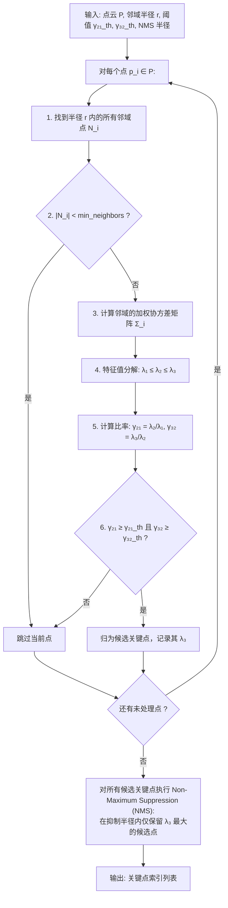

# 三维点云处理：ISS 固有形状特征点检测——基于特征值比率的鲁棒关键点

**ISS（Intrinsic Shape Signatures，固有形状特征）** 是 Yu Zhong 于 2009 年提出的三维关键点检测算法。与 Harris 3D 相比，ISS 通过分析局部邻域协方差矩阵的特征值**比率**（而非绝对值）来判断点的重要性，使其对点密度变化和尺度变化具有天然的鲁棒性。

ISS 被广泛认为是目前最稳健的三维关键点检测器之一，也是 PCL（Point Cloud Library）和 Open3D 中的默认关键点检测方案。

---

## 一、ISS 的核心思想

### 1.1 特征值比率的几何意义

ISS 定义一个点 $p_i$ 的"显著性"基于其局部邻域协方差矩阵 $\Sigma_i$ 的两个特征值比率：

$$\gamma_{21} = \frac{\lambda_2}{\lambda_1}, \quad \gamma_{32} = \frac{\lambda_3}{\lambda_2}$$

其中 $\lambda_1 \leq \lambda_2 \leq \lambda_3$ 是 $\Sigma_i$ 的三个特征值（升序）。

```
  不同点类型的特征值比率

  类型         λ₁    λ₂    λ₃    γ₂₁=λ₂/λ₁   γ₃₂=λ₃/λ₂   判定
  ───────────────────────────────────────────────────────────────
  噪声/散点    接近  接近  接近     ≈ 1          ≈ 1       非显著
              (球状分布)
  平面点       小    中    中       >> 1         ≈ 1       非显著
              (面分布)
  边缘点       小    小    大       ≈ 1          >> 1      中等
              (线分布)
  角点         中    中    大       >> 1         >> 1      ✅ 显著
              (两个方向变化大)
```

**ISS 核心判断**：一个点是好的特征点，当且仅当它在两个主方向上都有显著的变化（即 $\gamma_{21}$ 和 $\gamma_{32}$ 都大于某个阈值）。

---

## 二、ISS 算法流程



---

## 三、数学细节

### 3.1 加权的局部协方差

与 Harris 3D 使用 K 近邻略有不同，ISS 通常使用半径邻域并给邻域点加权重：

$$w_j = \frac{1}{\|p_j - p_i\|_2} \quad \text{或} \quad w_j = \exp\left(-\frac{\|p_j - p_i\|^2}{2\sigma^2}\right)$$

**为什么加权？** 离查询点更近的点对其局部几何形态的影响更大，应该赋予更高的权重。这不仅提高了检测的稳定性，还减小了半径选择带来的边界效应。

### 3.2 为什么特征值比率而非绝对值？

特征值 $\lambda_k$ 的绝对值取决于点的尺度（邻域半径 $r$）和数据坐标范围。而比率 $\gamma_{21}$ 和 $\gamma_{32}$ 是**无量纲**的——它们只描述局部形状的 anisotropy（各向异性程度），不依赖于绝对尺度。

> 这是 ISS 比 Harris 3D 更鲁棒的根本原因：Harris 3D 的响应函数涉及特征值的绝对大小，而 ISS 只用比率。

### 3.3 显著性排序

在 NMS 阶段，ISS 使用 $\lambda_3$（最大特征值）作为显著性排序准则——$\lambda_3$ 越大，表明点的主方向变化越剧烈，信息越丰富。

---

## 四、Python 实现

```python
import numpy as np
from scipy.spatial import KDTree


def iss_keypoints(points, salient_radius=0.1, non_max_radius=0.15,
                  gamma_21_threshold=0.975, gamma_32_threshold=0.975,
                  min_neighbors=5, angle_threshold=None):
    """
    ISS (Intrinsic Shape Signatures) 关键点检测。

    :param points: N x 3 点云坐标
    :param salient_radius: 邻域半径 r（用于计算特征值比率）
    :param non_max_radius: NMS 抑制半径
    :param gamma_21_threshold: γ₂₁ = λ₂/λ₁ 的上限阈值 (＜1, 需足够大)
    :param gamma_32_threshold: γ₃₂ = λ₃/λ₂ 的上限阈值 (＜1, 需足够大)
    :param min_neighbors: 最小邻域点数
    :param angle_threshold: 可选的法向量角度过滤
    :return: keypoint_indices
    """
    N = points.shape[0]
    tree = KDTree(points)

    # ── 第一步：筛选候选关键点 ──
    keypoint_candidates = []
    lambda3_values = []

    for i in range(N):
        # 1. 半径邻域搜索
        indices = tree.query_ball_point(points[i], salient_radius)

        if len(indices) < min_neighbors:
            continue

        neighborhood = points[indices]

        # 2. 加权协方差矩阵
        centroid = np.mean(neighborhood, axis=0)
        centered = neighborhood - centroid

        # 距离加权
        dists = np.linalg.norm(centered, axis=1)
        weights = 1.0 / (dists + 1e-10)
        weights = weights / weights.sum()

        cov = np.zeros((3, 3))
        for j, pt in enumerate(centered):
            cov += weights[j] * np.outer(pt, pt)

        # 3. 特征值分解
        eigenvalues = np.linalg.eigvalsh(cov)  # 升序: λ₁ ≤ λ₂ ≤ λ₃
        l1, l2, l3 = eigenvalues[0], eigenvalues[1], eigenvalues[2]

        if l1 < 1e-12:
            continue  # 退化情况

        # 4. 特征值比率检验
        gamma_21 = l2 / l1
        gamma_32 = l3 / l2

        if gamma_21 < gamma_21_threshold or gamma_32 < gamma_32_threshold:
            continue

        keypoint_candidates.append(i)
        lambda3_values.append(l3)

    # ── 第二步：非极大值抑制 (NMS) ──
    # 按 λ₃ 降序排列（最显著的点优先）
    candidates = np.array(keypoint_candidates)
    lambda3_arr = np.array(lambda3_values)
    sort_idx = np.argsort(lambda3_arr)[::-1]

    selected = np.zeros(len(candidates), dtype=bool)

    for idx in sort_idx:
        if selected[idx]:
            continue

        pt = points[candidates[idx]]

        # 在抑制半径内查找其他候选点并抑制
        neighbors = tree.query_ball_point(pt, non_max_radius)
        for n in neighbors:
            if n in candidates:
                n_local = np.where(candidates == n)[0]
                if len(n_local) > 0:
                    selected[n_local[0]] = True

        # 重新激活当前点（它是局部最优的）
        selected[idx] = True

    final_keypoints = candidates[selected]

    print(f"[ISS] 原始点: {N}, 候选点: {len(candidates)}, "
          f"最终关键点: {len(final_keypoints)} "
          f"({100*len(final_keypoints)/N:.2f}%)")

    return final_keypoints
```

---

## 五、使用 Open3D 的 ISS 实现

Open3D 提供了高度优化的 ISS 关键点检测：

```python
import open3d as o3d
import numpy as np


def open3d_iss_demo(pcd):
    """
    使用 Open3D 内置的 ISS 关键点检测。
    """
    # 设置 ISS 参数
    # 注意: Open3D 的接口将 salient_radius 和 non_max_radius 统一管理
    keypoints = o3d.geometry.keypoint.compute_iss_keypoints(
        pcd,
        salient_radius=0.05,         # 用于计算特征值比率
        non_max_radius=0.08,         # 用于 NMS
        gamma_21=0.975,              # λ₂/λ₁ 阈值
        gamma_32=0.975,              # λ₃/λ₂ 阈值
        min_neighbors=5              # 最小邻域点数
    )

    print(f"原始点数: {len(pcd.points)}")
    print(f"ISS 关键点数: {len(keypoints.points)}")

    # 可视化
    keypoints.paint_uniform_color([1.0, 0.0, 0.0])  # 红色标注关键点
    pcd.paint_uniform_color([0.6, 0.6, 0.7])         # 灰色点云

    o3d.visualization.draw_geometries([pcd, keypoints])

    return keypoints
```

---

## 六、ISS vs Harris 3D 实验对比

<svg viewBox="0 0 600 180" width="100%" style="background-color: transparent; font-family: sans-serif; margin: 20px 0; overflow: visible;">
  <!-- Original Point Cloud (Left) -->
  <g transform="translate(40, 20)">
  <rect x="0" y="20" width="140" height="100" fill="rgba(100, 100, 100, 0.05)" stroke="var(--vp-c-divider)" stroke-width="1.5" rx="6" />
  <text x="70" y="10" text-anchor="middle" font-size="13" fill="currentColor">原始点云</text>
  <!-- Surface outline points in grey -->
  <g fill="var(--vp-c-text-3)" opacity="0.6">
  <circle cx="20" cy="50" r="2" /><circle cx="35" cy="40" r="2" /><circle cx="50" cy="35" r="2" />
  <circle cx="70" cy="35" r="2" /><circle cx="90" cy="40" r="2" /><circle cx="110" cy="50" r="2" />
  <circle cx="120" cy="70" r="2" /><circle cx="110" cy="90" r="2" /><circle cx="90" cy="100" r="2" />
  <circle cx="70" cy="105" r="2" /><circle cx="50" cy="100" r="2" /><circle cx="35" cy="90" r="2" />
  <circle cx="20" cy="70" r="2" />
  <!-- Inner points -->
  <circle cx="50" cy="65" r="2" /><circle cx="70" cy="70" r="2" /><circle cx="90" cy="65" r="2" />
  <circle cx="60" cy="85" r="2" /><circle cx="80" cy="85" r="2" />
  </g>
  <text x="70" y="140" text-anchor="middle" font-size="11" fill="var(--vp-c-text-2)">存在噪声和边缘不均</text>
  </g>
  <!-- Harris 3D (Middle) -->
  <g transform="translate(230, 20)">
  <rect x="0" y="20" width="140" height="100" fill="rgba(100, 100, 100, 0.05)" stroke="var(--vp-c-divider)" stroke-width="1.5" rx="6" />
  <text x="70" y="10" text-anchor="middle" font-size="13" fill="currentColor">Harris 3D</text>
  <!-- Points clustered strictly on high curvature / edges (red) -->
  <g fill="#f5222d">
  <circle cx="20" cy="50" r="4.5" />
  <circle cx="110" cy="50" r="4.5" />
  <circle cx="20" cy="70" r="4.5" />
  <circle cx="120" cy="70" r="4.5" />
  <circle cx="70" cy="105" r="4.5" />
  </g>
  <text x="70" y="140" text-anchor="middle" font-size="11" fill="#f5222d">聚类于高曲率边缘且对噪敏感</text>
  </g>
  <!-- ISS (Right) -->
  <g transform="translate(420, 20)">
  <rect x="0" y="20" width="140" height="100" fill="rgba(100, 100, 100, 0.05)" stroke="var(--vp-c-divider)" stroke-width="1.5" rx="6" />
  <text x="70" y="10" text-anchor="middle" font-size="13" fill="currentColor">ISS (固有形状)</text>
  <!-- Points evenly distributed on features (green) -->
  <g fill="#52c41a">
  <circle cx="35" cy="40" r="4.5" />
  <circle cx="70" cy="35" r="4.5" />
  <circle cx="90" cy="40" r="4.5" />
  <circle cx="50" cy="65" r="4.5" />
  <circle cx="90" cy="65" r="4.5" />
  <circle cx="70" cy="105" r="4.5" />
  </g>
  <text x="70" y="140" text-anchor="middle" font-size="11" fill="#52c41a">特征点均匀分布，抗噪性强</text>
  </g>
</svg>

| 维度 | Harris 3D | ISS |
|------|-----------|-----|
| **响应度量** | 特征值绝对值的组合 | 特征值比率（无量纲） |
| **尺度鲁棒性** | 较差 | 好（比率不随尺度变化） |
| **密度鲁棒性** | 较差 | 好 |
| **计算复杂度** | $O(NK)$ | $O(NK)$（KD-Tree 邻域 + 3×3 特征分解） |
| **参数敏感度** | 对 harris_k 敏感 | 对 $\gamma$ 阈值相对鲁棒 |
| **可重复性** | 0.4–0.6 | 0.6–0.8（评测中通常更优） |

---

## 七、参数选择指南

| 参数 | 推荐值 | 选择策略 |
|------|--------|----------|
| **salient_radius** | 点云分辨率的 5–10 倍 | 太小→噪声敏感；太大→丢失细节特征 |
| **non_max_radius** | $\approx 1.5 \times$ salient_radius | 太近→特征点过密；太远→丢失特征点 |
| **$\gamma_{21}$ 阈值** | 0.85–0.975 | 越小→越宽松（更多候选）；越接近 1→越严格 |
| **$\gamma_{32}$ 阈值** | 0.85–0.975 | 同上 |
| **min_neighbors** | 5–10 | 用于排除孤立噪声点 |

> **点云分辨率估算**：对随机采样 1000 个点，计算每个点到最近邻的平均距离，取中位数。

```python
def estimate_point_cloud_resolution(pcd, sample_size=1000):
    """估算点云分辨率（平均点间距）"""
    points = np.asarray(pcd.points)
    if len(points) > sample_size:
        points = points[np.random.choice(len(points), sample_size, replace=False)]
    tree = KDTree(points)
    dists, _ = tree.query(points, k=2)
    return np.median(dists[:, 1])
```

---

## 八、总结

| 概念 | 要点 |
|------|------|
| **ISS 核心** | 用特征值比率 $\gamma_{21}$ 和 $\gamma_{32}$ 判断局部几何的各向异性 |
| **为何鲁棒** | 比率是无量纲的，不随尺度和密度变化 |
| **两步筛选** | (1) 比率阈值筛选候选点; (2) NMS（以 $\lambda_3$ 排序）确保空间分散 |
| **最佳场景** | 几何结构丰富、密度不均的大规模点云 |

检测到关键点只是第一步。为了让不同视角的关键点能够相互匹配，我们需要为每个关键点计算一个**特征描述子（Descriptor）**——这就是下一章的主题。

下一章将学习 **PFH（点特征直方图）和 FPFH（快速点特征直方图）**——两种最经典的三维局部特征描述子。
