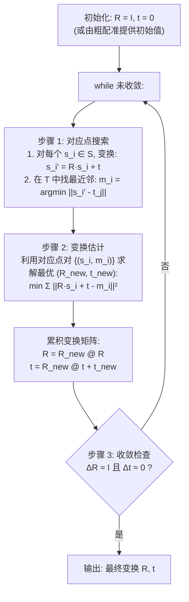

# 三维点云处理：ICP 迭代最近点配准算法——原理、变体与工程实践

**点云配准（Point Cloud Registration）** 是将两个或多个不同视角的点云对齐到同一坐标系的算法。它是三维重建、SLAM 和多传感器融合的核心技术。

**ICP（Iterative Closest Point，迭代最近点）** 自 1992 年由 Besl 和 McKay 提出以来，一直是点云配准的标准算法。它的基本思想极其简单：反复执行"找最近对应点 → 求解刚体变换"直到收敛。

---

## 一、问题定义

### 1.1 刚体配准的数学表述

给定源点云 $S = \{s_i\}_{i=1}^{N_s}$ 和目标点云 $T = \{t_j\}_{j=1}^{N_t}$，寻找刚体变换 $(R, t)$ 使得：

$$\min_{R, t} \sum_{i=1}^{N_s} \|R s_i + t - m_i\|^2$$

其中 $R \in SO(3)$（旋转矩阵），$t \in \mathbb{R}^3$（平移向量），$m_i \in T$ 是 $s_i$ 在目标点云中的对应点。

**这是一个鸡生蛋、蛋生鸡的问题**：要找到对应点需要知道 $(R, t)$，但要求解 $(R, t)$ 又需要知道对应点。

### 1.2 ICP 的迭代策略

ICP 的解决方案：**先猜对应点，再求变换；用更好的变换找更好的对应点；重复。**



---

## 二、SVD 闭式解：求解刚体变换

### 2.1 Point-to-Point 的单步优化

给定 $N$ 对对应点 $(s_i, m_i)$，目标是：

$$\min_{R, t} \sum_{i=1}^N \|R s_i + t - m_i\|^2$$

**去耦合技巧**：质心相减消去平移。

$$\bar{s} = \frac{1}{N} \sum s_i, \quad \bar{m} = \frac{1}{N} \sum m_i$$

$$\hat{s}_i = s_i - \bar{s}, \quad \hat{m}_i = m_i - \bar{m}$$

此时最优平移为：

$$t^* = \bar{m} - R \bar{s}$$

旋转问题简化为：

$$\min_{R \in SO(3)} \sum_{i=1}^N \|\hat{m}_i - R \hat{s}_i\|^2 = \min_R \|\hat{M} - R \hat{S}\|_F^2$$

其中 $\hat{S} = [\hat{s}_1, \ldots, \hat{s}_N] \in \mathbb{R}^{3 \times N}$，$\hat{M}$ 同。

### 2.2 SVD 求解旋转——正交 Procrustes 问题

**定理（Kabsch-Umeyama）** ：最优旋转为 $R^* = V U^T$，其中：

$$H = \hat{S} \hat{M}^T = U \Sigma V^T \quad \text{(SVD)}$$

为确保 $R^*$ 是合法旋转矩阵（$\det(R) = +1$ 而非 $-1$），需要修正：

$$R^* = V \begin{bmatrix} 1 & 0 & 0 \\ 0 & 1 & 0 \\ 0 & 0 & \det(VU^T) \end{bmatrix} U^T$$

### 2.3 Python 实现

```python
import numpy as np


def solve_rigid_transform_svd(source, target):
    """
    SVD 求解最优刚体变换 (Point-to-Point)。

    :param source: N x 3 源点云
    :param target: N x 3 目标点云 (与 source 一一对应)
    :return: R (3x3), t (3,)
    """
    # 1. 去质心
    centroid_src = np.mean(source, axis=0)
    centroid_tgt = np.mean(target, axis=0)
    src_centered = source - centroid_src
    tgt_centered = target - centroid_tgt

    # 2. 计算互协方差矩阵 H
    H = src_centered.T @ tgt_centered  # 3 x 3

    # 3. SVD
    U, _, Vt = np.linalg.svd(H)

    # 4. 计算旋转矩阵 (含 mirror 修正)
    R = Vt.T @ U.T
    if np.linalg.det(R) < 0:
        Vt[-1, :] *= -1
        R = Vt.T @ U.T

    # 5. 平移
    t = centroid_tgt - R @ centroid_src

    return R, t


def icp_point_to_point(source, target, max_iters=50, tol=1e-6):
    """
    ICP 主循环 — Point-to-Point 版本。

    :param source: N_s x 3
    :param target: N_t x 3
    :return: R (3x3), t (3,), history
    """
    from scipy.spatial import KDTree

    R = np.eye(3)
    t = np.zeros(3)
    src_current = source.copy()
    target_tree = KDTree(target)
    history = []

    for iteration in range(max_iters):
        # ── 步骤 1: 找最近对应点 ──
        src_transformed = (R @ src_current.T).T + t  # N_s x 3
        distances, indices = target_tree.query(src_transformed)

        # 筛选有效对应（距离不过大）
        valid_mask = distances < np.median(distances) * 3
        src_corr = source[valid_mask]
        tgt_corr = target[indices[valid_mask]]

        if len(src_corr) < 3:
            break

        # ── 步骤 2: SVD 求解变换 ──
        R_new, t_new = solve_rigid_transform_svd(src_corr, tgt_corr)

        # ── 步骤 3: 累积变换 ──
        R = R_new @ R
        t = R_new @ t + t_new

        # ── 步骤 4: 收敛检查 ──
        delta_R = np.linalg.norm(R_new - np.eye(3), 'fro')
        delta_t = np.linalg.norm(t_new)

        mean_dist = np.mean(distances[valid_mask])
        history.append(mean_dist)

        if delta_R < tol and delta_t < tol:
            print(f"[ICP] 第 {iteration+1} 轮收敛 "
                  f"(ΔR={delta_R:.2e}, Δt={delta_t:.2e})")
            break
    else:
        print(f"[ICP] 达到最大迭代次数 {max_iters}")

    return R, t, history
```

---

## 三、Point-to-Plane ICP

### 3.1 误差定义

Point-to-Plane 使用沿目标点法向量方向的投影距离：

$$E(R, t) = \sum_{i=1}^N \left((R s_i + t - m_i) \cdot n_{m_i}\right)^2$$

其中 $n_{m_i}$ 是目标点 $m_i$ 处的法向量。

  Point-to-Point vs Point-to-Plane
<svg viewBox="0 0 600 220" width="100%" style="background-color: transparent; font-family: sans-serif; margin: 20px 0; overflow: visible;">
  <!-- Point-to-Point (Left) -->
  <g transform="translate(60, 20)">
  <text x="100" y="0" text-anchor="middle" font-size="14" fill="currentColor">Point-to-Point (点对点)</text>
  <!-- Source point s_i' -->
  <circle cx="60" cy="40" r="4.5" fill="#1677ff" />
  <text x="60" y="28" text-anchor="middle" font-size="11" fill="#1677ff">s_i'</text>
  <!-- Target point m_i -->
  <circle cx="140" cy="120" r="4.5" fill="#fa8c16" />
  <text x="140" y="135" text-anchor="middle" font-size="11" fill="#fa8c16">m_i</text>
  <!-- Distance vector -->
  <line x1="60" y1="40" x2="135" y2="115" stroke="#f5222d" stroke-width="2" marker-end="url(#arrow-red-icp)" />
  <text x="120" y="70" font-size="12" fill="#f5222d">d = ||s_i' - m_i||</text>
  <text x="100" y="170" text-anchor="middle" font-size="12" fill="var(--vp-c-text-2)">对平面内滑动无惩罚<br/>收敛较慢、容易陷入局部最优</text>
  </g>
  <!-- Point-to-Plane (Right) -->
  <g transform="translate(340, 20)">
  <text x="120" y="0" text-anchor="middle" font-size="14" fill="currentColor">Point-to-Plane (点对面)</text>
  <!-- Source point s_i' -->
  <circle cx="70" cy="40" r="4.5" fill="#1677ff" />
  <text x="70" y="28" text-anchor="middle" font-size="11" fill="#1677ff">s_i'</text>
  <!-- Target point m_i -->
  <circle cx="150" cy="120" r="4.5" fill="#fa8c16" />
  <text x="165" y="128" font-size="11" fill="#fa8c16">m_i</text>
  <!-- Tangent Plane -->
  <line x1="70" y1="120" x2="230" y2="120" stroke="currentColor" stroke-width="2" />
  <text x="210" y="135" font-size="11" fill="var(--vp-c-text-2)">切平面</text>
  <!-- Normal n -->
  <line x1="150" y1="120" x2="150" y2="70" stroke="#52c41a" stroke-width="2" marker-end="url(#arrow-green-icp)" />
  <text x="158" y="78" font-size="12" fill="#52c41a">n</text>
  <!-- Projected distance (orthogonal projection onto normal) -->
  <line x1="70" y1="40" x2="150" y2="40" stroke="#f5222d" stroke-width="1.5" stroke-dasharray="3 3" />
  <line x1="150" y1="40" x2="150" y2="120" stroke="#f5222d" stroke-width="1.5" stroke-dasharray="3 3" />
  <line x1="70" y1="40" x2="70" y2="120" stroke="#f5222d" stroke-width="2.5" marker-end="url(#arrow-red-icp)" />
  <text x="15" y="85" font-size="12" fill="#f5222d">d = (s_i' - m_i) · n</text>
  <text x="150" y="170" text-anchor="middle" font-size="12" fill="var(--vp-c-text-2)">正确惩罚了“离开表面”的垂直偏移<br/>收敛快、在面状场景中极精确</text>
  </g>
  <!-- Markers -->
  <defs>
  <marker id="arrow-red-icp" viewBox="0 0 10 10" refX="6" refY="5" markerWidth="5" markerHeight="5" orient="auto">
  <path d="M 0 1.5 L 8 5 L 0 8.5 z" fill="#f5222d" />
  </marker>
  <marker id="arrow-green-icp" viewBox="0 0 10 10" refX="6" refY="5" markerWidth="5" markerHeight="5" orient="auto">
  <path d="M 0 1.5 L 8 5 L 0 8.5 z" fill="#52c41a" />
  </marker>
  </defs>
</svg>

### 3.2 线性近似求解

Point-to-Plane 是非线性问题（与 $R$ 的元素非线性相关），但在小角度假设下可线性化。设 $\Delta R \approx I + [\omega]_\times$（$\omega$ 为旋转向量），则有：

$$\min_{\omega, t} \sum_i \left((s_i + \omega \times s_i + t - m_i) \cdot n_{m_i}\right)^2$$

展开为 $Ax = b$ 的线性最小二乘问题：

$$A_i = \begin{bmatrix} (s_i \times n_{m_i})^T & n_{m_i}^T \end{bmatrix}$$

$$b_i = (m_i - s_i) \cdot n_{m_i}$$

```python
def icp_point_to_plane(source, target, target_normals, max_iters=50, tol=1e-6):
    """
    ICP — Point-to-Plane 版本（线性近似求解）。

    :param source: N_s x 3
    :param target: N_t x 3
    :param target_normals: N_t x 3 目标点云法向量
    :return: R, t
    """
    from scipy.spatial import KDTree

    R = np.eye(3)
    t = np.zeros(3)
    target_tree = KDTree(target)

    for iteration in range(max_iters):
        # ── 1. 找对应 ──
        src_transformed = (R @ source.T).T + t
        distances, indices = target_tree.query(src_transformed)

        valid = distances < np.median(distances) * 3
        s = source[valid]
        m = target[indices[valid]]
        n = target_normals[indices[valid]]

        if len(s) < 6:
            break

        # ── 2. 构建线性系统 ──
        # 未知数 x = [ω_x, ω_y, ω_z, t_x, t_y, t_z]^T (6,)
        A = np.zeros((len(s), 6))
        b = np.zeros(len(s))

        for i in range(len(s)):
            # ω × s_i 的雅可比
            A[i, :3] = np.cross(s[i], n[i])  # (s_i × n_i)^T
            A[i, 3:] = n[i]                   # n_i^T
            b[i] = np.dot(m[i] - s[i], n[i])

        # ── 3. 求解增量 ──
        x, _, _, _ = np.linalg.lstsq(A, b, rcond=None)
        omega, delta_t = x[:3], x[3:]

        # 从旋转向量重建增量旋转矩阵 (Rodrigues)
        theta = np.linalg.norm(omega)
        if theta > 1e-10:
            axis = omega / theta
            K = np.array([
                [0, -axis[2], axis[1]],
                [axis[2], 0, -axis[0]],
                [-axis[1], axis[0], 0]
            ])
            dR = np.eye(3) + np.sin(theta) * K + (1 - np.cos(theta)) * K @ K
        else:
            dR = np.eye(3)

        # ── 4. 累积 ──
        R = dR @ R
        t = dR @ t + delta_t

        # ── 5. 收敛 ──
        if np.linalg.norm(omega) < tol and np.linalg.norm(delta_t) < tol:
            print(f"[ICP P2Plane] 第 {iteration+1} 轮收敛")
            break

    return R, t
```

---

## 四、完整配准流水线（Open3D）

```python
import open3d as o3d
import numpy as np


def full_registration_pipeline(source, target, voxel_size=0.05):
    """
    完整的点云配准流水线：粗配准 (FPFH + RANSAC) + 精配准 (ICP)。

    :param source: 源点云
    :param target: 目标点云
    :param voxel_size: 体素下采样尺寸
    :return: transformation_matrix (4x4)
    """
    # ── 预处理 ──
    src_down = source.voxel_down_sample(voxel_size)
    tgt_down = target.voxel_down_sample(voxel_size)

    src_down.estimate_normals(o3d.geometry.KDTreeSearchParamKNN(30))
    tgt_down.estimate_normals(o3d.geometry.KDTreeSearchParamKNN(30))

    # ── 粗配准: FPFH + RANSAC ──
    src_fpfh = o3d.pipelines.registration.compute_fpfh_feature(
        src_down, o3d.geometry.KDTreeSearchParamKNN(30)
    )
    tgt_fpfh = o3d.pipelines.registration.compute_fpfh_feature(
        tgt_down, o3d.geometry.KDTreeSearchParamKNN(30)
    )

    distance_threshold = voxel_size * 1.5
    ransac_result = o3d.pipelines.registration.registration_ransac_based_on_feature_matching(
        src_down, tgt_down, src_fpfh, tgt_fpfh,
        mutual_filter=True,
        max_correspondence_distance=distance_threshold,
        estimation_method=o3d.pipelines.registration.TransformationEstimationPointToPoint(),
        ransac_n=3,
        checkers=[
            o3d.pipelines.registration.CorrespondenceCheckerBasedOnEdgeLength(0.9),
            o3d.pipelines.registration.CorrespondenceCheckerBasedOnDistance(distance_threshold)
        ],
        criteria=o3d.pipelines.registration.RANSACConvergenceCriteria(100000, 0.999)
    )

    print(f"[粗配准] fitness={ransac_result.fitness:.3f}, "
          f"inlier_rmse={ransac_result.inlier_rmse:.4f}")

    # ── 精配准: Point-to-Plane ICP ──
    icp_result = o3d.pipelines.registration.registration_icp(
        source, target,
        max_correspondence_distance=voxel_size * 0.4,
        init=ransac_result.transformation,
        estimation_method=o3d.pipelines.registration.TransformationEstimationPointToPlane(),
        criteria=o3d.pipelines.registration.ICPConvergenceCriteria(
            relative_fitness=1e-6,
            relative_rmse=1e-6,
            max_iteration=100
        )
    )

    print(f"[ICP 精配准] fitness={icp_result.fitness:.3f}, "
          f"inlier_rmse={icp_result.inlier_rmse:.4f}")

    return icp_result.transformation


# 使用示例
# T = full_registration_pipeline(pcd_source, pcd_target)
# pcd_source.transform(T)
# o3d.visualization.draw_geometries([pcd_source, pcd_target])
```

---

## 五、ICP 的局限性与改进

| 局限性 | 改进方法 |
|--------|----------|
| **需要好的初始位姿**（否则陷入局部最优） | 先用 RANSAC/FPFH 粗配准 |
| **对噪声和异常值敏感** | 使用鲁棒核函数（Huber/Tukey） |
| **部分重叠时精度下降** | 使用重叠度检测 + 对应筛选 |
| **收敛速度依赖对应点质量** | 使用 Point-to-Plane 误差项 |
| **对大规模点云慢** | 下采样 + KD-Tree 加速 |

### 5.1 鲁棒核函数

```python
def huber_weight(residual, k=0.1):
    """Huber 鲁棒核函数"""
    abs_r = np.abs(residual)
    return np.where(abs_r <= k, 1.0, k / abs_r)
```

---

## 六、总结

| 概念 | 要点 |
|------|------|
| **ICP 本质** | 交替执行"最近对应"和"SVD 求解变换"，保证收敛到局部最优 |
| **Point-to-Point** | SVD 解析解（Kabsch 算法），对切平面滑动不敏感 |
| **Point-to-Plane** | 线性化求解，利用法向量信息，收敛更快更精确 |
| **初始位姿** | ICP 的致命弱点——必须提供合理的初始猜测 |
| **工程实践** | 粗配准（FPFH+RANSAC）→ 精配准（Point-to-Plane ICP） |

下一章将学习 **NDT（正态分布变换）** 配准——一种不依赖显式对应点搜索的替代配准方法，在某些场景下比 ICP 更鲁棒。
