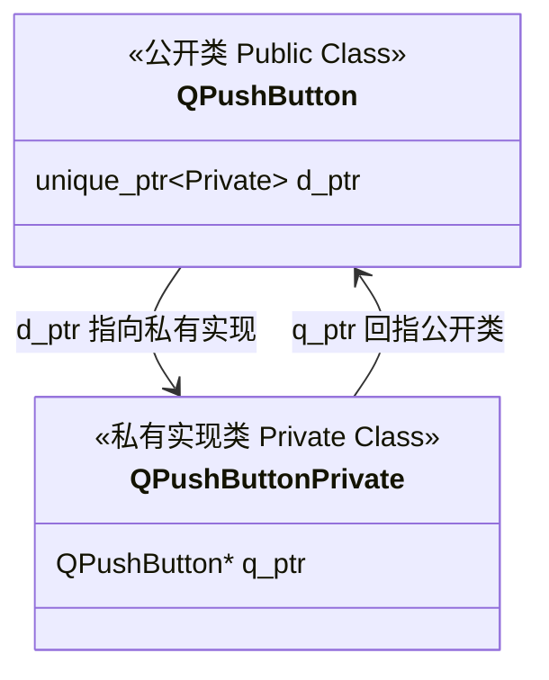

# Qt 核心架构：QObject 树与 d_ptr、q_ptr 私有实现机制

在 Qt 框架中，所有核心类的祖先都是 `QObject`。它是 Qt 核心机制的承载者。研究 `QObject` 的内部设计，能帮我们彻底理清两个关键机制：**对象树自动内存释放** 以及 Qt 专属的 Pimpl 变体—— **d_ptr 与 q_ptr 私有实现机制**。

本篇将深入剖析这些架构设计，帮助你在工程实践中避开内存安全陷阱。

---

## 1. QObject 树与内存半自动释放

在 Qt 中，创建控件时我们通常会传入一个 `parent` 指针：
```cpp
QPushButton* button = new QPushButton("Click me", this); // this (MainWindow) 是其父对象
```
这就是在构建 **QObject 对象树**。

### 1.1 自动释放机制
* 当一个 `QObject` 被创建并指定父对象时，它会自动将自己添加到父对象的 `children()` 列表中。
* **析构规则**：当父对象（如 `MainWindow`）被析构释放时，它会在自己的析构函数中自动遍历并 `delete` 它所有的子对象。这极大地减轻了 C++ 手动管理内存的负担。

### 1.2 ️ 致命红线：对象树与栈上析构顺序冲突
对象树虽然好用，但如果将生命周期不同的局部变量混合声明在**栈区 (Stack)**，极易触发程序崩溃（Double Free）：

```cpp
void create_widgets() {
    QWidget window;           // 栈上声明父窗口
    QPushButton button(&window); // 栈上声明按钮，并建立父子关系
} // 退出作用域析构发生
```
#### 崩溃解析：
在 C++ 中，栈区变量的析构顺序是**后构造的先析构**（类似于栈的后进先出）：
1. 退出作用域时，`button` 先析构。它会主动向父对象 `window` 报告：“我已经被销毁了，请把我从你的孩子列表里删掉。” `window` 收到并将其移除。
2. 随后，`window` 析构。此时它的孩子列表为空，安全释放。这是正常流程。

**如果颠倒声明顺序：**
```cpp
void create_widgets_failed() {
    QPushButton button; // 先构造，后析构
    QWidget window;     // 后构造，先析构
    button.setParent(&window); // 建立父子关系
}
```
1. 退出作用域，`window` 后构造，因而先析构。由于 `button` 是它的孩子，`window` 的析构函数中会直接调用 `delete &button`。
2. 但是，`button` 分配在栈上，**对栈地址调用 `delete` 是严重的非法操作**，会导致程序直接 Crash 崩溃！

> 💡 **黄金法则**：在 Qt 中，通过 `new` 在堆上分配子对象是最安全可靠的。如果必须在栈上创建，务必确保**父对象先于子对象构造**（即父对象声明在最上面）。

---

## 2. Qt 的 Pimpl 实现：d_ptr 与 q_ptr 机制

为了保证组件库的 **ABI（二进制兼容性）** 稳定，防止私有变量的修改导致外部调用端崩溃，Qt 全面应用了 Pimpl（具体实现指针）模式。在 Qt 中，这一模式被标准化为了 `d_ptr` 和 `q_ptr` 指针。



* **`d_ptr` (data pointer)**：指向私有实现类的指针。存在于公开类中，用于在公开接口中访问具体的私有数据。
* **`q_ptr` (QObject pointer)**：指向公开类的指针。存在于私有类中，用于私有实现方法中向公开类发送信号（`emit`）或调用公开接口。

---

## 3. Qt 独特的“平行继承树”设计

经典的 Pimpl 模式下，如果 `Class B` 继承自 `Class A`，两者都有自己的 Pimpl 指针，对象内存中就会存在两个独立的实现类指针，造成内存开销和间接寻址开销。

Qt 采用了一种巧妙的 **“平行继承树”** 设计：
* **公开类继承树**：`QObject` $\rightarrow$ `QWidget` $\rightarrow$ `QPushButton`
* **私有类继承树**：`QObjectPrivate` $\rightarrow$ `QWidgetPrivate` $\rightarrow$ `QPushButtonPrivate`

### 核心机制：
1. **单一指针**：只有最底层的基类 `QObject` 声明了唯一的 `d_ptr`。所有的子类都**共享并复用**这同一个指针。
2. **多态转换**：子类通过虚函数或类型强转，将父类的 `QObjectPrivate* d_ptr` 转换为对应的子类私有指针（如 `QPushButtonPrivate*`），极大地节省了显存开销。

---

## 4. 详解 Qt 三大魔术宏

为了让开发者免于编写复杂的类型强转代码，Qt 提供了三个核心宏：

### 4.1 `Q_DECLARE_PRIVATE(Class)`
声明在公开类（如 `Widget`）的头文件中。它会自动生成一个友元类声明，并定义内联辅助函数 `d_func()`，用于执行类型强转：
```cpp
// 宏展开效果近似于：
inline WidgetPrivate* d_func() { 
    return reinterpret_cast<WidgetPrivate*>(qGetPtrHelper(d_ptr)); 
}
```

### 4.2 `Q_D(Class)`
使用在公开类的源文件（`.cpp`）中。它会在当前函数的作用域内定义一个局部指针 `d`，指向具体的私有类：
```cpp
void Widget::resize(int w, int h) {
    Q_D(Widget); // 展开为：WidgetPrivate* const d = d_func();
    d->width = w;  // 之后即可通过简洁的 d-> 直接操作私有变量
    d->height = h;
}
```

### 4.3 `Q_Q(Class)`
使用在私有类（`.cpp`）的方法中。它会在当前作用域内定义一个局部指针 `q`，指向对应的公开类对象：
```cpp
void WidgetPrivate::updateHelper() {
    Q_Q(Widget); // 展开为：Widget* const q = q_func();
    emit q->sig_updated(); // 通过 q-> 调用公开接口或发出信号
}
```
