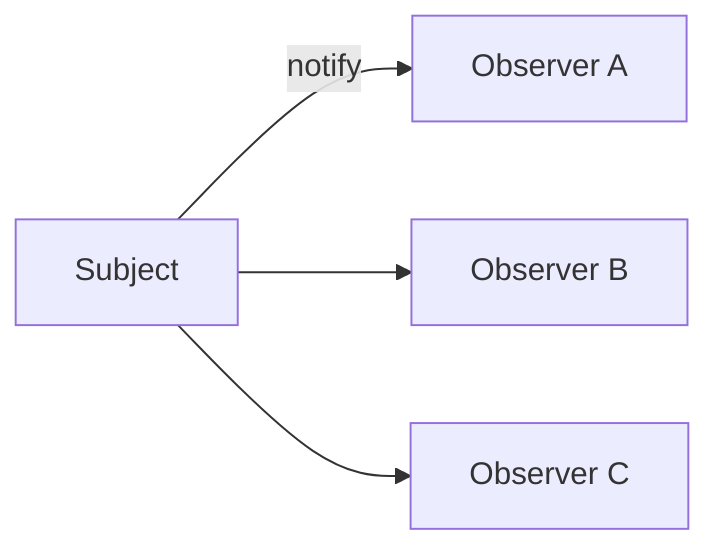
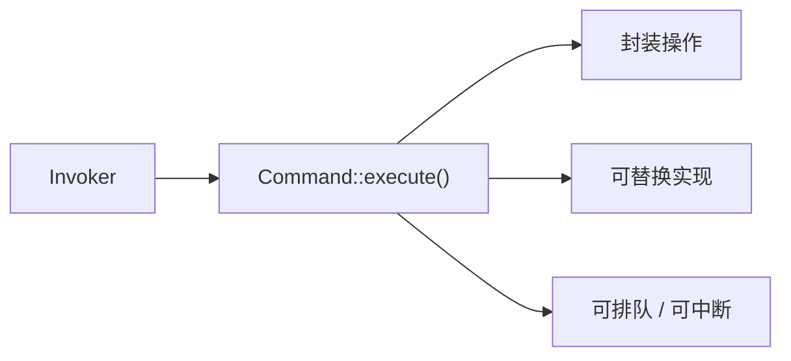
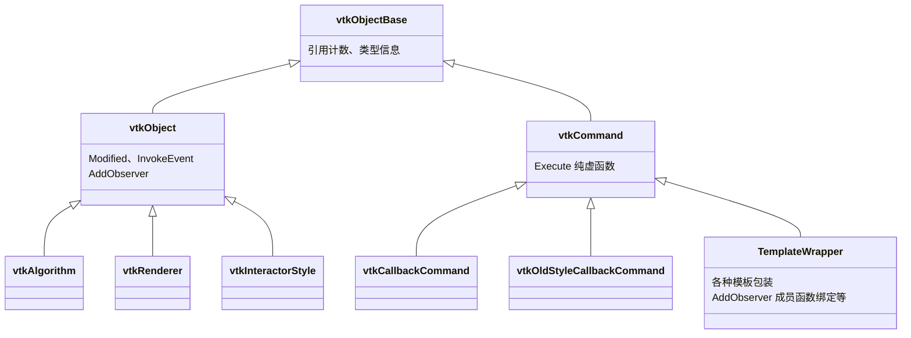
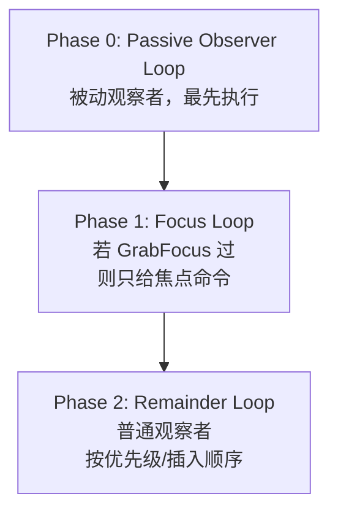
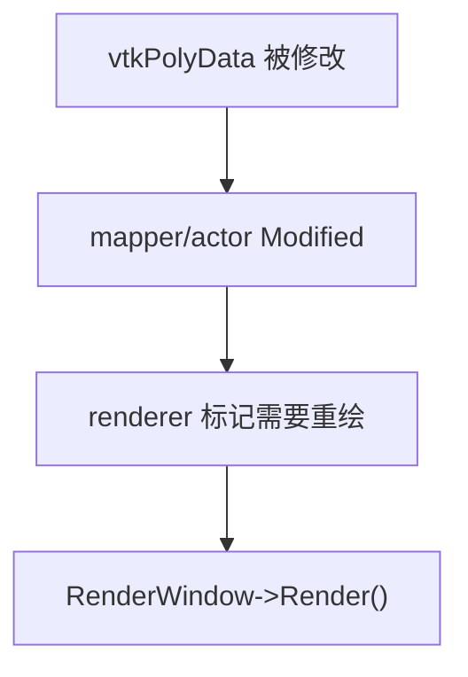
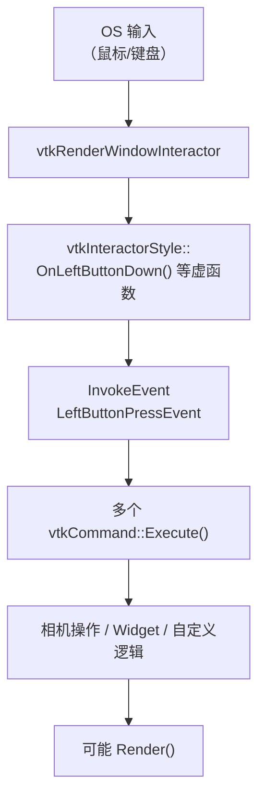
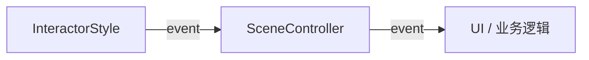
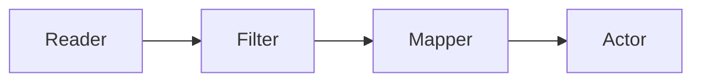
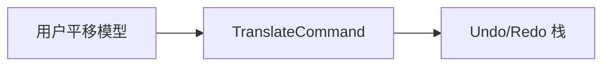
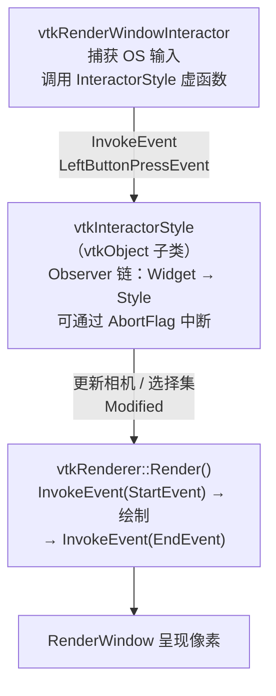

---
title: VTK 中的观察者模式与命令模式：机制、渲染链路与本质
description: >
  本文基于 VTK 官方 API 与 Kitware 开源源码梳理，不依赖任何特定业务项目。  主要参考：`Common/Core/vtkObject.cxx`、`Common/Core/vtkCommand.h`、`Rendering/Core/vtkRenderer.cxx`、`Inter
---

# VTK 中的观察者模式与命令模式：机制、渲染链路与本质

本文基于 VTK 官方 API 与 Kitware 开源源码梳理，不依赖任何特定业务项目。
 主要参考：`Common/Core/vtkObject.cxx`、`Common/Core/vtkCommand.h`、`Rendering/Core/vtkRenderer.cxx`、`Interaction/Style/vtkInteractorStyle.cxx`。

---

### 写在前面：这不是两篇东西，而是一套机制

很多人第一次读 VTK 文档时，会把「观察者模式」和「命令模式」当成两个独立话题。但 VTK 官方在 `vtkCommand.h` 的类注释里写得很直白：

>

*vtkCommand is an implementation of the **observer/command** design pattern.*

也就是说：

- **观察者模式**解决的是：*谁订阅、谁广播、如何一对多通知*；
- **命令模式**解决的是：*通知到了以后，具体执行什么逻辑，以及如何封装、替换、中断这条逻辑链*。

在 VTK 里，这两件事通过同一条 API 缝合在一起：

```
unsigned long tag = someVtkObject->AddObserver(vtkCommand::SomeEvent, someCommand, priority);
someVtkObject->InvokeEvent(vtkCommand::SomeEvent, callData);

```

`AddObserver` 是观察者订阅；`vtkCommand` 是命令对象；`InvokeEvent` 是事件广播。
 **分开理解概念，结合理解 VTK。**

---

### 1. 从设计模式本质说起

#### 1.1 观察者模式（Observer）

经典结构：



核心性质：

| 性质 | 含义  |
| 一对多 | 一个 Subject 可有多个 Observer  |
| 松耦合 | Subject 不知道 Observer 的具体类型  |
| 动态订阅 | 运行期可 Add / Remove  |
| 推模型 | 状态变化时主动通知，而不是轮询  |

在 VTK 中，几乎所有可交互对象都继承 `vtkObject`，而 `vtkObject` 内部持有一个 `vtkSubjectHelper`，专门管理 observer 列表。

#### 1.2 命令模式（Command）

经典结构：



核心性质：

| 性质 | 含义  |
| 行为对象化 | 把「做什么」变成对象，而不是散落的全局函数  |
| 统一接口 | 所有命令通过同一 `Execute()` 入口  |
| 可组合 | 多个命令可链式处理同一事件  |
| 可截断 | 某个命令处理完后可声明「后续不用再执行」  |

在 VTK 中，这个统一接口就是：

```
virtual void Execute(vtkObject* caller, unsigned long eventId, void* callData) = 0;

```

#### 1.3 VTK 为什么要把两者合并？

C++ 里没有 Java 式的 `interface Observer { void update(); }` 泛型回调体系，VTK 又需要：

- 与引用计数体系 `vtkObjectBase::Register/UnRegister` 兼容；
- 支持 C 风格静态回调、C++ 成员函数、Lambda 包装；
- 支持**优先级**、**事件中断**、**焦点捕获**；
- 在渲染与交互这种高频路径上保持足够轻量。

所以 VTK 没有单独做一个 `vtkObserver` 抽象类，而是让 **`vtkCommand` 同时承担 Observer 的回调职责**。

---

### 2. VTK 核心类关系



#### 2.1 `vtkObject`：Subject

`vtkObject` 对外的关键 API：

```
unsigned long AddObserver(unsigned long event, vtkCommand*, float priority = 0.0f);
void RemoveObserver(unsigned long tag);
void RemoveObservers(unsigned long event, vtkCommand* = nullptr);
vtkTypeBool InvokeEvent(unsigned long event, void* callData = nullptr);

```

内部并不自己维护链表，而是委托给 `vtkSubjectHelper`：

```
// vtkObject.cxx（概念摘录）
vtkTypeBool vtkObject::InvokeEvent(unsigned long event, void* callData)
{
  if (this->SubjectHelper)
    return this->SubjectHelper->InvokeEvent(event, callData, this);
  return 0;
}

```

`vtkObject::Modified()` 也会触发 `ModifiedEvent`，这是数据驱动视图刷新最常见的入口之一。

#### 2.2 `vtkCommand`：Command + Observer 回调体

`vtkCommand.h` 中的官方说明（意译）：

- `vtkRenderer` 在开始渲染时触发 `StartEvent`，结束时触发 `EndEvent`；
- `vtkAlgorithm` 子类在处理数据时触发 `StartEvent / ProgressEvent / EndEvent`；
- 监听这些事件，需要使用 `vtkObject::AddObserver()`，并传入 `vtkCommand` 实例。

`vtkCommand` 还内置了两类非常重要的控制位：

| 成员 | 作用  |
| `AbortFlag` | 当前命令执行后，是否中断后续 observer  |
| `PassiveObserver` | 标记为「被动观察者」，只观察、不应改变系统状态  |

此外还有 `vtkCommand::AnyEvent`，可订阅所有事件，常用于调试或通用日志。

---

### 3. 事件是如何被分发的：`vtkSubjectHelper::InvokeEvent`

这是理解 VTK 事件系统**本质**的关键函数，源码在 `Common/Core/vtkObject.cxx`。

#### 3.1 总体流程

当调用 `obj->InvokeEvent(event, callData)` 时，`vtkSubjectHelper` 并不是简单 foreach 一遍列表，而是分 **三个阶段**：



源码注释（摘录）：

```
// 0. Passive observer loop
//   执行 PassiveObserver 为 true 的 observer。
//   这些 observer 不应改变系统状态，也不应 abort 事件。

// 1. Focus loop
//   若存在 focus holder，只执行与焦点关联的 observer。

// 2. Remainder loop
//   若没有 focus 已处理事件，则执行剩余 observer。

```

#### 3.2 为什么要分三段？

**Passive Observer** 典型用途：性能统计、调试、只读埋点。
 它最先执行，且设计上不应改变场景状态。

**Focus** 典型用途：3D Widget、交互工具临时「接管」鼠标事件。
 例如一个处于选中状态的 widget 需要先处理 `LeftButtonPressEvent`，处理完可 `AbortFlagOn()`，阻止后续 interactor style 再处理同一个事件。

**Remainder** 则是常规业务观察者：刷新 UI、同步相机、更新标注等。

#### 3.3 `AbortFlag`：事件链上的「熔断器」

在 Focus / Remainder 阶段，每个命令执行前会：

```
cmd->SetAbortFlag(0);
cmd->Execute(self, event, callData);
if (cmd->GetAbortFlag())
{
  return 1;  // 事件被中止，后续 observer 不再执行
}

```

这正是 `vtkCommand.h` 所说：

>

*The ordering/aborting of events is important for things like 3D widgets, which handle an event if the widget is selected (and then aborting further processing of that event).*

**本质**：VTK 的事件系统不是广播完就结束，而是一个**可中断的责任链（Chain of Responsibility）**。

#### 3.4 优先级与调用顺序

`AddObserver(event, cmd, priority)` 的 `priority` 越高，越先执行（默认 0）。
 相同优先级下，调用顺序受「插入顺序」与历史兼容逻辑影响。VTK 官方文档专门说明了这一点：

- 文档：[vtkObject Observers - observer invocation order](https://docs.vtk.org/en/latest/advanced/observer_invocation_order.html)
- 若业务上要求两个 observer 的相对顺序稳定，**必须显式设置 priority**，不要依赖默认行为。

#### 3.5 重入与递归安全

`InvokeEvent` 支持重入：一个 observer 的 `Execute()` 里可能再次 `InvokeEvent`。
 为此 `vtkSubjectHelper` 使用 `ListModified` 栈记录递归深度，并规定：

- 在本次 `InvokeEvent` 调用之后才加入的 observer（tag >= maxTag）**不会**在本次分发中执行；
- 回调中若修改 observer 列表，迭代器会按 `upper_bound` 重新定位。

这说明 VTK 的事件系统是为「复杂交互 / 渲染回调」设计的，而不是简单的函数指针列表。

---

### 4. 渲染链路中的观察者：以 `vtkRenderer` 为例

VTK 渲染并不是黑盒 `Render()` 一次画完，它在关键节点**主动发事件**，让外部有机会插入逻辑。

#### 4.1 `vtkRenderer::Render()` 中的 StartEvent / EndEvent

在 `Rendering/Core/vtkRenderer.cxx` 中，一次渲染大致如下：

```
void vtkRenderer::Render()
{
  if (!this->Draw)
    return;

  this->InvokeEvent(vtkCommand::StartEvent, nullptr);

  // ... 可见性裁剪、遍历 Prop、调用底层 DeviceRender ...

  this->InvokeEvent(vtkCommand::EndEvent, nullptr);
}

```

**本质**：

- `StartEvent` / `EndEvent` 是渲染阶段的**生命周期钩子**；
- 任何对象都可以 `renderer->AddObserver(StartEvent, cmd)` 来挂载前后处理；
- 这与 GUI 框架里的 `beforePaint / afterPaint` 类似，但位于 VTK 渲染管线内部。

#### 4.2 相机相关事件

`vtkRenderer` 还会在相机状态变化时发事件，例如：

| 事件 | 典型时机 | callData  |
| `ActiveCameraEvent` | 激活相机切换 | 指向 `vtkCamera*`  |
| `CreateCameraEvent` | 创建新相机 | 指向新 `vtkCamera*`  |
| `ResetCameraEvent` | ResetCamera | 通常指向 renderer 自身  |
| `ResetCameraClippingRangeEvent` | 自动调整裁剪范围 | 通常指向 renderer 自身  |
| `ComputeVisiblePropBoundsEvent` | 计算场景包围盒 | 通常指向 renderer 自身  |

这些事件让「自动 fit 场景」「同步多视口相机」「更新坐标轴」不必侵入 `vtkRenderer` 源码，而是通过 observer 外挂。

#### 4.3 `ModifiedEvent`：数据变化驱动重绘

任何 `vtkObject` 调用 `Modified()` 时：

```
this->ModifiedTime.Modified();
this->InvokeEvent(vtkCommand::ModifiedEvent, nullptr);

```

渲染侧常见模式：



很多应用会在 actor 或 interactor style 上挂 `ModifiedEvent` observer，在回调里调用 `RenderWindow->Render()`。
 **注意**：`ModifiedEvent` 可能非常频繁，不应在回调里做重计算。

#### 4.4 渲染事件 vs 数据管线事件

容易混淆的两套事件：

| 来源 | 典型事件 | 语义  |
| `vtkAlgorithm` | `StartEvent / ProgressEvent / EndEvent` | 数据过滤、读取、计算进度  |
| `vtkRenderer` | `StartEvent / EndEvent` | 一帧图像绘制前后  |
| `vtkRenderWindow` | `WindowResizeEvent` 等 | 窗口级事件  |

它们共用同一套 `vtkCommand` 机制，但**语义完全不同**。写 observer 时要先搞清楚「监听的是数据算法还是绘制器」。

---

### 5. 交互链路：从鼠标到命令链

交互是 VTK 事件系统最复杂的应用场景。

#### 5.1 典型调用栈（概念）



`vtkInteractorStyle` 并不只是「一个策略类」，它本身也是 `vtkObject`，会对外广播标准输入事件。

#### 5.2 VTK 自带类中的典型用法

下面三段都来自 **VTK 发行版自带模块**，不依赖任何上层应用框架。

**例 1：监听 `vtkRenderer` 的 `ResetCameraClippingRangeEvent`**

相机自动调整近远裁剪面时，renderer 会 `InvokeEvent`。应用层可同步更新坐标轴、HUD 等：

```
void OnClippingRange(vtkObject* caller, unsigned long, void* clientData, void*)
{
  auto* view = static_cast<MyView*>(clientData);
  view->syncOverlayBounds(vtkRenderer::SafeDownCast(caller));
}

vtkNew<vtkCallbackCommand> cmd;
cmd->SetCallback(OnClippingRange);
cmd->SetClientData(this);
renderer->AddObserver(vtkCommand::ResetCameraClippingRangeEvent, cmd);

```

**例 2：用 `vtkInteractorStyleRubberBand2D` 做框选**

框选完成后，Style 会发出 `SelectionChangedEvent`；subject 是 **InteractorStyle**，不是 Renderer：

```
void OnRubberBandSelection(vtkObject* o, unsigned long, void* clientData, void* callData)
{
  auto* style = vtkInteractorStyleRubberBand2D::SafeDownCast(o);
  static_cast<MyPicker*>(clientData)->onRubberBand(style, callData);
}

vtkNew<vtkInteractorStyleRubberBand2D> rubberStyle;
interactor->SetInteractorStyle(rubberStyle);

vtkNew<vtkCallbackCommand> selCmd;
selCmd->SetCallback(OnRubberBandSelection);
selCmd->SetClientData(&picker);
rubberStyle->AddObserver(vtkCommand::SelectionChangedEvent, selCmd);

```

说明：**任何 `vtkObject` 子类都能当 Subject**，不限于 renderer。

**例 3：应用自己的 `vtkObject` 子类向上层广播**

VTK 应用里常封装一个「场景控制器」继承 `vtkObject`，在内部状态变化时再 `InvokeEvent`，把 VTK 层与 UI 层隔开：

```
class SceneController : public vtkObject {
public:
  static SceneController* New();
  vtkTypeMacro(SceneController, vtkObject);
  void notifySelectionChanged(vtkIdType id) {
    this->SelectedId = id;
    this->InvokeEvent(vtkCommand::SelectionChangedEvent, &this->SelectedId);
  }
private:
  vtkIdType SelectedId = -1;
};

```

UI 或业务模块 `AddObserver(SelectionChangedEvent, ...)` 即可，形成：



一层层都是 Observer + Command，只是职责不同。

#### 5.3 `vtkInteractorStyle` 与交互生命周期事件

`vtkInteractorStyleTrackballCamera`（轨道球旋转）等标准 Style 在拖拽过程中会触发：

- `vtkCommand::StartInteractionEvent` — 开始交互（按下并拖动）
- `vtkCommand::InteractionEvent` — 交互进行中
- `vtkCommand::EndInteractionEvent` — 交互结束（松开）

可在 Style 或 Interactor 上监听，用于：

- 交互时隐藏辅助线、降低渲染质量换帧率；
- 松手后做一次高质量 `Render()`；
- 统计用户操作时长。

```
interactor->AddObserver(vtkCommand::StartInteractionEvent, cmd);
interactor->AddObserver(vtkCommand::EndInteractionEvent, cmd);

```

**本质**：把「用户正在拖拽」抽象成可订阅的事件，而不必在定时器里轮询鼠标状态。

---

### 6. 如何编写 Command：从 C 回调到成员函数

#### 6.1 `vtkCallbackCommand`：最原始的命令对象

适合 C 风格静态函数：

```
void MyCallback(vtkObject* caller, unsigned long eventId, void* clientData, void* callData)
{
  auto* self = static_cast<MyClass*>(clientData);
  self->onEvent(caller, eventId, callData);
}

vtkNew<vtkCallbackCommand> cmd;
cmd->SetCallback(MyCallback);
cmd->SetClientData(this);

obj->AddObserver(vtkCommand::ProgressEvent, cmd);

```

**特点**：

- 与 VTK 早期 C API 风格一致；
- `clientData` 需要自行管理生命周期；
- 很多 VTK 内部代码仍使用这种模式。

#### 6.2 成员函数绑定：`vtkObject::AddObserver` 模板重载

VTK 在 `vtkObject.h` 中提供模板，可直接把**成员函数**绑成 observer，无需手写 `vtkCallbackCommand`：

```
class MyView : public vtkObject {
public:
  static MyView* New();
  vtkTypeMacro(MyView, vtkObject);
  void OnRendererModified(vtkObject* caller, unsigned long eventId, void* callData) {
    if (eventId == vtkCommand::ModifiedEvent)
      this->requestRender();
  }
};

// 注册
auto* view = MyView::New();
renderer->AddObserver(vtkCommand::ModifiedEvent, view, &MyView::OnRendererModified);

```

内部会生成 `vtkClassMemberCallback`，在 `RemoveObserver` 时自动清理，比裸 `clientData` 更安全。

若项目里已有自定义 `vtkCommand` 子类（封装状态、复用逻辑），也可继续用 **6.1 的 `vtkCallbackCommand`** 或 **第 11 节的子类写法**。

#### 6.3 该选哪种？

| 方式 | 适用场景  |
| `vtkCallbackCommand` | C 风格静态函数、`clientData` 传 `this`  |
| `AddObserver(..., &Class::Method)` 模板 | C++ 成员函数，VTK 内置包装  |
| 自定义 `vtkCommand` 子类 | 需保存复杂状态、多处复用同一命令对象  |

---

### 7. `callData`：事件携带的「上下文载荷」

`InvokeEvent(event, callData)` 的第二个参数经常被忽略，但它非常重要。

官方说明：

>

*callData is nullptr most of the time.*
 *The callData is not specific to a type of event but specific to a type of vtkObject invoking a specific event.*

也就是说：**同一种事件，不同 subject 传来的 callData 可能完全不同。**

常见例子：

| 事件 | callData 含义  |
| `ProgressEvent` | 通常指向 `double`，范围 0.0~1.0  |
| `ErrorEvent / WarningEvent` | `const char*` 消息文本  |
| `SelectionChangedEvent` | 可能是 `vtkSelection*`，也可能是整数数组  |
| `ResetCameraEvent` | `vtkRenderer` 可能传 `this` 指针  |

**实践建议**：

- 订阅事件前，先查 VTK 文档或源码中该 subject 的 `InvokeEvent` 调用点；
- 不要假设所有 `LeftButtonPressEvent` 都带 `QMouseEvent*`——只有 Qt 集成层才这样；
- 对 `callData` 做类型转换前，确认 subject 类型。

---

### 8. 与「Pipeline」和「应用层 Command」的区分

#### 8.1 VTK Pipeline 不是 Command Pattern

`vtkAlgorithm::Update()` 驱动的



是**数据流管道（Pipeline）**，不是 GoF 命令模式。
 它也有 `StartEvent/EndEvent`，但那只是算法执行的生命周期通知，不等于「可撤销的操作对象」。

#### 8.2 应用层的 Undo/Redo Command 是另一套东西

很多 VTK 应用（包括 CAD/医学影像软件）会在 UI 层实现自己的 `CommandManager`：



这与 `vtkCommand` **名字相近、层次不同**：

| | `vtkCommand` | 应用层 Undo Command  |
| 层次 | VTK 内核事件回调 | 业务逻辑 / 编辑操作  |
| 接口 | `Execute(caller, eventId, callData)` | `execute() / undo() / redo()`  |
| 目的 | 响应 VTK 对象事件 | 记录用户可撤销操作  |

读 VTK 源码或写应用时，务必分清这两层。

---

### 9. 常见陷阱与最佳实践

#### 9.1 忘记 `RemoveObserver` 导致悬空回调

`vtkCommand` 通过引用计数存活，但 `clientData` 或成员函数绑定的 `this` 指针不会自动失效。
 对象销毁前应：

```
obj->RemoveObservers(vtkCommand::ModifiedEvent, callback);
// 或按 tag 移除
obj->RemoveObserver(tag);

```

#### 9.2 在 `Execute()` 里做重活

尤其是 `ModifiedEvent`、鼠标移动事件，频率极高。
 应只做轻量标记，例如：

```
void OnModified(...) { this->NeedsRender = true; }

```

真正的 `Render()` 放到事件循环空闲或节流后执行。

#### 9.3 回调里增删 observer

`vtkSubjectHelper` 虽做了一定保护，但官方明确警告：Passive observer 不应在回调里 Add/Remove observer。
 尽量在初始化/析构阶段管理订阅。

#### 9.4 滥用 `AbortFlag`

`AbortFlag` 适合 widget 消费事件，不应作为普通业务逻辑的控制流工具。
 错误使用会导致其他合法 observer 永远收不到事件。

#### 9.5 优先级默认值依赖

需要严格顺序时，显式设置 `priority`，参考 VTK 官方 observer order 文档。

---

### 10. 一张总图：渲染 + 交互 + 观察者/命令



> 贯穿全程的机制：`vtkObject::AddObserver(event, vtkCommand*, priority)`、`vtkCommand::Execute(caller, eventId, callData)`

---

### 11. 最小可运行示例（理解用）

下面是一段独立于任何大型项目的伪代码，展示「渲染前后挂钩」：

```
class RenderLogger : public vtkCommand
{
public:
  static RenderLogger* New() { return new RenderLogger; }

  void Execute(vtkObject* caller, unsigned long eventId, void*) override
  {
  if (eventId == vtkCommand::StartEvent)
    std::cout << "Render start\n";
  else if (eventId == vtkCommand::EndEvent)
    std::cout << "Render end\n";
  }
};

// 使用
vtkNew<RenderLogger> logger;
renderer->AddObserver(vtkCommand::StartEvent, logger);
renderer->AddObserver(vtkCommand::EndEvent, logger);
renderWindow->Render();

```

交互事件同理，只是把 subject 换成 `interactor` 或 `interactorStyle`。

---

### 12. 总结：一句话抓住本质

| 概念 | 在 VTK 中的落点 | 本质问题  |
| 观察者模式 | `vtkObject` + `AddObserver` + `InvokeEvent` | **谁通知谁？**  |
| 命令模式 | `vtkCommand::Execute` | **通知后执行什么？**  |
| 责任链 | `priority` + `AbortFlag` + `GrabFocus` | **谁优先处理？何时停止传递？**  |
| 渲染集成 | `vtkRenderer` 的 `Start/EndEvent` | **如何在绘制生命周期插入逻辑？**  |
| 交互集成 | `vtkInteractorStyle` 输入事件 | **如何把鼠标键盘变成可订阅命令链？**  |

VTK 并不是「用了两种设计模式」，而是实现了一套 **以 `vtkObject` 为事件总线、以 `vtkCommand` 为执行体、带优先级与中断的观察者-命令混合框架**。
 读懂 `vtkSubjectHelper::InvokeEvent` 的三段分发，就读懂了 VTK 事件系统的大半本质。

---

### 重点与注意（进阶速记）

>

**重点**：VTK 把 Observer 与 Command **焊在一起**——`AddObserver` 订阅，`vtkCommand::Execute` 执行；别把它拆成两个互不相关的模式去理解。
 **重点**：`InvokeEvent` 三阶段：Passive（只读）→ Focus（`GrabFocus`）→ Remainder；`AbortFlag` 为 true 则**整链截断**。
 **重点**：`vtkCommand` ≠ `QUndoCommand` ≠ Pipeline；三者名字或场景相近，语义完全不同。
 **注意**：`callData` 类型**不由 eventId 决定**，而由**谁 InvokeEvent** 决定——排错时必须先查发射点源码。
 **注意**：需要稳定 observer 顺序时**必须设 priority**，不要依赖默认插入顺序（见官方 observer invocation order 文档）。
 **注意**：`ModifiedEvent` 极高频，回调里只做轻量标记，真正 `Render()` 应节流或合并。

---

### 13. 延伸阅读（源码与文档）

| 资源 | 路径 / 链接  |
| 事件命令基类 | [VTK `Common/Core/vtkCommand.h`](https://github.com/Kitware/VTK/blob/master/Common/Core/vtkCommand.h)  |
| Subject 实现 | [VTK `Common/Core/vtkObject.cxx`](https://github.com/Kitware/VTK/blob/master/Common/Core/vtkObject.cxx)（`vtkSubjectHelper::InvokeEvent`）  |
| 渲染事件 | [VTK `Rendering/Core/vtkRenderer.cxx`](https://github.com/Kitware/VTK/blob/master/Rendering/Core/vtkRenderer.cxx)  |
| Observer 调用顺序 | [VTK Docs: observer invocation order](https://docs.vtk.org/en/latest/advanced/observer_invocation_order.html)  |
| 轨道球交互 Style | [VTK `vtkInteractorStyleTrackballCamera`](https://vtk.org/doc/nightly/html/classvtkInteractorStyleTrackballCamera.html)  |
| 框选 Style | [VTK `vtkInteractorStyleRubberBand2D`](https://vtk.org/doc/nightly/html/classvtkInteractorStyleRubberBand2D.html)  |
| 3D Widget（Focus / AbortFlag） | [VTK Widgets 模块概览](https://vtk.org/doc/nightly/html/group__Interaction__Widgets.html)  |

---

*文档版本：2026-07-07*
 *供 VTK 学习者参考*
