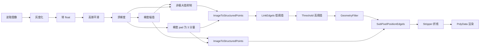

# Python VTK Canny 边缘检测：从数学原理到代码实现

本文整理自《VTK 图形图像开发进阶》中 Canny 算子章节，并结合 Canny 原始论文与 VTK 官方示例，补全数学推导、算法细节与可运行代码。配套脚本见 [`canny_vtk_demo.py`](canny_vtk_demo.py)，安装 VTK 后可直接运行，无需额外测试数据。

---

### 1. 引言

**Canny 边缘检测**由 John F. Canny 于 1986 年提出，是多阶段、基于梯度的经典边缘检测算法。与单一卷积核（如 Sobel、Prewitt）不同，Canny 将边缘检测拆成五个串行步骤，在**抗噪**、**定位精度**和**单像素细化**之间取得较好平衡。

Canny 的设计遵循三条准则：

- **低错误率**：尽量检测真实边缘，抑制噪声伪边缘；
- **高定位精度**：检测到的边缘应尽可能贴近真实边缘位置；
- **单一响应**：同一条真实边缘只产生一次响应，避免“一条边多条线”。

在 VTK 中，**没有**一个名为 `vtkImageCannyEdgeDetection` 的单一 Filter 封装完整流程；官方推荐通过多个 Imaging / General Filter 串联实现，并将边缘结果以 **Edgels（边缘元）→ Polyline** 的几何形式输出。这正是本文重点讲解的方式。

---

### 2. Canny 算法的五个步骤

#### 2.1 第一步：高斯平滑（降噪）

原始图像含噪声，而梯度算子会放大噪声。Canny 首先用高斯核对图像平滑：

         G

         (

         x

         ,

         y

         )

         =

          1

           2

           π

            σ

            2

         exp

         ⁡
         ⁣

          (

          −

             x

             2

            +

             y

             2

            2

             σ

             2

          )

         G(x, y) = \frac{1}{2\pi\sigma^2} \exp\!\left(-\frac{x^2 + y^2}{2\sigma^2}\right)

     G(x,y)=2πσ21​exp(−2σ2x2+y2​)

平滑后的图像：

          I

          s

         =

          G

          σ

         ∗

         I

         I_s = G_\sigma * I

     Is​=Gσ​∗I

其中

        σ

       \sigma

    σ 控制平滑强度：

        σ

       \sigma

    σ 越大，噪声抑制越强，但边缘也会被抹糊。

**VTK 对应类**：`vtkImageGaussianSmooth`

#### 2.2 第二步：计算梯度幅值与方向

对平滑图像求偏导，得到梯度向量：

         ∇

          I

          s

         =

         (

          G

          x

         ,

          G

          y

         )

         \nabla I_s = (G_x, G_y)

     ∇Is​=(Gx​,Gy​)

梯度**幅值**（边缘强度）：

         M

         (

         x

         ,

         y

         )

         =

            G

            x

            2

           +

            G

            y

            2

         M(x,y) = \sqrt{G_x^2 + G_y^2}

     M(x,y)=Gx2​+Gy2​
            ​

梯度**方向**（边缘法线方向）：

         θ

         (

         x

         ,

         y

         )

         =

         atan2

         ⁡

         (

          G

          y

         ,

          G

          x

         )

         \theta(x,y) = \operatorname{atan2}(G_y, G_x)

     θ(x,y)=atan2(Gy​,Gx​)

经典 Canny 论文使用 Sobel 类算子估计

         G

         x

        ,

         G

         y

       G_x, G_y

    Gx​,Gy​。VTK 中 `vtkImageGradient` 基于中心差分计算各方向偏导，再配合 `vtkImageMagnitude` 求模。

**VTK 对应类**：`vtkImageGradient` + `vtkImageMagnitude`

#### 2.3 第三步：非极大值抑制（NMS）

梯度幅值图往往较“粗”，同一条边缘附近多个像素都有较大响应。NMS 沿**梯度方向**检查每个像素：若该点不是局部极大值，则置零。

对像素

        (

        i

        ,

        j

        )

       (i,j)

    (i,j)，设梯度方向

        θ

       \theta

    θ 落在某一扇区（通常将

        [

        0

        ,

        π

        )

       [0,\pi)

    [0,π) 划分为 4 个方向：

        0

        °

       0°

    0°、

        45

        °

       45°

    45°、

        90

        °

       90°

    90°、

        135

        °

       135°

    135°），比较

        (

        i

        ,

        j

        )

       (i,j)

    (i,j) 与其梯度方向上**前后两个邻域像素**的幅值：

- 若

         M

         (

         i

         ,

         j

         )

        M(i,j)

     M(i,j) 为三者中最大 → 保留；
- 否则 → 置 0。

NMS 后边缘被细化为**单像素宽**。

**VTK 对应类**：`vtkImageNonMaximumSuppression`（需要幅值图 + 梯度向量图两个输入）

#### 2.4 第四步：双阈值（滞后阈值）

仅用一个阈值很难区分“强边缘”和“噪声”。Canny 引入高阈值

          T

          h

        T_h

     Th​ 与低阈值

          T

          l

        T_l

     Tl​（通常

         T

         l

        ≈

         T

         h

        /

        2

       T_l \approx T_h/2

    Tl​≈Th​/2）：

| 像素类型 | 条件 | 含义  |
| 强边缘 |

           M

           ≥

            T

            h

          M \ge T_h

       M≥Th​ | 肯定是边缘  |
| 弱边缘 |

            T

            l

           ≤

           M

           <

            T

            h

          T_l \le M < T_h

       Tl​≤M<Th​ | 可能是边缘，需跟踪确认  |
| 非边缘 |

           M

           <

            T

            l

          M < T_l

       M<Tl​ | 直接丢弃  |

#### 2.5 第五步：边缘跟踪（滞后连接）

从所有**强边缘**像素出发，在 8 邻域内搜索与之连通的**弱边缘**像素；若弱边缘与强边缘连通，则保留，否则删除。

直观理解：真实边缘通常是连续曲线，噪声往往是孤立点或小片段。滞后阈值让算法“沿着边缘走”，避免弱边缘被过早丢弃。

**VTK 中的实现方式与教科书略有不同**：VTK 将双阈值拆到 `vtkLinkEdgels`（低阈值 + 方向一致性链接）和 `vtkThreshold`（高阈值）两个 Filter，并额外提供子像素精修 `vtkSubPixelPositionEdgels`。

---

### 3. VTK 实现总览

#### 3.1 处理管线



与纯图像域 Canny 不同，VTK 示例把边缘当作 **Polyline 几何数据**处理，因此后半段涉及 `vtkGeometryFilter`、`vtkStripper` 等几何 Filter。

#### 3.2 双阈值在 VTK 中的对应关系

| Canny 概念 | VTK 类 | 方法 | 示例值  |
| 低阈值

            T

            l

          T_l

       Tl​ | `vtkLinkEdgels` | `SetGradientThreshold()` | 2  |
| 高阈值

            T

            h

          T_h

       Th​ | `vtkThreshold` | `SetUpperThreshold()` + `THRESHOLD_UPPER` | 10  |

`vtkLinkEdgels` 还会根据梯度方向（Phi）和邻域方向（Alpha）的一致性，将 edgels 连接成折线，其内部还有 `SetPhiThreshold()`、`SetLinkThreshold()` 等参数控制链接质量。

---

### 4. 完整可运行代码

以下代码与 [`canny_vtk_demo.py`](canny_vtk_demo.py) 一致，包含：

- 内置测试图（无需 `CT_head.png` 等外部数据）；
- 完整 Canny 管线；
- 原图 + 白色边缘叠加显示；
- 命令行参数调节

         σ

        \sigma

     σ、高低阈值。

```
#!/usr/bin/env python3
# -*- coding: utf-8 -*-
"""
VTK Canny 边缘检测完整示例

依赖: pip install vtk

运行:
    python canny_vtk_demo.py
    python canny_vtk_demo.py --image path/to/your.png
    python canny_vtk_demo.py --low 2 --high 10 --sigma 1.0
"""

from __future__ import annotations

import argparse
from pathlib import Path

import vtkmodules.vtkInteractionStyle  # noqa: F401
import vtkmodules.vtkRenderingFreeType  # noqa: F401
import vtkmodules.vtkRenderingOpenGL2  # noqa: F401
from vtkmodules.vtkCommonExecutionModel import vtkImageToStructuredPoints
from vtkmodules.vtkFiltersCore import vtkStripper, vtkThreshold
from vtkmodules.vtkFiltersGeneral import vtkLinkEdgels, vtkSubPixelPositionEdgels
from vtkmodules.vtkFiltersGeometry import vtkGeometryFilter
from vtkmodules.vtkIOImage import vtkPNGReader
from vtkmodules.vtkImagingColor import vtkImageLuminance
from vtkmodules.vtkImagingCore import vtkImageCast, vtkImageConstantPad
from vtkmodules.vtkImagingGeneral import vtkImageGaussianSmooth, vtkImageGradient
from vtkmodules.vtkImagingMath import vtkImageMagnitude
from vtkmodules.vtkImagingMorphological import vtkImageNonMaximumSuppression
from vtkmodules.vtkImagingSources import vtkImageCanvasSource2D
from vtkmodules.vtkRenderingCore import (
    vtkActor,
    vtkImageMapper,
    vtkPolyDataMapper,
    vtkRenderWindow,
    vtkRenderWindowInteractor,
    vtkRenderer,
)

def create_test_image() -> vtkImageCanvasSource2D:
    """生成一张内置测试图，无需外部数据文件。"""
    source = vtkImageCanvasSource2D()
    source.SetExtent(0, 399, 0, 399, 0, 0)
    source.SetScalarTypeToUnsignedChar()
    source.SetNumberOfScalarComponents(3)

    source.draw_color = (30, 30, 30)
    source.FillBox(0, 399, 0, 399)

    source.draw_color = (220, 220, 220)
    source.FillBox(60, 160, 80, 320)
    source.FillBox(240, 340, 100, 300)

    source.draw_color = (255, 255, 255)
    source.FillCircle(200, 200, 55)

    source.draw_color = (120, 120, 120)
    source.FillCircle(120, 280, 28)
    source.FillCircle(300, 140, 22)

    source.Update()
    return source

def build_canny_pipeline(
    image_source,
    *,
    sigma: float = 1.0,
    low_threshold: float = 2.0,
    high_threshold: float = 10.0,
):
    """按 VTK 官方 Canny 示例组装完整管线。"""
    luminance = vtkImageLuminance()
    luminance.SetInputConnection(image_source.GetOutputPort())

    image_cast = vtkImageCast()
    image_cast.SetOutputScalarTypeToFloat()
    image_cast.SetInputConnection(luminance.GetOutputPort())

    gaussian = vtkImageGaussianSmooth()
    gaussian.SetInputConnection(image_cast.GetOutputPort())
    gaussian.SetDimensionality(2)
    gaussian.SetRadiusFactors(sigma, sigma, 0)
    gaussian.SetStandardDeviations(sigma, sigma, 0)

    gradient = vtkImageGradient()
    gradient.SetInputConnection(gaussian.GetOutputPort())
    gradient.SetDimensionality(2)

    magnitude = vtkImageMagnitude()
    magnitude.SetInputConnection(gradient.GetOutputPort())

    non_max = vtkImageNonMaximumSuppression()
    non_max.SetMagnitudeInputData(magnitude.GetOutput())
    non_max.SetVectorInputData(gradient.GetOutput())
    non_max.SetDimensionality(2)

    pad = vtkImageConstantPad()
    pad.SetInputConnection(gradient.GetOutputPort())
    pad.SetOutputNumberOfScalarComponents(3)
    pad.SetConstant(0)

    i2sp_link = vtkImageToStructuredPoints()
    i2sp_link.SetInputConnection(non_max.GetOutputPort())
    i2sp_link.SetVectorInputData(pad.GetOutput())

    link_edgels = vtkLinkEdgels()
    link_edgels.SetInputConnection(i2sp_link.GetOutputPort())
    link_edgels.SetGradientThreshold(low_threshold)

    threshold = vtkThreshold()
    threshold.SetInputConnection(link_edgels.GetOutputPort())
    threshold.SetThresholdFunction(vtkThreshold.THRESHOLD_UPPER)
    threshold.SetUpperThreshold(high_threshold)
    threshold.AllScalarsOff()

    geometry = vtkGeometryFilter()
    geometry.SetInputConnection(threshold.GetOutputPort())

    i2sp_grad = vtkImageToStructuredPoints()
    i2sp_grad.SetInputConnection(magnitude.GetOutputPort())
    i2sp_grad.SetVectorInputData(pad.GetOutput())

    subpixel = vtkSubPixelPositionEdgels()
    subpixel.SetInputConnection(geometry.GetOutputPort())
    subpixel.SetGradMapsData(i2sp_grad.GetStructuredPointsOutput())

    strip = vtkStripper()
    strip.SetInputConnection(subpixel.GetOutputPort())

    gray_mapper = vtkImageMapper()
    gray_mapper.SetInputConnection(luminance.GetOutputPort())
    gray_mapper.SetColorWindow(255)
    gray_mapper.SetColorLevel(127.5)

    gray_actor = vtkActor()
    gray_actor.SetMapper(gray_mapper)

    edge_mapper = vtkPolyDataMapper()
    edge_mapper.SetInputConnection(strip.GetOutputPort())
    edge_mapper.ScalarVisibilityOff()

    edge_actor = vtkActor()
    edge_actor.SetMapper(edge_mapper)
    edge_actor.GetProperty().SetColor(1.0, 1.0, 1.0)
    edge_actor.GetProperty().SetAmbient(1.0)
    edge_actor.GetProperty().SetDiffuse(0.0)
    edge_actor.GetProperty().SetLineWidth(1.5)

    return gray_actor, edge_actor, strip

def parse_args() -> argparse.Namespace:
    parser = argparse.ArgumentParser(description="VTK Canny edge detection demo")
    parser.add_argument("--image", type=Path, default=None, help="输入 PNG 路径")
    parser.add_argument("--sigma", type=float, default=1.0, help="高斯平滑标准差")
    parser.add_argument("--low", type=float, default=2.0, help="低阈值")
    parser.add_argument("--high", type=float, default=10.0, help="高阈值")
    return parser.parse_args()

def main() -> None:
    args = parse_args()

    if args.image is not None:
        reader = vtkPNGReader()
        reader.SetFileName(str(args.image))
        reader.Update()
        image_source = reader
        title = f"VTK Canny | {args.image.name}"
    else:
        image_source = create_test_image()
        title = "VTK Canny | built-in test image"

    gray_actor, edge_actor, _strip = build_canny_pipeline(
        image_source,
        sigma=args.sigma,
        low_threshold=args.low,
        high_threshold=args.high,
    )

    renderer = vtkRenderer()
    renderer.SetBackground(0.08, 0.12, 0.20)
    renderer.AddActor(gray_actor)
    renderer.AddActor(edge_actor)

    window = vtkRenderWindow()
    window.SetSize(900, 900)
    window.SetWindowName(title)
    window.AddRenderer(renderer)

    interactor = vtkRenderWindowInteractor()
    interactor.SetRenderWindow(window)

    window.Render()
    interactor.Start()

if __name__ == "__main__":
    main()

```

#### 4.1 运行方式

```
pip install vtk
python canny_vtk_demo.py
python canny_vtk_demo.py --image CT_head.png --sigma 1.2 --low 3 --high 15

```

#### 4.2 预期效果

- **背景**：灰度原图；
- **前景**：白色折线，为检测到的边缘；
- 边缘为单像素级折线，经子像素定位后比纯梯度阈值更贴合真实边界。

---

### 5. 关键 VTK 类详解

#### 5.1 `vtkImageLuminance`

彩色图转灰度：

         Y

         =

         0.30
         
         R

         +

         0.59
         
         G

         +

         0.11
         
         B

         Y = 0.30\,R + 0.59\,G + 0.11\,B

     Y=0.30R+0.59G+0.11B

#### 5.2 `vtkImageCast`

转换标量类型。Canny 管线中通常将 `unsigned char` 转为 `float`，避免梯度运算截断。

#### 5.3 `vtkImageGaussianSmooth`

高斯平滑，对应 Canny 第一步。

常用接口：

- `SetDimensionality(2)`：二维滤波；
- `SetRadiusFactors(rx, ry, rz)`：各方向核半径因子；
- `SetStandardDeviations(sx, sy, sz)`：各方向标准差。

#### 5.4 `vtkImageGradient` / `vtkImageMagnitude`

`vtkImageGradient` 输出向量图（每像素一个梯度向量）；`vtkImageMagnitude` 计算向量模长，得到边缘强度标量图。

#### 5.5 `vtkImageNonMaximumSuppression`

**两个输入**：

- `SetMagnitudeInputData()`：幅值图；
- `SetVectorInputData()`：梯度方向图。

沿梯度方向做局部极大值抑制，输出细化后的 edgels 强度图。

#### 5.6 `vtkImageConstantPad`

将梯度图扩展为 3 个标量组分（类似 RGB 向量），供 `vtkImageToStructuredPoints` 携带方向信息。本书示例使用：

```
pad.SetOutputNumberOfScalarComponents(3)
pad.SetConstant(0)

```

#### 5.7 `vtkImageToStructuredPoints`

将 `vtkImageData` 转为 `vtkStructuredPoints`，并把可选的向量图写入点属性。Canny 管线中会出现两次：

- 连接 edgels 前：输入 NMS 结果 + 梯度方向；
- 子像素定位前：输入幅值图 + 梯度方向。

#### 5.8 `vtkLinkEdgels`

Canny 中“低阈值 + 边缘连接”的核心类。算法逐像素考察 4/8 邻域，将 edgels 链接为折线（Polyline）。

主要阈值：

| 方法 | 作用  |
| `SetGradientThreshold()` | 梯度幅值下限，即 **低阈值**  |
| `SetPhiThreshold()` | 相邻 edgel 方向差上限  |
| `SetLinkThreshold()` | 链接方向与 edgel 方向差上限  |

官方文档说明：`GradientThreshold` 可用于 Canny 双阈值中的较低阈值。

#### 5.9 `vtkThreshold`

对链接后的 edgels 做**高阈值**过滤：

```
threshold.SetThresholdFunction(vtkThreshold.THRESHOLD_UPPER)
threshold.SetUpperThreshold(10.0)
threshold.AllScalarsOff()

```

`AllScalarsOff()` 表示只要有一个标量分量满足阈值即可（而非要求所有分量同时满足）。

#### 5.10 `vtkGeometryFilter`

将 `vtkThreshold` 输出的非结构化网格转为 `vtkPolyData`，提取可渲染的几何边缘。

#### 5.11 `vtkSubPixelPositionEdgels`

利用梯度图对边缘折线做**子像素级**位置修正，提高定位精度——对应 Canny“高定位精度”准则的工程实现。

#### 5.12 `vtkStripper`

将线段整理为连续折线，便于渲染与后续几何处理。

---

### 6. 参数调节建议

| 参数 | VTK 设置 | 调大效果 | 调小效果  |
| σ

          \sigma

       σ | `SetStandardDeviations` | 更平滑、更抗噪、边缘更少 | 保留更多细节、噪声增多  |
| 低阈值

            T

            l

          T_l

       Tl​ | `SetGradientThreshold` | 弱边缘更难被链接 | 更多弱边缘被保留，噪声增加  |
| 高阈值

            T

            h

          T_h

       Th​ | `SetUpperThreshold` | 只保留最强边缘 | 更多边缘通过，可能引入伪边缘  |

**经验法则**：

- 先固定

         σ

        \sigma

     σ，观察梯度幅值分布；
- 设

          T

          h

        T_h

     Th​ 为幅值直方图较高分位（如 70%～90%）；
- 设

          T

          l

         ≈

         (

         0.4

         ∼

         0.5

         )
         
          T

          h

        T_l \approx (0.4 \sim 0.5)\,T_h

     Tl​≈(0.4∼0.5)Th​；
- 若边缘断裂，降低

          T

          l

        T_l

     Tl​ 或略降

          T

          h

        T_h

     Th​；若噪声多，增大

         σ

        \sigma

     σ 或提高

          T

          h

        T_h

     Th​。

---

### 7. 与 OpenCV / 教科书 Canny 的对比

| 维度 | 教科书 / OpenCV `cv2.Canny` | VTK 本示例  |
| 输出形式 | 二值图像 `uint8` | `vtkPolyData` 折线  |
| 双阈值 | 单一 API 内完成滞后跟踪 | `vtkLinkEdgels` + `vtkThreshold` 分拆  |
| 子像素 | 通常无 | `vtkSubPixelPositionEdgels`  |
| 学习价值 | 快速使用 | 可看清每个阶段的 Filter 与数据类型  |

若只需要二值边缘图，可在 NMS 之后自行实现滞后阈值，或导出 `vtkStripper` 结果再栅格化；VTK 官方示例更偏向**几何边缘提取**场景（如医学图像轮廓、特征线可视化）。

---

### 8. 常见问题

#### Q1：为什么要把边缘当几何数据处理？

VTK 的核心抽象是可视化管线（图像 + 几何 + 体数据）。将 edgels 链接为 Polyline 后，可直接叠加 3D 场景、做测量、导出 STL/VTK 文件，也方便与子像素定位 Filter 衔接。

#### Q2：`vtkImageNonMaximumSuppression` 在哪个模块？

较新版本位于 `vtkmodules.vtkImagingMorphological`；旧版本可能在 `vtkImagingGeneral`。若 import 失败，可尝试：

```
from vtkmodules.vtkImagingMorphological import vtkImageNonMaximumSuppression

```

#### Q3：彩色图能否跳过 `vtkImageLuminance`？

可以，但需保证进入梯度计算的是单通道灰度；否则梯度含义不明确。医学 CT/MR 通常已是灰度，可直接 `vtkImageCast`。

#### Q4：阈值 2 和 10 是 universal 的吗？

不是。它们针对具体图像的梯度幅值尺度。不同 bit 深度、是否归一化、

        σ

       \sigma

    σ 大小都会影响幅值范围，必须结合可视化迭代调整。

---

### 9. 总结

Canny 边缘检测通过 **高斯平滑 → 求梯度 → 非极大值抑制 → 双阈值 → 边缘跟踪** 五个阶段，在噪声环境下获得细、准、少的边缘。VTK 没有单一 `Canny` 类，而是用一条清晰的 Filter 链完整复现该流程：

- 图像域：`GaussianSmooth` → `Gradient` → `Magnitude` → `NonMaximumSuppression`
- 几何域：`ImageToStructuredPoints` → `LinkEdgels` → `Threshold` → `SubPixelPositionEdgels` → `Stripper`

理解这条管线，既有助于掌握 Canny 原理，也便于在 VTK 中按需替换某一步（例如换成 `vtkImageSobel2D` 求梯度）做对比实验。

---

### 参考资料

- Canny, J. (1986). *A Computational Approach to Edge Detection*. IEEE TPAMI, 8(6), 679–698.
- VTK 官方示例：[CannyEdgeDetector](https://examples.vtk.org/site/PythonicAPI/Images/CannyEdgeDetector/)
- VTK 源码测试：`Filters/General/Testing/Python/Canny.py`
- 《VTK 图形图像开发进阶》第 7.4.2 节 Canny 算子
