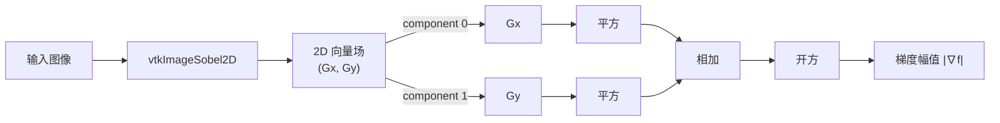

# Python VTK Sobel 边缘检测：从数学原理到代码实现

本文从图像边缘检测的数学基础出发，完整推导 Sobel 算子的构造过程，并给出 Python + VTK 的可运行实现。文中示意图见 [`sobel_kernels.svg`](sobel_kernels.svg) 与 [`sobel_vtk_result.svg`](sobel_vtk_result.svg)；本地安装 Python 后运行 `sobel_vtk_demo.py` 还可导出高分辨率 PNG。

---

### 1. 引言

**边缘**是图像中灰度值发生剧烈变化的区域，例如物体轮廓、纹理突变处。边缘检测的核心问题是：如何在离散像素网格上，稳定地找出“灰度变化最快”的位置？

经典思路来自**一阶导数（梯度）**：

- 灰度变化越剧烈 → 梯度模长越大 → 越可能是边缘。
- 梯度方向 → 边缘的法线方向（垂直于边缘走向）。

Sobel 算子是其中最常用的离散梯度算子之一：它在求导的同时对垂直方向做加权平滑，兼顾**边缘响应**与**抗噪能力**。本文将依次讲解：

- 连续梯度与离散差分
- Sobel 核的外积推导
- 3×3 卷积的逐像素展开
- Python VTK 中的 `vtkImageSobel2D` 与 `vtkImageConvolve` 实现

---

### 2. 一阶导数与二维梯度

#### 2.1 连续情形

设连续图像函数为

        f

        (

        x

        ,

        y

        )

       f(x, y)

    f(x,y)，其一阶偏导数描述灰度沿

        x

       x

    x、

        y

       y

    y 方向的变化率：

         ∇

         f

         =

          (

            ∂

            f

            ∂

            x

          ,

            ∂

            f

            ∂

            y

          )

         =

         (

          f

          x

         ,

          f

          y

         )

         \nabla f = \left( \frac{\partial f}{\partial x},\ \frac{\partial f}{\partial y} \right) = (f_x,\ f_y)

     ∇f=(∂x∂f​, ∂y∂f​)=(fx​, fy​)

**梯度模长**（边缘强度）：

         ∣

         ∇

         f

         ∣

         =

             (

               ∂

               f

               ∂

               x

             )

            2

           +

             (

               ∂

               f

               ∂

               y

             )

            2

         |\nabla f| = \sqrt{ \left(\frac{\partial f}{\partial x}\right)^2 + \left(\frac{\partial f}{\partial y}\right)^2 }

     ∣∇f∣=(∂x∂f​)2+(∂y∂f​)2
            ​

**梯度方向**（边缘方向）：

         θ

         =

         arctan

         ⁡

          (

            ∂

            f

            /

            ∂

            y

            ∂

            f

            /

            ∂

            x

          )

         \theta = \arctan\left( \frac{\partial f/\partial y}{\partial f/\partial x} \right)

     θ=arctan(∂f/∂x∂f/∂y​)

边缘检测的本质：找出

         ∣

         ∇

         f

         ∣

        |\nabla f|

     ∣∇f∣ 较大的像素。

#### 2.2 从变化率到“边缘”

在一维中，

         f

         ′

        (

        x

        )

        =

        d

        f

        /

        d

        x

       f'(x) = df/dx

    f′(x)=df/dx 表示函数变化快慢。二维图像中，边缘通常对应

        ∣

        ∇

        f

        ∣

       |\nabla f|

    ∣∇f∣ 的局部极大值。因此，任何实用的边缘算子，最终目标都是估计

         f

         x

       f_x

    fx​、

         f

         y

       f_y

    fy​，再合成梯度幅值。

---

### 3. 离散差分：像素网格上的导数近似

数字图像是离散采样，不能直接求

        ∂

        f

        /

        ∂

        x

       \partial f/\partial x

    ∂f/∂x，只能用**差分**近似。

#### 3.1 前向差分

           ∂

           f

           ∂

           x

         ≈

         f

         (

         x

         +

         1

         ,

         y

         )

         −

         f

         (

         x

         ,

         y

         )

         \frac{\partial f}{\partial x} \approx f(x+1, y) - f(x, y)

     ∂x∂f​≈f(x+1,y)−f(x,y)

实现简单，但不对称，精度较低。

#### 3.2 中心差分（更常用）

           ∂

           f

           ∂

           x

         ≈

           f

           (

           x

           +

           1

           ,

           y

           )

           −

           f

           (

           x

           −

           1

           ,

           y

           )

          2

         \frac{\partial f}{\partial x} \approx \frac{f(x+1, y) - f(x-1, y)}{2}

     ∂x∂f​≈2f(x+1,y)−f(x−1,y)​

           ∂

           f

           ∂

           y

         ≈

           f

           (

           x

           ,

           y

           +

           1

           )

           −

           f

           (

           x

           ,

           y

           −

           1

           )

          2

         \frac{\partial f}{\partial y} \approx \frac{f(x, y+1) - f(x, y-1)}{2}

     ∂y∂f​≈2f(x,y+1)−f(x,y−1)​

中心差分同时利用左右（或上下）邻域，误差阶更高，是 Sobel 等算子的基础。

#### 3.3 差分的卷积核形式

一阶差分可写成极小卷积核：

**x 方向：**

          D

          x

         =

          [

               −

               1

              0

              1

          ]

         D_x = \begin{bmatrix} -1 & 0 & 1 \end{bmatrix}

     Dx​=[−1​0​1​]

（省略归一化因子

        1

        /

        2

       1/2

    1/2 时，仅差一个常数倍，不影响边缘位置。）

**y 方向：**

          D

          y

         =

          [

               −

               1

              0

              1

          ]

         D_y = \begin{bmatrix} -1 \\ 0 \\ 1 \end{bmatrix}

     Dy​=
              ​−101​
              ​

#### 3.4 简单差分的问题

         D

         x

       D_x

    Dx​、

         D

         y

       D_y

    Dy​ 只对 3 个像素做运算，**对噪声极其敏感**：单个噪点即可产生虚假“边缘”。Sobel 的改进思路是：**在求导方向保持差分结构，在垂直方向引入平滑**。

---

### 4. Sobel 算子的推导：差分 × 平滑（外积）

#### 4.1 设计目标

对 **x 方向梯度**

         G

         x

       G_x

    Gx​（检测**垂直边缘**，即灰度沿 x 变化）：

| 方向 | 操作 | 作用  |
| x | 差分 | 求一阶导数  |
| y | 平滑 | 抑制垂直方向噪声  |

对 **y 方向梯度**

         G

         y

       G_y

    Gy​（检测**水平边缘**）则对称：y 方向差分，x 方向平滑。

#### 4.2 基本一维核

**x 方向一阶差分：**

          D

          x

         =

          [

               −

               1

              0

              1

          ]

         D_x = \begin{bmatrix} -1 & 0 & 1 \end{bmatrix}

     Dx​=[−1​0​1​]

**y 方向平滑（三角权重，中心权重更大）：**

          S

          y

         =

          [

              1

              2

              1

          ]

         S_y = \begin{bmatrix} 1 \\ 2 \\ 1 \end{bmatrix}

     Sy​=
              ​121​
              ​

平滑核

        [

        1

        ,

        2

        ,

        1

        ]

       [1, 2, 1]

    [1,2,1] 可看作小尺度高斯平滑的离散近似，中心像素权重为 2，强调当前行（或列）的信息。

4.3 外积构造

         G

         x

       G_x

    Gx​

Sobel 的 x 方向 3×3 核由**外积（张量积）**得到：

          G

          x

         =

          S

          y

         ⊗

          D

          x

         =

          [

              1

              2

              1

          ]

          [

               −

               1

              0

              1

          ]

         =

          [

               −

               1

              0

              1

               −

               2

              0

              2

               −

               1

              0

              1

          ]

         G_x = S_y \otimes D_x = \begin{bmatrix} 1 \\ 2 \\ 1 \end{bmatrix} \begin{bmatrix} -1 & 0 & 1 \end{bmatrix} = \begin{bmatrix} -1 & 0 & 1 \\ -2 & 0 & 2 \\ -1 & 0 & 1 \end{bmatrix}

     Gx​=Sy​⊗Dx​=
              ​121​
              ​[−1​0​1​]=
              ​−1−2−1​000​121​
              ​

逐元素计算示例：

- 第 1 行：

         1

         ×

         [

         −

         1

         ,

         0

         ,

         1

         ]

         =

         [

         −

         1

         ,

         0

         ,

         1

         ]

        1 \times [-1,0,1] = [-1,0,1]

     1×[−1,0,1]=[−1,0,1]
- 第 2 行：

         2

         ×

         [

         −

         1

         ,

         0

         ,

         1

         ]

         =

         [

         −

         2

         ,

         0

         ,

         2

         ]

        2 \times [-1,0,1] = [-2,0,2]

     2×[−1,0,1]=[−2,0,2]
- 第 3 行：

         1

         ×

         [

         −

         1

         ,

         0

         ,

         1

         ]

         =

         [

         −

         1

         ,

         0

         ,

         1

         ]

        1 \times [-1,0,1] = [-1,0,1]

     1×[−1,0,1]=[−1,0,1]

4.4 外积构造

         G

         y

       G_y

    Gy​

y 方向对称地有：

          S

          x

         =

          [

              1

              2

              1

          ]

         ,

          D

          y

         =

          [

               −

               1

              0

              1

          ]

         S_x = \begin{bmatrix} 1 & 2 & 1 \end{bmatrix}, \quad D_y = \begin{bmatrix} -1 \\ 0 \\ 1 \end{bmatrix}

     Sx​=[1​2​1​],Dy​=
              ​−101​
              ​

          G

          y

         =

          S

          x

         ⊗

          D

          y

         =

          [

               −

               1

               −

               2

               −

               1

              0

              0

              0

              1

              2

              1

          ]

         G_y = S_x \otimes D_y = \begin{bmatrix} -1 & -2 & -1 \\ 0 & 0 & 0 \\ 1 & 2 & 1 \end{bmatrix}

     Gy​=Sx​⊗Dy​=
              ​−101​−202​−101​
              ​

即

         G

         y

        =

         G

         x

         ⊤

       G_y = G_x^\top

    Gy​=Gx⊤​（在标准 Sobel 定义下）。

#### 4.5 示意图


上图直观展示了：

- 左上：

          D

          x

        D_x

     Dx​ 在 x 方向做差分
- 中上：

          S

          y

        S_y

     Sy​ 在 y 方向做加权平均
- 右上：二者外积得到

          G

          x

        G_x

     Gx​
- 下行：同理得到

          G

          y

        G_y

     Gy​

---

### 5. 3×3 卷积的逐像素展开

设

         f

          i

          ,

          j

       f_{i,j}

    fi,j​ 表示行

        i

       i

    i、列

        j

       j

    j 的灰度（

        i

       i

    i 向下增大，

        j

       j

    j 向右增大），以

        (

        i

        ,

        j

        )

       (i,j)

    (i,j) 为中心的 3×3 邻域为：

         [

              f

               i

               −

               1

               ,

               j

               −

               1

              f

               i

               −

               1

               ,

               j

              f

               i

               −

               1

               ,

               j

               +

               1

              f

               i

               ,

               j

               −

               1

              f

               i

               ,

               j

              f

               i

               ,

               j

               +

               1

              f

               i

               +

               1

               ,

               j

               −

               1

              f

               i

               +

               1

               ,

               j

              f

               i

               +

               1

               ,

               j

               +

               1

         ]

         \begin{bmatrix} f_{i-1,j-1} & f_{i-1,j} & f_{i-1,j+1} \\ f_{i,j-1} & f_{i,j} & f_{i,j+1} \\ f_{i+1,j-1} & f_{i+1,j} & f_{i+1,j+1} \end{bmatrix}

              ​fi−1,j−1​fi,j−1​fi+1,j−1​​fi−1,j​fi,j​fi+1,j​​fi−1,j+1​fi,j+1​fi+1,j+1​​
              ​

与

         G

         x

       G_x

    Gx​ 卷积（相关运算，核不翻转）：

              G

              x

             (

             i

             ,

             j

             )

             =
              
             (

             −

             1

             )
             
              f

               i

               −

               1

               ,

               j

               −

               1

             +

             0

             ⋅

              f

               i

               −

               1

               ,

               j

             +

             1

             ⋅

              f

               i

               −

               1

               ,

               j

               +

               1

             +

             (

             −

             2

             )
             
              f

               i

               ,

               j

               −

               1

             +

             0

             ⋅

              f

               i

               ,

               j

             +

             2

             ⋅

              f

               i

               ,

               j

               +

               1

             +

             (

             −

             1

             )
             
              f

               i

               +

               1

               ,

               j

               −

               1

             +

             0

             ⋅

              f

               i

               +

               1

               ,

               j

             +

             1

             ⋅

              f

               i

               +

               1

               ,

               j

               +

               1

         \begin{aligned} G_x(i,j) =\;& (-1)\,f_{i-1,j-1} + 0\cdot f_{i-1,j} + 1\cdot f_{i-1,j+1} \\ &+ (-2)\,f_{i,j-1} + 0\cdot f_{i,j} + 2\cdot f_{i,j+1} \\ &+ (-1)\,f_{i+1,j-1} + 0\cdot f_{i+1,j} + 1\cdot f_{i+1,j+1} \end{aligned}

     Gx​(i,j)=​(−1)fi−1,j−1​+0⋅fi−1,j​+1⋅fi−1,j+1​+(−2)fi,j−1​+0⋅fi,j​+2⋅fi,j+1​+(−1)fi+1,j−1​+0⋅fi+1,j​+1⋅fi+1,j+1​​

整理为：

          G

          x

         (

         i

         ,

         j

         )

         =

         −

          f

           i

           −

           1

           ,

           j

           −

           1

         +

          f

           i

           −

           1

           ,

           j

           +

           1

         −

         2

          f

           i

           ,

           j

           −

           1

         +

         2

          f

           i

           ,

           j

           +

           1

         −

          f

           i

           +

           1

           ,

           j

           −

           1

         +

          f

           i

           +

           1

           ,

           j

           +

           1

         G_x(i,j) = -f_{i-1,j-1} + f_{i-1,j+1} - 2f_{i,j-1} + 2f_{i,j+1} - f_{i+1,j-1} + f_{i+1,j+1}

     Gx​(i,j)=−fi−1,j−1​+fi−1,j+1​−2fi,j−1​+2fi,j+1​−fi+1,j−1​+fi+1,j+1​

同理：

              G

              y

             (

             i

             ,

             j

             )

             =
              
             −

              f

               i

               −

               1

               ,

               j

               −

               1

             −

             2

              f

               i

               −

               1

               ,

               j

             −

              f

               i

               −

               1

               ,

               j

               +

               1

             +

              f

               i

               +

               1

               ,

               j

               −

               1

             +

             2

              f

               i

               +

               1

               ,

               j

             +

              f

               i

               +

               1

               ,

               j

               +

               1

         \begin{aligned} G_y(i,j) =\;& -f_{i-1,j-1} - 2f_{i-1,j} - f_{i-1,j+1} \\ &+ f_{i+1,j-1} + 2f_{i+1,j} + f_{i+1,j+1} \end{aligned}

     Gy​(i,j)=​−fi−1,j−1​−2fi−1,j​−fi−1,j+1​+fi+1,j−1​+2fi+1,j​+fi+1,j+1​​

**边缘强度**：

         ∣

         ∇

         f

         ∣

         (

         i

         ,

         j

         )

         =

            G

            x

           (

           i

           ,

           j

            )

            2

           +

            G

            y

           (

           i

           ,

           j

            )

            2

         |\nabla f|(i,j) = \sqrt{ G_x(i,j)^2 + G_y(i,j)^2 }

     ∣∇f∣(i,j)=Gx​(i,j)2+Gy​(i,j)2
            ​

**边缘方向**：

         θ

         (

         i

         ,

         j

         )

         =

         arctan

         ⁡
         ⁣

          (

             G

             y

            (

            i

            ,

            j

            )

             G

             x

            (

            i

            ,

            j

            )

          )

         \theta(i,j) = \arctan\!\left( \frac{G_y(i,j)}{G_x(i,j)} \right)

     θ(i,j)=arctan(Gx​(i,j)Gy​(i,j)​)

---

### 6. 设计哲学：为何“求导方向差分，垂直方向平滑”？

这是 Sobel 最容易被误解之处，总结为三句话：

- **求导方向必须用差分核**，否则无法估计一阶导数。
- **垂直方向必须用平滑核**，否则噪声会被差分放大。
- **Sobel = 求导方向差分 × 垂直方向平滑（外积）**。

#### 6.1 为何 x 方向不能也平滑？

若在 x 方向也使用

        [

        1

        ,

        2

        ,

        1

        ]

       [1, 2, 1]

    [1,2,1] 平滑，会把“求导”变成“先平滑再求导”，导致：

- 边缘变宽
- 梯度峰值降低
- 边缘定位不准

Sobel 的设计哲学：**求导方向保持敏锐，垂直方向抑制噪声**。

#### 6.2 若两个方向都用差分会怎样？


这更接近**二阶导数 / Laplacian** 型算子，对噪声极度敏感，不是 Sobel 想要的一阶梯度。

#### 6.3 与 Prewitt、Scharr 的对比

| 算子 | 平滑权重 | 特点  |
| Sobel |

           [

           1

           ,

           2

           ,

           1

           ]

          [1, 2, 1]

       [1,2,1] | 经典，计算快，工程最常用  |
| Prewitt |

           [

           1

           ,

           1

           ,

           1

           ]

          [1, 1, 1]

       [1,1,1] | 权重均匀，更平滑、边缘更宽  |
| Scharr | 优化系数 | 更好的旋转不变性，精度更高  |

Sobel 可理解为“小尺度高斯平滑 + 差分”的 3×3 离散近似。

---

### 7. Python VTK 实现

#### 7.1 环境准备

```
pip install vtk matplotlib numpy

```

VTK 中 Sobel 相关的主要类：

| 类 | 模块 | 作用  |
| `vtkImageSobel2D` | `vtkImagingGeneral` | 内置 Sobel，输出 2 分量梯度向量场  |
| `vtkImageConvolve` | `vtkImagingGeneral` | 自定义 3×3 核卷积，便于与公式对照  |
| `vtkImageExtractComponents` | `vtkImagingCore` | 提取

            G

            x

          G_x

       Gx​ /

            G

            y

          G_y

       Gy​ 分量  |
| `vtkImageMathematics` | `vtkImagingMath` | 计算

              G

              x

              2

             +

              G

              y

              2

          \sqrt{G_x^2 + G_y^2}

       Gx2​+Gy2​
              ​  |

>

**注意**：`vtkImageSobel2D` 的输出是 **double 型 2 分量向量场**，不是直接的边缘二值图。需提取分量并计算模长，才得到常见的“边缘强度图”。

#### 7.2 方式 A：`vtkImageSobel2D`（推荐）

```
#!/usr/bin/env python3
"""Compute Sobel gradients with vtkImageSobel2D."""

import vtkmodules.vtkRenderingOpenGL2  # noqa: F401
from vtkmodules.vtkImagingCore import vtkImageExtractComponents
from vtkmodules.vtkImagingGeneral import vtkImageSobel2D
from vtkmodules.vtkImagingMath import vtkImageMathematics
from vtkmodules.vtkIOImage import vtkPNGReader

def read_grayscale(path: str):
    reader = vtkPNGReader()
    reader.SetFileName(path)
    reader.Update()
    return reader.GetOutput()

def sobel_gradients(image):
    """Return (Gx, Gy, magnitude) as vtkImageData."""
    sobel = vtkImageSobel2D()
    sobel.SetInputData(image)
    sobel.Update()

    extract_x = vtkImageExtractComponents()
    extract_x.SetInputConnection(sobel.GetOutputPort())
    extract_x.SetComponents(0)
    extract_x.Update()

    extract_y = vtkImageExtractComponents()
    extract_y.SetInputConnection(sobel.GetOutputPort())
    extract_y.SetComponents(1)
    extract_y.Update()

    square_x = vtkImageMathematics()
    square_x.SetOperationToMultiply()
    square_x.SetInputConnection(0, extract_x.GetOutputPort())
    square_x.SetInputConnection(1, extract_x.GetOutputPort())
    square_x.Update()

    square_y = vtkImageMathematics()
    square_y.SetOperationToMultiply()
    square_y.SetInputConnection(0, extract_y.GetOutputPort())
    square_y.SetInputConnection(1, extract_y.GetOutputPort())
    square_y.Update()

    sum_sq = vtkImageMathematics()
    sum_sq.SetOperationToAdd()
    sum_sq.SetInputConnection(0, square_x.GetOutputPort())
    sum_sq.SetInputConnection(1, square_y.GetOutputPort())
    sum_sq.Update()

    magnitude = vtkImageMathematics()
    magnitude.SetOperationToSquareRoot()
    magnitude.SetInputConnection(sum_sq.GetOutputPort())
    magnitude.Update()

    return extract_x.GetOutput(), extract_y.GetOutput(), magnitude.GetOutput()

```

**Pipeline 数据流：**



#### 7.3 方式 B：`vtkImageConvolve` 手写 Sobel 核

与第 4 节公式一一对应，适合教学验证：

```
from vtkmodules.vtkImagingGeneral import vtkImageConvolve

# VTK SetKernel3x3 按行优先排列 9 个元素
GX_KERNEL = [-1, 0, 1, -2, 0, 2, -1, 0, 1]
GY_KERNEL = [-1, -2, -1, 0, 0, 0, 1, 2, 1]

def convolve_sobel(image):
    conv_x = vtkImageConvolve()
    conv_x.SetInputData(image)
    conv_x.SetKernel3x3(GX_KERNEL)
    conv_x.Update()

    conv_y = vtkImageConvolve()
    conv_y.SetInputData(image)
    conv_y.SetKernel3x3(GY_KERNEL)
    conv_y.Update()

    return conv_x.GetOutput(), conv_y.GetOutput()

```

`vtkImageSobel2D` 与手写 `GX_KERNEL` 卷积的结果在数值上应一致（边界处理方式可能略有差异）。

#### 7.4 方式 C：NumPy 对照（无 VTK 时验证公式）

```
import numpy as np
from scipy.ndimage import convolve

GX = np.array([[-1, 0, 1],
               [-2, 0, 2],
               [-1, 0, 1]], dtype=float)

GY = np.array([[-1, -2, -1],
               [ 0,  0,  0],
               [ 1,  2,  1]], dtype=float)

def sobel_numpy(image: np.ndarray):
    gx = convolve(image, GX, mode="reflect")
    gy = convolve(image, GY, mode="reflect")
    magnitude = np.hypot(gx, gy)
    return gx, gy, magnitude

```

#### 7.5 完整可运行示例（合成测试图 + 可视化）

同目录 [`sobel_vtk_demo.py`](sobel_vtk_demo.py) 包含：

- 用 Matplotlib 绘制 Sobel 外积分解图 → `sobel_kernels.png`（同目录已附带 `sobel_kernels.svg` 示意图）
- 用 VTK 在合成图像上运行 Sobel → `sobel_vtk_result.png`（同目录已附带 `sobel_vtk_result.svg` 示意图）

运行：

```
python sobel_vtk_demo.py

```

核心 VTK 流程摘录：

```
from vtkmodules.vtkImagingSources import vtkImageCanvasSource2D
from vtkmodules.vtkImagingGeneral import vtkImageSobel2D, vtkImageConvolve

# 1. 创建测试图（黑底 + 白色矩形 + 圆形）
source = vtkImageCanvasSource2D(extent=(0, 199, 0, 199, 0, 0))
source.SetScalarTypeToUnsignedChar()
source.draw_color = (0, 0, 0)
source.FillBox(0, 199, 0, 199)
source.draw_color = (255, 255, 255)
source.FillBox(40, 80, 40, 160)
source.FillCircle(100, 100, 25)
source.Update()

# 2. Sobel 滤波
sobel = vtkImageSobel2D()
sobel.SetInputConnection(source.GetOutputPort())
sobel.Update()

# 3. 手写核验证
conv_x = vtkImageConvolve()
conv_x.SetInputConnection(source.GetOutputPort())
conv_x.SetKernel3x3([-1, 0, 1, -2, 0, 2, -1, 0, 1])
conv_x.Update()

```

#### 7.6 运行结果


图中可见：

- ∣

           G

           x

          ∣

         |G_x|

      ∣Gx​∣：垂直边缘（左右灰度突变）响应强
- ∣

           G

           y

          ∣

         |G_y|

      ∣Gy​∣：水平边缘响应强
- ∣

          ∇

          f

          ∣

         |\nabla f|

      ∣∇f∣：综合边缘强度
- **手写核与 `vtkImageSobel2D` 差异图**：接近全零，验证公式与实现一致

---

### 8. 工程要点

#### 8.1 输出类型

- `vtkImageSobel2D` → `vtkImageData`，2 分量 double 向量
- 显示为灰度图前，通常取绝对值并做 `vtkImageShiftScale` 归一化到

         [

         0

         ,

         255

         ]

        [0, 255]

     [0,255]

#### 8.2 边界处理

卷积在图像边界处缺少完整 3×3 邻域。VTK 各 filter 有默认边界策略；若与 NumPy `mode='reflect'` 对比，边界若干像素可能存在差异。工程上可：

- 裁剪边界后再分析
- 或预先 `vtkImageConstantPad` 扩展

#### 8.3 从梯度到二值边缘

Sobel 给出**边缘强度**，若要二值边缘图，还需：

         edge

         (

         i

         ,

         j

         )

         =

          {

               1

               ,

               ∣

               ∇

               f

               ∣

               (

               i

               ,

               j

               )

               >

               T

               0

               ,

              otherwise

         \text{edge}(i,j) = \begin{cases} 1, & |\nabla f|(i,j) > T \\ 0, & \text{otherwise} \end{cases}

     edge(i,j)={1,0,​∣∇f∣(i,j)>Totherwise​

其中

        T

       T

    T 为阈值，常用 Otsu、自适应阈值等方法选取。

---

### 9. 总结

| 层次 | 要点  |
| 数学 | 边缘 ≈ 梯度模长极大；离散图像用差分近似导数  |
| Sobel |

            G

            x

           =

            S

            y

           ⊗

            D

            x

          G_x = S_y \otimes D_x

       Gx​=Sy​⊗Dx​，求导方向差分、垂直方向平滑  |
| 合成 | $  |
| VTK | 生产环境用 `vtkImageSobel2D`；教学验证用 `vtkImageConvolve` 手写核  |

**三句话回顾：**

- 一阶导数 / 梯度是边缘检测的理论基础。
- 离散差分对噪声敏感；Sobel 通过外积引入平滑，更稳定。
- Python VTK 中，`vtkImageSobel2D` + `vtkImageMathematics` 即可完整实现 Sobel 梯度与边缘强度计算。

---

### 参考资料

- [VTK vtkImageSobel2D 文档](https://vtk.org/doc/nightly/html/classvtkImageSobel2D.html)
- [VTK ImageSobel2D Python 示例](https://examples.vtk.org/site/PythonicAPI/Images/ImageSobel2D/)
- [VTK vtkImageConvolve 文档](https://vtk.org/doc/nightly/html/classvtkImageConvolve.html)
