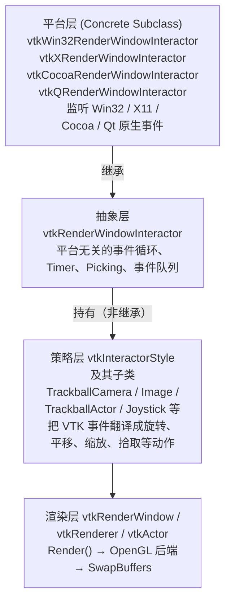
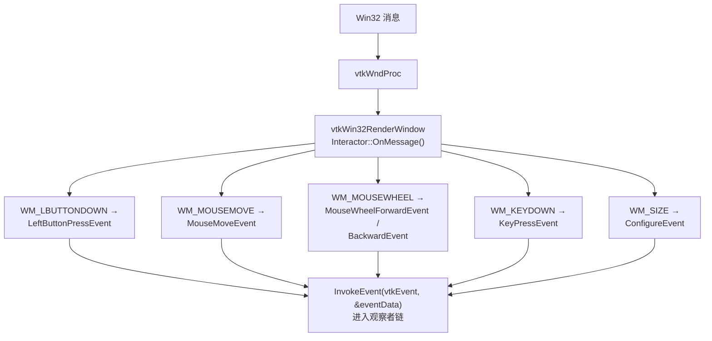
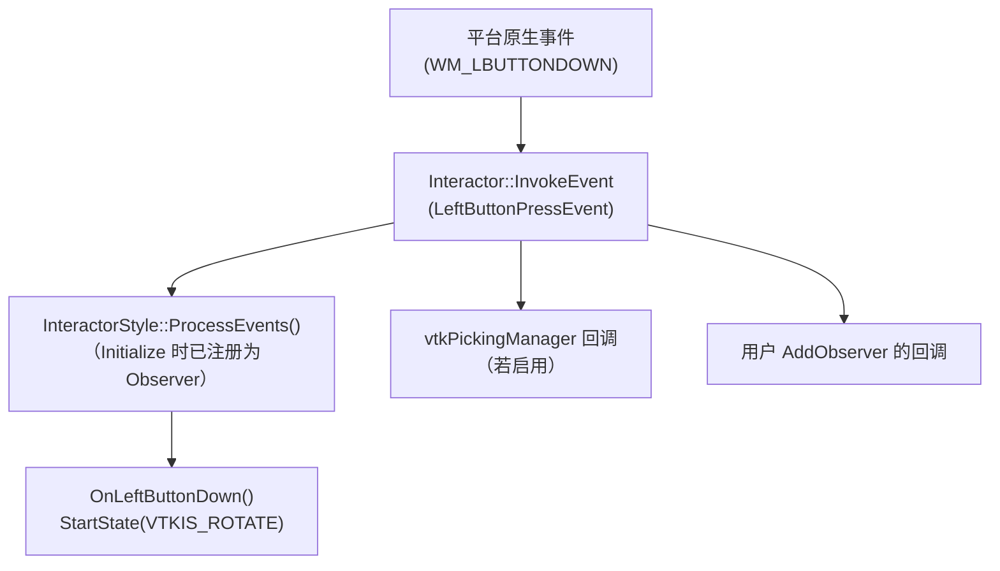
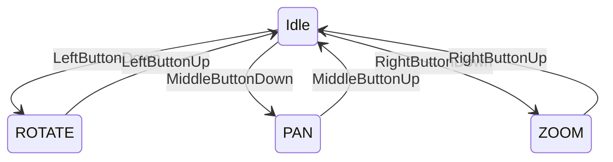
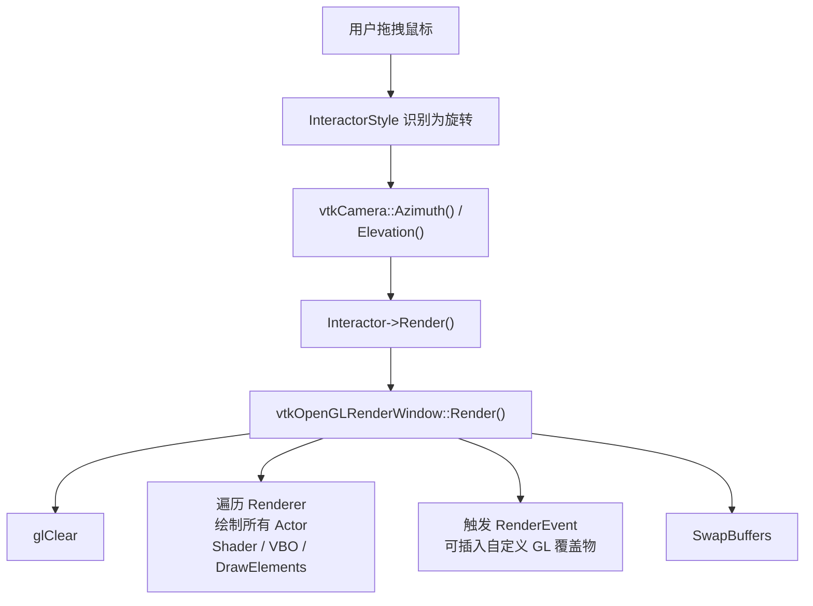
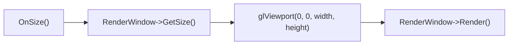
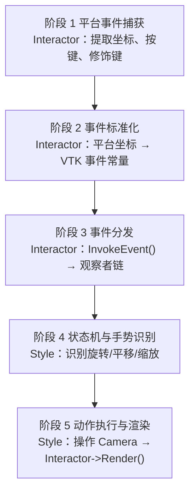
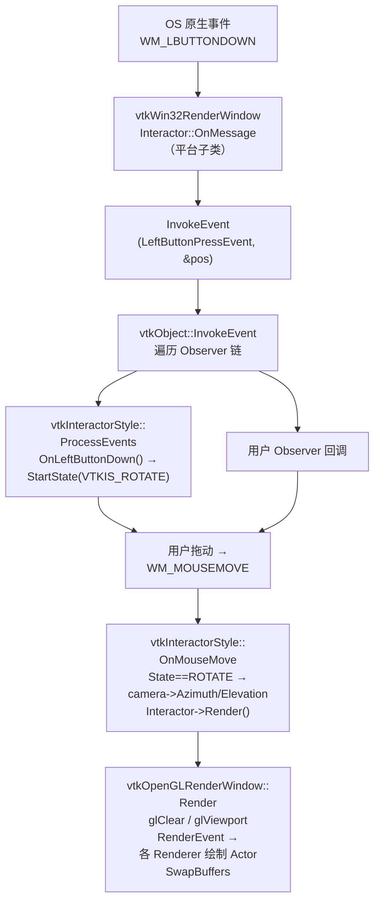

# VTK 交互系统详解：从教材 10.2 到 vtkRenderWindowInteractor 内部流程

> 本文以 VTK 教材 **10.2 交互** 为理论起点，系统梳理 `vtkRenderWindowInteractor` 的架构、事件流转、OpenGL 衔接，以及与 `vtkInteractorStyle` 的职责分工。文中附 Python / C++ 可运行示例，帮助你在源码层面理解「一次鼠标点击如何最终变成一帧 OpenGL 重绘」。

---

## 1. 引言：VTK 交互在做什么？

在 VTK 可视化应用中，用户最常见的操作——**缩放、平移、旋转、选择对象、退出程序**——都依赖交互子系统完成。教材 10.2 节给出了一个精炼的定义：

> `vtkRenderWindowInteractor` 是一个**与平台无关**的渲染窗口交互器。它为鼠标、键盘和定时器事件提供独立的处理机制，并将这些消息路由到 `vtkInteractorObserver` 及其子类。它还提供拾取（Picking）、帧率控制和多种事件的回调函数。平台相关的子类则提供操作定时器、终止应用等底层方法。

几个关键类各司其职：

| 类 | 角色 |
|:---|:---|
| `vtkRenderWindowInteractor` | 平台无关的事件循环与分发中枢 |
| `vtkInteractorObserver` | 能响应交互事件的观察者基类 |
| `vtkInteractorStyle` | 将 VTK 事件翻译成旋转/平移/缩放等「业务动作」 |
| `vtkInteractorStyleImage` | 面向 2D 图像查看的专用交互风格 |

交互风格可通过 `SetInteractorStyle()` 随时切换，例如从轨迹球相机风格换成图像查看风格，而无需改动底层事件循环。

---

## 2. 核心机制：Command / Observer 模式

教材强调，交互器使用 VTK 的 **Command/Observer（命令/观察者）模式** 来路由事件：

1. 平台相关子类（Win32 / X11 / Cocoa / Qt）检测到原生窗口事件；
2. 调用 `InvokeEvent()` 将其转换为标准 **VTK 事件**；
3. 触发已在 `vtkInteractorObserver` 或其子类中注册的操作。

这是整个交互体系的「枢纽」——平台差异在子类中被消化，上层代码只面对统一的 VTK 事件常量（如 `LeftButtonPressEvent`、`MouseMoveEvent`）。

```cpp
// 平台子类中的典型翻译逻辑（以 Win32 为例）
case WM_LBUTTONDOWN:
    this->SetEventPosition(LOWORD(lParam), HIWORD(lParam));
    this->InvokeEvent(vtkCommand::LeftButtonPressEvent, nullptr);
    break;
```

`InvokeEvent()` 内部遍历观察者链，依次回调所有订阅了该事件的对象——包括 `InteractorStyle`、Widget、用户自定义 Observer 等。

---

## 3. 整体架构：三层结构

VTK 交互体系是典型的「分层 + 观察者」设计：



**注意**：`InteractorStyle` 是 `Interactor` 的「客户」，不是子类。一个 Interactor 同一时刻持有一个 Style，但 Style 本身继承自 `vtkInteractorObserver`，能独立订阅事件。

---

## 4. 初始化：OpenGL 上下文何时就绪？

调用 `interactor->Initialize()` 时，平台子类依次完成：

1. **创建/绑定窗口**：`RenderWindow->SetWindowId()` 或由子类创建 OS 窗口；
2. **OpenGL 上下文初始化**：`RenderWindow->OpenGLInit()`，内部走 `vtkOpenGLRenderWindow`：
   - 调用平台 API 创建 GL Context（Windows: `wglCreateContext`，Linux: `glXMakeCurrent`）；
   - 调用 `OpenGLInitContext()`，初始化 GLEW/GLAD，查询扩展；
3. **注册平台回调**：如 Win32 的 `vtkWndProc`、X11 的 `XtAppAddEventHandler`；
4. **初始化 Picker**：默认创建 `vtkPicker` 实例；
5. **初始化 Timer 列表**：供后续 `CreateTimer()` 使用。

> **关键结论**：OpenGL Context 在 `Initialize()` 之后才可用。在此之前调用任何 `gl*` 函数都没有意义。

---

## 5. 事件循环：三种运行模式

`vtkRenderWindowInteractor` 支持三种事件循环模式：

| 模式 | 方法 | 说明 |
|:-----|:-----|:-----|
| **平台消息循环** | `Start()` | 阻塞式，接管主线程消息泵 |
| **定时器轮询** | `StartEventLoop()` | 非阻塞，使用内部定时器驱动 |
| **外部驱动** | `ProcessEvents()` | 每帧由外部主动调用 |

以 Win32 的 `Start()` 为例，简化逻辑如下：

```cpp
void vtkWin32RenderWindowInteractor::Start()
{
    while (!this->Done)
    {
        // 1. 平台消息泵
        MSG msg;
        while (PeekMessage(&msg, NULL, 0, 0, PM_NOREMOVE))
        {
            GetMessage(&msg, NULL, 0, 0);
            TranslateMessage(&msg);
            DispatchMessage(&msg);   // → 触发 vtkWndProc
        }

        // 2. 处理 VTK 定时器
        this->UpdateTimers();

        // 3. 连续渲染（可选）
        if (this->RenderWindow->GetDesiredUpdateRate() > 0)
            this->RenderWindow->Render();
    }
}
```

原生消息在 `vtkWndProc` 中被翻译为 VTK 事件：



---

## 6. 事件分发顺序

`InvokeEvent()` 是事件分发的核心入口。实际顺序大致为：



`vtkInteractorStyle` 在构造时通过 `EventCallbackCommand` 把自己注册为 Observer：

```cpp
vtkInteractorStyle::vtkInteractorStyle()
{
    this->EventCallbackCommand->SetCallback(vtkInteractorStyle::ProcessEvents);
    this->Interactor->AddObserver(vtkCommand::LeftButtonPressEvent,
                                  this->EventCallbackCommand);
    // LeftButtonRelease、MouseMove、KeyPress 等同理
}
```

Trackball Camera 的典型状态机：



每个状态下 `OnMouseMove` 执行完全不同的相机操作——这正是 Style 作为「策略层」的价值。

---

## 7. 与 OpenGL 的衔接

Interactor **自己不直接调用 OpenGL API**，但在以下节点会驱动 OpenGL 渲染：

### 7.1 交互触发重绘（最常见）



### 7.2 拾取（Picking）

`Interactor->GetPicker()->Pick(x, y, 0, renderer)` 内部使用 `vtkOpenGLHardwareSelector`：

1. 在离屏 FBO 上用唯一颜色 ID 重绘场景；
2. `glReadPixels` 读回鼠标位置像素；
3. 颜色解码得到 Actor ID 和三维坐标。

这是 Interactor 与 OpenGL **结合最深**的场景之一。

### 7.3 窗口 Resize 与视口



鼠标坐标转换同样需要视口信息（来自 OpenGL 上下文），因此 Interactor 与 RenderWindow 紧密耦合。

### 7.4 OpenGL 调用对照表

| 流程阶段 | OpenGL 调用 | 说明 |
|:---------|:------------|:-----|
| 初始化 | `glCreateContext`, `glMakeCurrent` | 创建/激活上下文 |
| 窗口 Resize | `glViewport` | 匹配窗口尺寸 |
| 拾取 | `glReadPixels`, FBO 离屏渲染 | 颜色编码拾取 |
| 交互渲染 | `glClear`, `glDraw*` | 清除并重绘场景 |
| 多缓冲 | `SwapBuffers` / `glSwapInterval` | 双缓冲与 VSync |
| 离屏渲染 | `glBindFramebuffer` | 拾取、截图等 |

---

## 8. Interactor 与 InteractorStyle 的职责分工

一句话概括：**Interactor 负责「事件来源」，Style 负责「事件响应」。**

| 职责 | vtkRenderWindowInteractor | vtkInteractorStyle |
|:-----|:--------------------------|:-------------------|
| 监听 OS 原生事件 | ✅（平台子类） | ❌ |
| 翻译成 VTK 事件 | ✅ | ❌ |
| 维护事件队列 / Timer | ✅ | ❌ |
| 拥有 Picker 实例 | ✅ | ❌ |
| 触发 Render | 提供 `Render()` | 调用它 |
| 决定「左键拖动 = 旋转还是平移？」 | ❌ | ✅ |
| 维护状态机（ROTATE/PAN/ZOOM） | ❌ | ✅ |
| 控制相机 / Actor 参数 | ❌ | ✅ |
| 可热插拔替换 | 创建一次 | `SetInteractorStyle()` 随时换 |

五阶段分工全景：



---

## 9. VTK 事件列表（节选）

教材表 10.1 列出了 VTK 定义的标准事件。交互相关的常用事件如下：

| VTK 事件名 | 典型触发场景 |
|:-----------|:-------------|
| `LeftButtonPressEvent` | 鼠标左键按下 |
| `LeftButtonReleaseEvent` | 鼠标左键释放 |
| `RightButtonPressEvent` | 鼠标右键按下 |
| `MiddleButtonPressEvent` | 鼠标中键按下 |
| `MouseMoveEvent` | 鼠标移动 |
| `MouseWheelForwardEvent` | 滚轮向前 |
| `MouseWheelBackwardEvent` | 滚轮向后 |
| `KeyPressEvent` | 键盘按下 |
| `KeyReleaseEvent` | 键盘释放 |
| `EnterEvent` / `LeaveEvent` | 鼠标进入/离开窗口 |
| `ConfigureEvent` | 窗口大小改变 |
| `TimerEvent` | 定时器触发 |
| `ExposeEvent` | 窗口需要重绘 |
| `StartInteractionEvent` / `EndInteractionEvent` | 交互开始/结束 |
| `WidgetActivateEvent` | Widget 被激活 |

完整列表可参考 VTK 源码中的 `vtkCommand.h`，或使用 `vtkCommand::GetStringFromEventId()` 将事件 ID 转为可读字符串。

---

## 10. Python 示例

### 10.1 观察事件流

以下示例为 Interactor 注册 Observer，打印平台事件翻译后的 VTK 事件：

```python
import vtk

# 基础渲染管线
sphere = vtk.vtkSphereSource()
sphere.SetRadius(1.0)
sphere.SetPhiResolution(30)
sphere.SetThetaResolution(30)

mapper = vtk.vtkPolyDataMapper()
mapper.SetInputConnection(sphere.GetOutputPort())

actor = vtk.vtkActor()
actor.SetMapper(mapper)
actor.GetProperty().SetColor(0.2, 0.6, 0.9)

renderer = vtk.vtkRenderer()
renderer.AddActor(actor)
renderer.SetBackground(0.1, 0.1, 0.1)
renderer.ResetCamera()

render_window = vtk.vtkRenderWindow()
render_window.AddRenderer(renderer)
render_window.SetSize(800, 600)
render_window.SetWindowName("VTK Interactor Event Logger")

interactor = vtk.vtkRenderWindowInteractor()
interactor.SetRenderWindow(render_window)
interactor.SetInteractorStyle(vtk.vtkInteractorStyleTrackballCamera())

class EventLogger(vtk.vtkCommand):
    def __init__(self):
        super().__init__()
        self.event_count = 0

    def Execute(self, caller, event, call_data):
        self.event_count += 1
        interactor = vtk.vtkRenderWindowInteractor.SafeDownCast(caller)
        pos = interactor.GetEventPosition()
        mods = []
        if interactor.GetShiftKey():   mods.append("Shift")
        if interactor.GetControlKey(): mods.append("Ctrl")
        if interactor.GetAltKey():     mods.append("Alt")
        print(f"[{self.event_count:03d}] {interactor.GetEventName():25s} "
              f"pos=({pos[0]:4d},{pos[1]:4d}) mods=[{'+'.join(mods) or 'None'}]")

logger = EventLogger()
for evt in [
    vtk.vtkCommand.LeftButtonPressEvent,
    vtk.vtkCommand.LeftButtonReleaseEvent,
    vtk.vtkCommand.RightButtonPressEvent,
    vtk.vtkCommand.RightButtonReleaseEvent,
    vtk.vtkCommand.MiddleButtonPressEvent,
    vtk.vtkCommand.MiddleButtonReleaseEvent,
    vtk.vtkCommand.MouseMoveEvent,
    vtk.vtkCommand.MouseWheelForwardEvent,
    vtk.vtkCommand.MouseWheelBackwardEvent,
    vtk.vtkCommand.KeyPressEvent,
    vtk.vtkCommand.TimerEvent,
]:
    interactor.AddObserver(evt, logger)

render_window.Render()
interactor.Initialize()
print("左键拖拽=旋转 | 右键=缩放 | 中键=平移 | Shift+左键=平移 | 滚轮=缩放")
interactor.Start()
```

### 10.2 自定义 InteractorStyle：状态机演示

```python
import vtk
import math

class CustomInteractorStyle(vtk.vtkInteractorStyleTrackballCamera):
    """演示 Style 的三项核心职责：状态机、手势识别、相机操作"""

    def __init__(self):
        super().__init__()
        self.state = "NONE"
        self.last_pos = None
        self.motion_factor = 10.0
        self.zoom_factor = 1.1

        for evt, handler in [
            (vtk.vtkCommand.LeftButtonPressEvent,   self.on_left_press),
            (vtk.vtkCommand.LeftButtonReleaseEvent, self.on_left_release),
            (vtk.vtkCommand.RightButtonPressEvent,  self.on_right_press),
            (vtk.vtkCommand.RightButtonReleaseEvent,self.on_right_release),
            (vtk.vtkCommand.MouseMoveEvent,         self.on_mouse_move),
            (vtk.vtkCommand.MouseWheelForwardEvent, self.on_wheel_forward),
            (vtk.vtkCommand.MouseWheelBackwardEvent,self.on_wheel_backward),
        ]:
            self.AddObserver(evt, handler)

    def on_left_press(self, obj, event):
        interactor = self.GetInteractor()
        if interactor.GetShiftKey():
            self.state = "PAN";    self.StartPan()
        elif interactor.GetControlKey():
            self.state = "SPIN";   self.StartSpin()
        else:
            self.state = "ROTATE"; self.StartRotate()
        self.last_pos = interactor.GetEventPosition()
        print(f"[Style] → {self.state}")

    def on_left_release(self, obj, event):
        self.state = "NONE"
        self.EndRotate()

    def on_right_press(self, obj, event):
        self.state = "ZOOM"
        self.StartDolly()
        self.last_pos = self.GetInteractor().GetEventPosition()

    def on_right_release(self, obj, event):
        self.state = "NONE"
        self.EndDolly()

    def on_mouse_move(self, obj, event):
        if self.state == "NONE" or self.last_pos is None:
            return
        interactor = self.GetInteractor()
        cur = interactor.GetEventPosition()
        dx, dy = cur[0] - self.last_pos[0], cur[1] - self.last_pos[1]
        renderer = interactor.GetRenderWindow().GetRenderers().GetFirstRenderer()
        camera = renderer.GetActiveCamera()
        w, h = interactor.GetRenderWindow().GetSize()

        if self.state == "ROTATE":
            camera.Azimuth(-20.0 / w * dx)
            camera.Elevation(-20.0 / h * dy)
            camera.OrthogonalizeViewUp()
        elif self.state == "PAN":
            self.Pan()  # 使用父类平移逻辑
        elif self.state == "ZOOM":
            camera.Dolly(math.pow(1.02, -dy * 0.5))
            renderer.ResetCameraClippingRange()
        elif self.state == "SPIN":
            camera.Roll(dx * 0.5)

        self.last_pos = cur
        interactor.Render()

    def on_wheel_forward(self, obj, event):
        renderer = self.GetInteractor().GetRenderWindow().GetRenderers().GetFirstRenderer()
        renderer.GetActiveCamera().Dolly(self.zoom_factor)
        renderer.ResetCameraClippingRange()
        self.GetInteractor().Render()

    def on_wheel_backward(self, obj, event):
        renderer = self.GetInteractor().GetRenderWindow().GetRenderers().GetFirstRenderer()
        renderer.GetActiveCamera().Dolly(1.0 / self.zoom_factor)
        renderer.ResetCameraClippingRange()
        self.GetInteractor().Render()


# 主程序
sphere = vtk.vtkSphereSource()
mapper = vtk.vtkPolyDataMapper()
mapper.SetInputConnection(sphere.GetOutputPort())
actor = vtk.vtkActor()
actor.SetMapper(mapper)
actor.GetProperty().SetColor(0.2, 0.6, 0.9)

renderer = vtk.vtkRenderer()
renderer.AddActor(actor)
renderer.AddActor(vtk.vtkAxesActor())
renderer.SetBackground(0.1, 0.1, 0.1)
renderer.ResetCamera()

rw = vtk.vtkRenderWindow()
rw.AddRenderer(renderer)
rw.SetSize(800, 600)

interactor = vtk.vtkRenderWindowInteractor()
interactor.SetRenderWindow(rw)
interactor.SetInteractorStyle(CustomInteractorStyle())

rw.Render()
interactor.Initialize()
interactor.Start()
```

### 10.3 OpenGL 拾取与帧缓冲读回

```python
import vtk

class PickingStyle(vtk.vtkInteractorStyleTrackballCamera):
    def __init__(self):
        super().__init__()
        self.picked_actor = None
        self.AddObserver(vtk.vtkCommand.LeftButtonPressEvent, self.on_pick)
        self.AddObserver(vtk.vtkCommand.CharEvent, self.on_key)

    def on_pick(self, obj, event):
        interactor = self.GetInteractor()
        pos = interactor.GetEventPosition()
        renderer = interactor.GetRenderWindow().GetRenderers().GetFirstRenderer()

        picker = vtk.vtkPropPicker()
        if picker.Pick(pos[0], pos[1], 0, renderer):
            actor = picker.GetActor()
            if self.picked_actor and self.picked_actor != actor:
                self.picked_actor.GetProperty().SetColor(0.2, 0.6, 0.9)
            actor.GetProperty().SetColor(1.0, 0.3, 0.3)
            self.picked_actor = actor
            print(f"[Pick] 命中 {actor.GetClassName()}")
        else:
            print("[Pick] 未命中")
        interactor.Render()

    def on_key(self, obj, event):
        key = self.GetInteractor().GetKeySym()
        rw = self.GetInteractor().GetRenderWindow()
        if key == "s":
            w2i = vtk.vtkWindowToImageFilter()
            w2i.SetInput(rw)
            w2i.SetInputBufferTypeToRGB()
            w2i.ReadFrontBufferOff()
            w2i.Update()
            writer = vtk.vtkPNGWriter()
            writer.SetFileName("framebuffer.png")
            writer.SetInputConnection(w2i.GetOutputPort())
            writer.Write()
            print("[OpenGL] 帧缓冲已保存到 framebuffer.png")
```

---

## 11. C++ 示例：自定义 Style + RenderEvent 覆盖物

```cpp
#include <vtkSmartPointer.h>
#include <vtkRenderer.h>
#include <vtkRenderWindow.h>
#include <vtkRenderWindowInteractor.h>
#include <vtkOpenGLRenderWindow.h>
#include <vtkInteractorStyleTrackballCamera.h>
#include <vtkConeSource.h>
#include <vtkPolyDataMapper.h>
#include <vtkActor.h>
#include <vtkCamera.h>
#include <vtkCommand.h>
#include <iostream>

// 监听 RenderEvent，在 OpenGL 上下文激活时绘制覆盖物
class MyGLOverlayObserver : public vtkCommand
{
public:
    static MyGLOverlayObserver* New() { return new MyGLOverlayObserver; }

    void Execute(vtkObject* caller, unsigned long eventId,
                 void* /*callData*/) override
    {
        if (eventId != vtkCommand::RenderEvent) return;
        auto* rw = vtkRenderWindow::SafeDownCast(caller);
        if (!rw) return;
        std::cout << "[Overlay] Frame rendered, size="
                  << rw->GetSize()[0] << "x" << rw->GetSize()[1] << "\n";
    }
};

class MyInteractorStyle : public vtkInteractorStyleTrackballCamera
{
public:
    static MyInteractorStyle* New() { return new MyInteractorStyle; }

    void OnKeyPress() override
    {
        char key = this->Interactor->GetKeyCode();
        if (key == 'r' || key == 'R')
        {
            this->Interactor->GetRenderWindow()->Render();
        }
        else if (key == 'p' || key == 'P')
        {
            int* pos = this->Interactor->GetEventPosition();
            this->Interactor->GetPicker()->Pick(
                pos[0], pos[1], 0, this->CurrentRenderer);
            vtkActor* picked = this->Interactor->GetPicker()->GetActor();
            std::cout << "[Pick] " << (picked ? "HIT" : "missed") << "\n";
        }
        else if (key == 'q' || key == 'Q')
        {
            this->Interactor->ExitCallback();
        }
        else
        {
            vtkInteractorStyleTrackballCamera::OnKeyPress();
        }
    }

    void OnLeftButtonDown() override
    {
        int* pos = this->Interactor->GetEventPosition();
        std::cout << "[Style] LeftButtonDown at ("
                  << pos[0] << "," << pos[1] << ")\n";
        this->StartState(VTKIS_ROTATE);
    }

    void OnMouseMove() override
    {
        if (this->State != VTKIS_ROTATE) return;
        vtkCamera* cam = this->CurrentRenderer->GetActiveCamera();
        int* last = this->Interactor->GetLastEventPosition();
        int* cur  = this->Interactor->GetEventPosition();
        cam->Azimuth((cur[0] - last[0]) * 0.2);
        cam->Elevation(-(cur[1] - last[1]) * 0.2);
        this->Interactor->Render();
    }
};

void OnInteractorEvent(vtkObject* obj, unsigned long eid,
                       void*, void*)
{
    std::cout << "[Observer] "
              << vtkCommand::GetStringFromEventId(eid) << "\n";
}

int main()
{
    auto renderer     = vtkSmartPointer<vtkRenderer>::New();
    auto cone         = vtkSmartPointer<vtkConeSource>::New();
    auto mapper       = vtkSmartPointer<vtkPolyDataMapper>::New();
    auto actor        = vtkSmartPointer<vtkActor>::New();
    auto renderWindow = vtkSmartPointer<vtkRenderWindow>::New();
    auto interactor   = vtkSmartPointer<vtkRenderWindowInteractor>::New();
    auto style        = vtkSmartPointer<MyInteractorStyle>::New();

    cone->SetResolution(50);
    mapper->SetInputConnection(cone->GetOutputPort());
    actor->SetMapper(mapper);
    renderer->AddActor(actor);
    renderer->SetBackground(0.1, 0.2, 0.3);

    renderWindow->AddRenderer(renderer);
    renderWindow->SetSize(800, 600);

    interactor->SetRenderWindow(renderWindow);
    style->SetCurrentRenderer(renderer);
    interactor->SetInteractorStyle(style);

    interactor->AddObserver(vtkCommand::LeftButtonPressEvent, OnInteractorEvent);
    renderWindow->AddObserver(vtkCommand::RenderEvent, MyGLOverlayObserver::New());

    interactor->Initialize();
    renderWindow->Render();
    interactor->Start();
    return 0;
}
```

**这段代码能验证的四件事：**

1. OpenGL Context 在 `Initialize()` 之后才可用；
2. Style 不直接调 OpenGL，而是通过 `Interactor->Render()` 间接触发；
3. Observer 分发顺序：Style 先于用户 Observer（因为 `SetInteractorStyle` 时已注册）；
4. OpenGL 覆盖物应在 `RenderEvent` 回调中绘制，此时 Context 已 `MakeCurrent`。

---

## 12. 完整链路一图流



---

## 13. 常见踩坑

| 问题 | 原因与建议 |
|:-----|:-----------|
| Observer 回调里再 `Render()` 死循环 | 监听 `RenderEvent` 时不要再触发 `Render()` |
| 多线程访问 OpenGL 崩溃 | 每个 Interactor 持独立 Context，跨线程前必须 `MakeCurrent()` |
| 切换 Style 后交互失效 | 新 Style 需调用 `SetInteractor(this)` |
| Pick 性能差 | `vtkOpenGLHardwareSelector` 会离屏重绘整场景，避免每帧调用 |
| Qt 集成事件循环冲突 | `QVTKOpenGLWidget` 版由 Qt 驱动事件循环，`Start()` 行为与纯 Win32 不同 |
| `Initialize()` 前调用 `gl*` | Context 尚未创建，必然失败 |

---

## 14. 总结

| 要点 | 说明 |
|:-----|:-----|
| **Interactor 是平台网关** | 封装 Win32/X11/Cocoa 差异，提供统一 VTK 事件接口 |
| **Command/Observer 是路由核心** | `InvokeEvent()` 将平台事件转为标准 VTK 事件并分发给观察者 |
| **Interactor 不处理语义** | 只翻译和分发，不理解「旋转」或「平移」 |
| **Style 是交互策略** | 状态机 + 手势识别 + 相机操作，完全平台无关 |
| **OpenGL 在渲染层** | Interactor 通过 `Render()` 间接触发；拾取是唯一直接涉及 GL 的交互场景 |
| **分工清晰** | 改交互行为 → 继承 Style；改事件来源 → 继承平台 Interactor 子类 |

---

## 参考资料

- VTK 教材 10.2 交互（`vtkRenderWindowInteractor`、`vtkInteractorObserver`、Command/Observer 模式）
- VTK 官方文档：[vtkRenderWindowInteractor](https://vtk.org/doc/nightly/html/classvtkRenderWindowInteractor.html)
- VTK 源码：`vtkRenderWindowInteractor.cxx`、`vtkInteractorStyle.cxx`、`vtkCommand.h`
