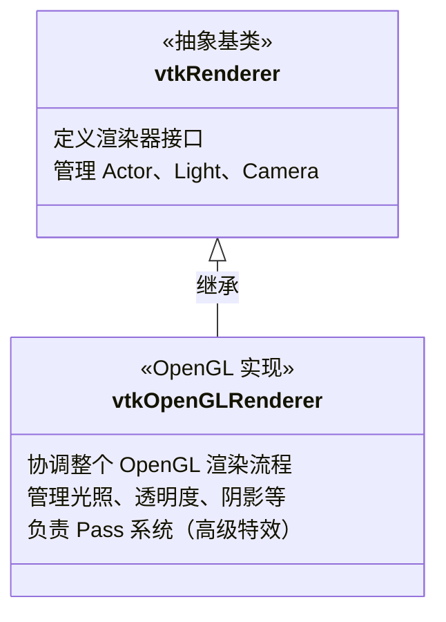
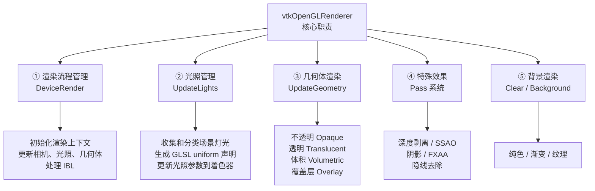
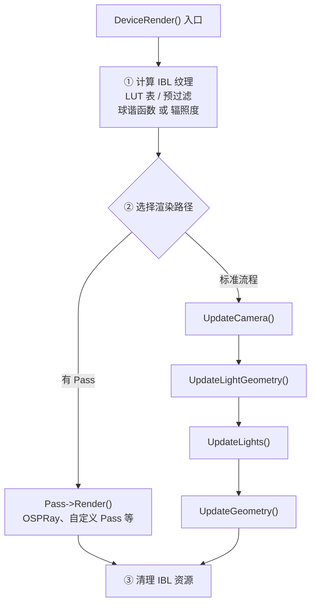
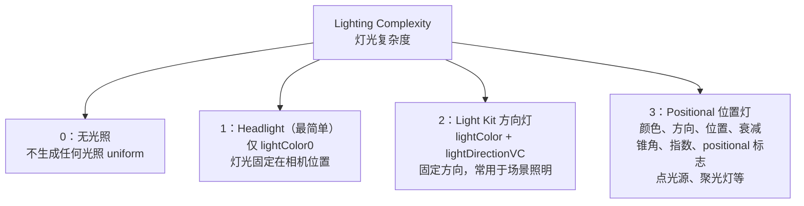
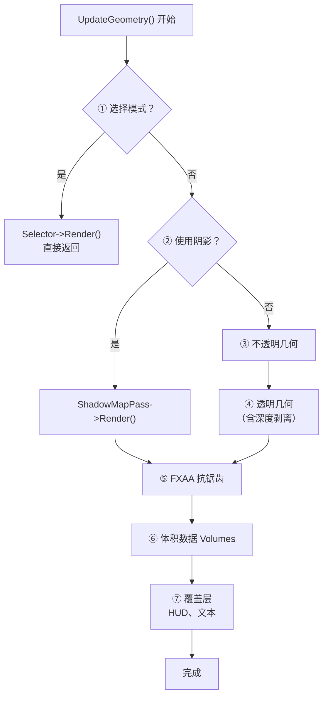
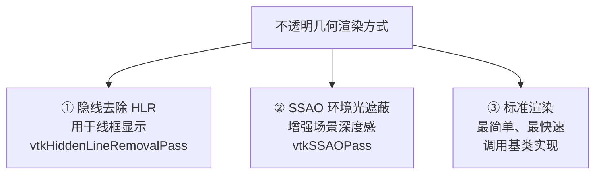
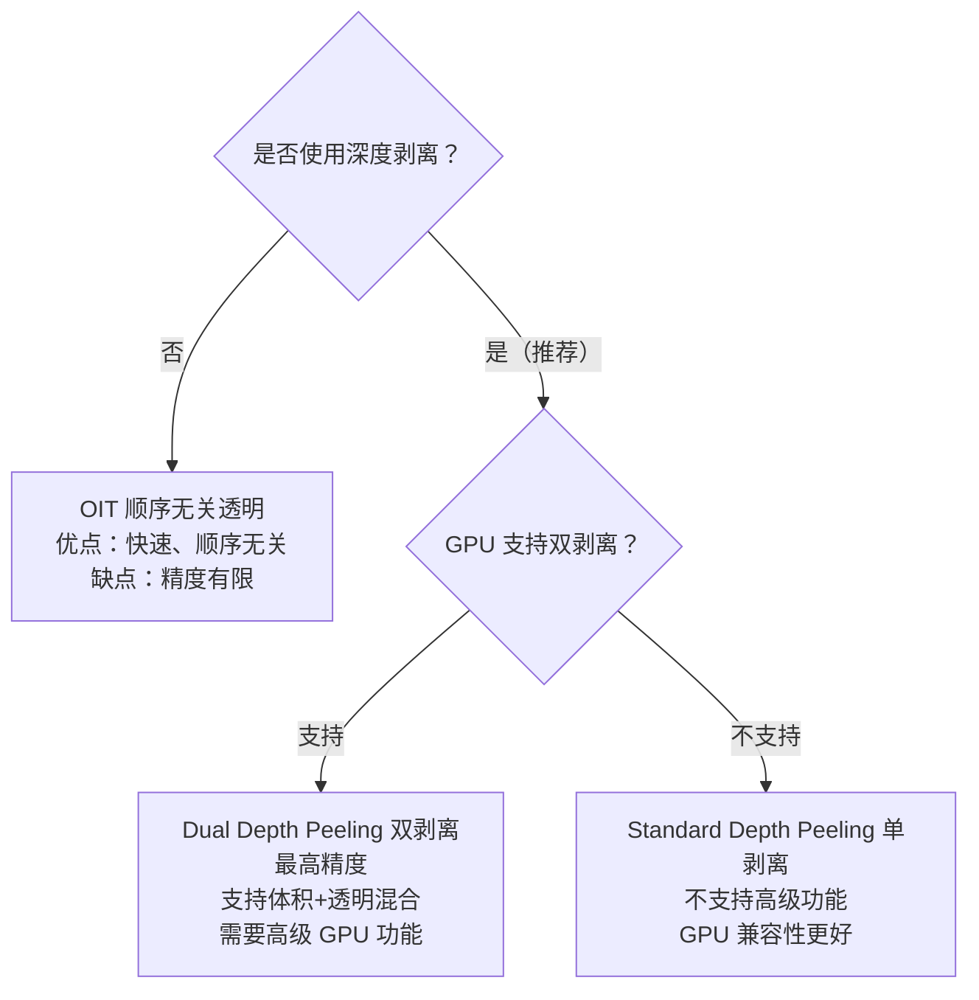
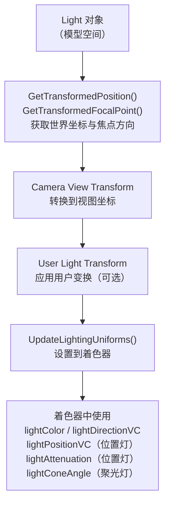
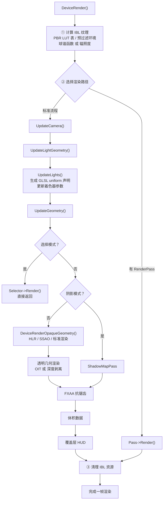

# vtkOpenGLRenderer 详细解析

## vtkOpenGLRenderer 详细解析

`vtkOpenGLRenderer` 是 VTK 中负责**OpenGL 渲染管线的核心协调器**，它管理整个场景的渲染流程，包括光照、相机、几何体、透明度处理、阴影等。

代码来源：[vtkOpenGLRenderer](https://github.com/Kitware/VTK/blob/4b354e85521dd027f2e4637e32aed48c7904500a/Rendering/OpenGL2/vtkOpenGLRenderer.cxx)

---

### 类的定位



---

### 主要功能模块



---

### 核心代码详解

#### 构造函数 - 初始化所有 Pass 对象

```
vtkOpenGLRenderer::vtkOpenGLRenderer()
{
  this->FXAAFilter = nullptr;              // FXAA 抗锯齿滤镜
  this->DepthPeelingPass = nullptr;        // 深度剥离通道
  this->SSAOPass = nullptr;                // 环境光遮蔽通道
  this->TranslucentPass = nullptr;         // 透明度通道
  this->ShadowMapPass = nullptr;           // 阴影映射通道
  this->DepthPeelingHigherLayer = 0;       // 深度剥离层数

  this->LightingCount = -1;                // 灯光数量（-1表示未初始化）
  this->LightingComplexity = -1;           // 灯光复杂度（0-3）

  this->EnvMapLookupTable = nullptr;       // PBR 查找表
  this->EnvMapIrradiance = nullptr;        // IBL 辐照度
  this->EnvMapPrefiltered = nullptr;       // IBL 预过滤
  this->UseSphericalHarmonics = true;      // 球谐函数标志
}

```

**设计意义：**

- 所有 Pass 对象延迟创建（按需创建），节省内存
- 灯光计数初始化为 -1 表示"未更新"状态

---

#### 核心渲染方法 - DeviceRender()

这是整个渲染流程的入口点：

```
void vtkOpenGLRenderer::DeviceRender()
{
  vtkTimerLog::MarkStartEvent("OpenGL Dev Render");

  // ===== 步骤1：计算 IBL (Image-Based Lighting) 纹理 =====
  // IBL：https://blog.csdn.net/shebao3333/article/details/134736437
  bool computeIBLTextures = !(this->Pass && this->Pass->IsA("vtkOSPRayPass")) &&
    this->UseImageBasedLighting && this->EnvironmentTexture;

  if (computeIBLTextures)
  {
    // 加载 PBR 相关纹理
    this->GetEnvMapLookupTable()->Load(this);           // LUT 表
    this->GetEnvMapPrefiltered()->Load(this);           // 预过滤图

    bool useSH = this->UseSphericalHarmonics;           // 使用球谐函数？

    // 如果是立方体贴图，不能使用球谐函数
    if (useSH && this->EnvironmentTexture->GetCubeMap())
    {
      vtkWarningMacro("Cannot compute spherical harmonics of a cubemap...");
      useSH = false;
    }

    // 计算球谐函数系数或辐照度纹理
    if (useSH)
    {
      if (!this->SphericalHarmonics ||
          img->GetMTime() > this->SphericalHarmonics->GetMTime())
      {
        vtkNew<vtkSphericalHarmonics> sh;
        sh->SetInputData(img);
        sh->Update();
        this->SphericalHarmonics = vtkFloatArray::SafeDownCast(
          vtkTable::SafeDownCast(sh->GetOutputDataObject(0))->GetColumn(0));
      }
    }
    else
    {
      this->GetEnvMapIrradiance()->Load(this);          // 使用辐照度纹理
    }
  }

  // ===== 步骤2：使用 RenderPass 系统 或 标准渲染流程 =====
  if (this->Pass != nullptr)
  {
    // 高级渲染通道（如 OSPRay、自定义 Pass）
    vtkRenderState s(this);
    s.SetPropArrayAndCount(this->PropArray, this->PropArrayCount);
    s.SetFrameBuffer(nullptr);
    this->Pass->Render(&s);
  }
  else
  {
    // 标准 OpenGL 渲染流程
    this->RenderWindow->MakeCurrent();
    vtkOpenGLClearErrorMacro();

    // 三个关键步骤
    this->UpdateCamera();              // 更新相机矩阵
    this->UpdateLightGeometry();       // 更新灯光位置
    this->UpdateLights();              // 更新灯光参数 → 着色器
    this->UpdateGeometry();            // 更新并渲染几何体

    vtkOpenGLCheckErrorMacro("failed after DeviceRender");
  }

  // ===== 步骤3：清理 IBL 纹理 =====
  if (computeIBLTextures)
  {
    this->GetEnvMapLookupTable()->PostRender(this);
    this->GetEnvMapIrradiance()->PostRender(this);
    this->GetEnvMapPrefiltered()->PostRender(this);
  }

  vtkTimerLog::MarkEndEvent("OpenGL Dev Render");
}

```

**流程图：**



---

#### 灯光管理 - UpdateLights()（关键方法）

这是理解 VTK 光照系统的核心：

```
int vtkOpenGLRenderer::UpdateLights()
{
  // ===== 步骤1：遍历所有灯光，分类 =====
  vtkLightCollection* lc = this->GetLights();
  vtkLight* light;

  int lightingComplexity = 0;  // 0=无  1=Headlight  2=LightKit  3=Positional
  int lightingCount = 0;

  vtkMTimeType ltime = lc->GetMTime();

  vtkCollectionSimpleIterator sit;
  for (lc->InitTraversal(sit); (light = lc->GetNextLight(sit));)
  {
    float status = light->GetSwitch();
    if (status > 0.0)  // 灯光是否启用
    {
      ltime = vtkMath::Max(ltime, light->GetMTime());
      lightingCount++;

      // 初始化复杂度
      if (lightingComplexity == 0)
        lightingComplexity = 1;
    }

    // 升级复杂度：多个灯或非 Headlight
    if (lightingComplexity == 1 &&
      (lightingCount > 1 || light->GetLightType() != VTK_LIGHT_TYPE_HEADLIGHT))
    {
      lightingComplexity = 2;
    }

    // 升级复杂度：有位置灯（点光源或聚光灯）
    if (lightingComplexity < 3 && light->GetPositional())
    {
      lightingComplexity = 3;
    }
  }

  // 如果没有灯光但使用 IBL，也需要一些光照
  if (this->GetUseImageBasedLighting() && this->GetEnvironmentTexture() &&
      lightingComplexity == 0)
  {
    lightingComplexity = 1;
  }

  // 自动创建灯光
  if (!lightingCount && this->AutomaticLightCreation)
  {
    vtkDebugMacro(<< "No lights are on, creating one.");
    this->CreateLight();
    // ... 重新初始化
  }

  // ===== 步骤2：如果灯光配置改变，生成 GLSL 代码 =====
  if (lightingComplexity != this->LightingComplexity ||
      lightingCount != this->LightingCount)
  {
    this->LightingComplexity = lightingComplexity;
    this->LightingCount = lightingCount;
    this->LightingUpdateTime = ltime;

    // 生成 GLSL uniform 声明
    std::ostringstream toString;
    switch (this->LightingComplexity)
    {
      case 0:  // 无光照
        this->LightingDeclaration = "";
        break;

      case 1:  // Headlight（简单头灯）
        this->LightingDeclaration = "uniform vec3 lightColor0;\n";
        break;

      case 2:  // Light Kit（多个方向灯）
        toString.clear();
        toString.str("");
        for (int i = 0; i < this->LightingCount; ++i)
        {
          toString << "uniform vec3 lightColor" << i << ";\n"
                   << "  uniform vec3 lightDirectionVC" << i << "; // normalized\n";
        }
        this->LightingDeclaration = toString.str();
        break;

      case 3:  // 位置灯（点光源、聚光灯）
        toString.clear();
        toString.str("");
        for (int i = 0; i < this->LightingCount; ++i)
        {
          toString << "uniform vec3 lightColor" << i << ";\n"
                   << "uniform vec3 lightDirectionVC" << i << "; // normalized\n"
                   << "uniform vec3 lightPositionVC" << i << ";\n"
                   << "uniform vec3 lightAttenuation" << i << ";\n"
                   << "uniform float lightConeAngle" << i << ";\n"
                   << "uniform float lightExponent" << i << ";\n"
                   << "uniform int lightPositional" << i << ";\n";
        }
        this->LightingDeclaration = toString.str();
        break;
    }
  }

  this->LightingUpdateTime = ltime;
  return this->LightingCount;
}

```

**灯光复杂度分类：**



**生成的 GLSL 代码示例（Complexity=3）：**

```
// 为 3 盏灯生成的 uniform 声明

uniform vec3 lightColor0;
uniform vec3 lightDirectionVC0;
uniform vec3 lightPositionVC0;
uniform vec3 lightAttenuation0;
uniform float lightConeAngle0;
uniform float lightExponent0;
uniform int lightPositional0;

uniform vec3 lightColor1;
// ... 相同模式

```

---

#### 几何体渲染 - UpdateGeometry()

管理所有几何体的渲染，包括选择、阴影、透明度：

```
int vtkOpenGLRenderer::UpdateGeometry(vtkFrameBufferObjectBase* fbo)
{
  vtkRenderTimerLog* timer = this->GetRenderWindow()->GetRenderTimer();
  VTK_SCOPED_RENDER_EVENT("vtkOpenGLRenderer::UpdateGeometry", timer);

  int i;
  this->NumberOfPropsRendered = 0;

  if (this->PropArrayCount == 0)
    return 0;

  // ===== 步骤1：处理选择模式 =====
  if (this->Selector)
  {
    VTK_SCOPED_RENDER_EVENT2("Selection", timer, selectionEvent);

    // 使用选择器进行拾取渲染
    if (this->PickFromProps)
    {
      // 从指定的 Props 中选择
      vtkProp** pa = new vtkProp*[this->PickFromProps->GetNumberOfItems()];
      int pac = 0;

      vtkCollectionSimpleIterator pit;
      for (this->PickFromProps->InitTraversal(pit);
           (aProp = this->PickFromProps->GetNextProp(pit));)
      {
        if (aProp->GetVisibility())
          pa[pac++] = aProp;
      }

      this->NumberOfPropsRendered = this->Selector->Render(this, pa, pac);
      delete[] pa;
    }
    else
    {
      // 从所有 Props 中选择
      this->NumberOfPropsRendered =
        this->Selector->Render(this, this->PropArray, this->PropArrayCount);
    }

    this->RenderTime.Modified();
    return this->NumberOfPropsRendered;
  }

  // ===== 步骤2：阴影渲染 或 标准几何渲染 =====
  int hasTranslucentPolygonalGeometry = 0;

  if (this->UseShadows)
  {
    VTK_SCOPED_RENDER_EVENT2("Shadows", timer, shadowsEvent);

    // 创建阴影 Pass
    if (!this->ShadowMapPass)
      this->ShadowMapPass = vtkShadowMapPass::New();

    vtkRenderState s(this);
    s.SetPropArrayAndCount(this->PropArray, this->PropArrayCount);

    // 执行阴影贴图烘焙和渲染
    this->ShadowMapPass->GetShadowMapBakerPass()->Render(&s);
    this->ShadowMapPass->Render(&s);
  }
  else
  {
    // ===== 不透明几何 =====
    timer->MarkStartEvent("Opaque Geometry");
    this->DeviceRenderOpaqueGeometry(fbo);
    timer->MarkEndEvent();

    // 检查是否有透明几何
    for (i = 0; !hasTranslucentPolygonalGeometry && i < this->PropArrayCount; i++)
    {
      hasTranslucentPolygonalGeometry =
        this->PropArray[i]->HasTranslucentPolygonalGeometry();
    }

    // ===== 透明几何 =====
    if (hasTranslucentPolygonalGeometry)
    {
      timer->MarkStartEvent("Translucent Geometry");
      this->DeviceRenderTranslucentPolygonalGeometry(fbo);
      timer->MarkEndEvent();
    }
  }

  // ===== 步骤3：抗锯齿 (FXAA) =====
  if (this->UseFXAA)
  {
    timer->MarkStartEvent("FXAA");
    if (!this->FXAAFilter)
      this->FXAAFilter = vtkOpenGLFXAAFilter::New();

    if (this->FXAAOptions)
      this->FXAAFilter->UpdateConfiguration(this->FXAAOptions);

    this->FXAAFilter->Execute(this);
    timer->MarkEndEvent();
  }

  // ===== 步骤4：体积数据 =====
  if (hasTranslucentPolygonalGeometry == 0 || !this->UseDepthPeeling ||
    !this->UseDepthPeelingForVolumes)
  {
    timer->MarkStartEvent("Volumes");
    for (i = 0; i < this->PropArrayCount; i++)
    {
      this->NumberOfPropsRendered +=
        this->PropArray[i]->RenderVolumetricGeometry(this);
    }
    timer->MarkEndEvent();
  }

  // ===== 步骤5：覆盖层（HUD、文本等） =====
  timer->MarkStartEvent("Overlay");
  for (i = 0; i < this->PropArrayCount; i++)
  {
    this->NumberOfPropsRendered +=
      this->PropArray[i]->RenderOverlay(this);
  }
  timer->MarkEndEvent();

  this->RenderTime.Modified();
  vtkDebugMacro(<< "Rendered " << this->NumberOfPropsRendered << " actors");

  return this->NumberOfPropsRendered;
}

```

**渲染顺序流程：**



---

#### 不透明几何渲染 - DeviceRenderOpaqueGeometry()

```
void vtkOpenGLRenderer::DeviceRenderOpaqueGeometry(vtkFrameBufferObjectBase* fbo)
{
  // ===== 选择渲染方法 =====

  // 隐线去除（Wireframe）
  bool useHLR = this->UseHiddenLineRemoval &&
    vtkHiddenLineRemovalPass::WireframePropsExist(this->PropArray, this->PropArrayCount);

  if (useHLR)
  {
    vtkNew<vtkHiddenLineRemovalPass> hlrPass;
    vtkRenderState s(this);
    s.SetPropArrayAndCount(this->PropArray, this->PropArrayCount);
    s.SetFrameBuffer(fbo);
    hlrPass->Render(&s);
    this->NumberOfPropsRendered += hlrPass->GetNumberOfRenderedProps();
  }
  else
  {
    // SSAO（Screen Space Ambient Occlusion）
    if (this->UseSSAO)
    {
      if (!this->SSAOPass)
      {
        this->SSAOPass = vtkSSAOPass::New();
        vtkNew<vtkOpaquePass> opaqueP;
        this->SSAOPass->SetDelegatePass(opaqueP);
      }

      vtkRenderState s(this);
      s.SetPropArrayAndCount(this->PropArray, this->PropArrayCount);
      s.SetFrameBuffer(fbo);

      // 设置 SSAO 参数
      this->SSAOPass->SetRadius(this->SSAORadius);
      this->SSAOPass->SetBias(this->SSAOBias);
      this->SSAOPass->SetKernelSize(this->SSAOKernelSize);
      this->SSAOPass->SetBlur(this->SSAOBlur);

      this->SSAOPass->Render(&s);
      this->NumberOfPropsRendered += this->SSAOPass->GetNumberOfRenderedProps();
    }
    else
    {
      // 标准不透明渲染
      this->Superclass::DeviceRenderOpaqueGeometry();
    }
  }
}

```

**不透明几何的三种渲染方式：**



---

#### 透明几何渲染 - DeviceRenderTranslucentPolygonalGeometry()

处理透明度问题的最复杂的部分：

```
void vtkOpenGLRenderer::DeviceRenderTranslucentPolygonalGeometry(vtkFrameBufferObjectBase* fbo)
{
  vtkOpenGLClearErrorMacro();
  vtkOpenGLRenderWindow* context = vtkOpenGLRenderWindow::SafeDownCast(this->RenderWindow);

  if (!this->UseDepthPeeling)
  {
    // ===== 不使用深度剥离：使用 OIT (Order-Independent Transparency) =====
    if (!this->TranslucentPass)
    {
      // 创建顺序无关透明度 Pass
      vtkOrderIndependentTranslucentPass* oit = vtkOrderIndependentTranslucentPass::New();
      this->TranslucentPass = oit;
    }

    vtkTranslucentPass* tp = vtkTranslucentPass::New();
    this->TranslucentPass->SetTranslucentPass(tp);
    tp->Delete();

    vtkRenderState s(this);
    s.SetPropArrayAndCount(this->PropArray, this->PropArrayCount);
    s.SetFrameBuffer(fbo);

    this->LastRenderingUsedDepthPeeling = 0;
    this->TranslucentPass->Render(&s);
    this->NumberOfPropsRendered += this->TranslucentPass->GetNumberOfRenderedProps();
  }
  else  // 使用深度剥离
  {
#ifdef GL_ES_VERSION_3_0
    vtkErrorMacro("Built in Dual Depth Peeling is not supported on ES3...");
    this->UpdateTranslucentPolygonalGeometry();
#else
    // ===== 创建或配置深度剥离 Pass =====
    if (!this->DepthPeelingPass)
    {
      // 选择单剥离或双剥离
      if (this->IsDualDepthPeelingSupported())
      {
        vtkDebugMacro("Using dual depth peeling.");
        vtkDualDepthPeelingPass* ddpp = vtkDualDepthPeelingPass::New();
        this->DepthPeelingPass = ddpp;
      }
      else
      {
        vtkDebugMacro("Using standard depth peeling...");
        this->DepthPeelingPass = vtkDepthPeelingPass::New();
      }

      vtkTranslucentPass* tp = vtkTranslucentPass::New();
      this->DepthPeelingPass->SetTranslucentPass(tp);
      tp->Delete();
    }

    // ===== 配置体积+深度剥离 =====
    if (this->UseDepthPeelingForVolumes)
    {
      vtkDualDepthPeelingPass* ddpp =
        vtkDualDepthPeelingPass::SafeDownCast(this->DepthPeelingPass);

      if (!ddpp)
      {
        vtkWarningMacro("UseDepthPeelingForVolumes requested, but unsupported...");
        this->UseDepthPeelingForVolumes = false;
      }
      else if (!ddpp->GetVolumetricPass())
      {
        vtkVolumetricPass* vp = vtkVolumetricPass::New();
        ddpp->SetVolumetricPass(vp);
        vp->Delete();
      }
    }
    else
    {
      vtkDualDepthPeelingPass* ddpp =
        vtkDualDepthPeelingPass::SafeDownCast(this->DepthPeelingPass);
      if (ddpp)
        ddpp->SetVolumetricPass(nullptr);
    }

    // ===== 执行深度剥离渲染 =====
    this->DepthPeelingPass->SetMaximumNumberOfPeels(this->MaximumNumberOfPeels);
    this->DepthPeelingPass->SetOcclusionRatio(this->OcclusionRatio);

    vtkRenderState s(this);
    s.SetPropArrayAndCount(this->PropArray, this->PropArrayCount);
    s.SetFrameBuffer(fbo);

    this->LastRenderingUsedDepthPeeling = 1;
    this->DepthPeelingPass->Render(&s);
    this->NumberOfPropsRendered += this->DepthPeelingPass->GetNumberOfRenderedProps();
#endif
  }

  vtkOpenGLCheckErrorMacro("failed after DeviceRenderTranslucentPolygonalGeometry");
}

```

**透明度处理方案对比：**



---

#### 背景渲染 - Clear()

处理各种背景类型：

```
void vtkOpenGLRenderer::Clear()
{
  vtkOpenGLClearErrorMacro();

  GLbitfield clear_mask = 0;
  vtkOpenGLState* ostate = this->GetState();

  // ===== 清屏颜色 =====
  if (!this->Transparent())
  {
    ostate->vtkglClearColor(
      static_cast<GLclampf>(this->Background[0]),
      static_cast<GLclampf>(this->Background[1]),
      static_cast<GLclampf>(this->Background[2]),
      static_cast<GLclampf>(this->BackgroundAlpha));
    clear_mask |= GL_COLOR_BUFFER_BIT;
  }

  // ===== 清屏深度 =====
  if (!this->GetPreserveDepthBuffer())
  {
    ostate->vtkglClearDepth(static_cast<GLclampf>(1.0));
    clear_mask |= GL_DEPTH_BUFFER_BIT;
    ostate->vtkglDepthMask(GL_TRUE);
  }

  vtkDebugMacro(<< "glClear\n");
  ostate->vtkglColorMask(GL_TRUE, GL_TRUE, GL_TRUE, GL_TRUE);
  ostate->vtkglClear(clear_mask);

  // ===== 渐变背景或纹理背景 =====
  if (!this->Transparent() && (this->GradientBackground || this->TexturedBackground))
  {
    auto oglRenWin = vtkOpenGLRenderWindow::SafeDownCast(this->GetRenderWindow());
    auto texture = this->GetCurrentTexturedBackground();

    // 使用全屏四边形 Shader 渲染
    std::string fs = vtkOpenGLRenderUtilities::GetFullScreenQuadFragmentShaderTemplate();
    ostate->vtkglDisable(GL_DEPTH_TEST);

    if (this->TexturedBackground && texture)
    {
      // 纹理背景：采样纹理
      vtkShaderProgram::Substitute(fs, "//VTK::FSQ::Decl",
        "uniform sampler2D backgroundImage;\n"
        "//VTK::FSQ::Decl");
      vtkShaderProgram::Substitute(fs, "//VTK::FSQ::Impl",
        "  gl_FragData[0] = vec4(texture(backgroundImage, texCoord).rgb, 1.0);\n"
        "//VTK::FSQ::Impl");
    }
    else  // 渐变背景
    {
      vtkShaderProgram::Substitute(fs, "//VTK::FSQ::Decl",
        "uniform vec3 stopColors[2];\n"
        "uniform vec2 screenSize;\n"
        "//VTK::FSQ::Decl");

      // 根据渐变模式选择算法
      switch (this->GradientMode)
      {
        case VTK_GRADIENT_RADIAL_VIEWPORT_FARTHEST_SIDE:
          vtkShaderProgram::Substitute(fs, "//VTK::FSQ::Impl",
            "  float value = clamp(length(texCoord - vec2(0.5)) * 2.0, 0.0, 1.0);\n"
            "//VTK::FSQ::Impl");
          break;
        case VTK_GRADIENT_HORIZONTAL:
          vtkShaderProgram::Substitute(fs, "//VTK::FSQ::Impl",
            "  float value = texCoord.s;\n"
            "//VTK::FSQ::Impl");
          break;
        case VTK_GRADIENT_VERTICAL:
          // ... 其他情况
          break;
      }

      // 混合两种颜色
      vtkShaderProgram::Substitute(fs, "//VTK::FSQ::Impl",
        "  gl_FragData[0] = vec4(stopColors[0] * (1.0 - value) + "
        "stopColors[1] * value, 1.0);");
    }

    // 编译并执行 Shader
    this->BackgroundRenderer.reset(
      new vtkOpenGLQuadHelper(oglRenWin, nullptr, fs.c_str(), nullptr, false));

    oglRenWin->GetShaderCache()->ReadyShaderProgram(this->BackgroundRenderer->Program);

    // 设置 uniform
    if (this->TexturedBackground && texture)
    {
      texture->InterpolateOn();
      texture->Render(this);
      this->BackgroundRenderer->Program->SetUniformi(
        "backgroundImage", texture->GetTextureUnit());
    }
    else
    {
      float stopColors[2][3] = {};
      std::copy(this->Background, this->Background + 3, &stopColors[0][0]);
      std::copy(this->Background2, this->Background2 + 3, &stopColors[1][0]);

      this->BackgroundRenderer->Program->SetUniform3fv("stopColors", 2, stopColors);
      // ... 设置其他参数
    }

    // 渲染背景
    this->BackgroundRenderer->Render();

    // 清理纹理
    if (this->TexturedBackground && texture)
      texture->PostRender(this);
  }

  ostate->vtkglEnable(GL_DEPTH_TEST);
  vtkOpenGLCheckErrorMacro("failed after Clear");
}

```

**背景渲染的三种模式：**

```
// 模式1: 纯色背景
glClearColor(r, g, b, a);

// 模式2: 渐变背景
float value = length(texCoord - vec2(0.5)) * 2.0;  // 径向
float value = texCoord.s;  // 水平
float value = texCoord.t;  // 竖直

gl_FragColor = mix(color1, color2, value);

// 模式3: 纹理背景
gl_FragColor = texture(backgroundImage, texCoord);

```

---

#### 灯光 Uniforms 更新 - UpdateLightingUniforms()

将灯光参数设置到 GLSL 着色器：

```
void vtkOpenGLRenderer::UpdateLightingUniforms(vtkShaderProgram* program)
{
  // ===== 检查是否需要更新 =====
  vtkMTimeType ptime = program->GetUniformGroupUpdateTime(vtkShaderProgram::LightingGroup);
  vtkMTimeType ltime = this->LightingUpdateTime;

  // 相机影响灯光（对于非头灯情况）
  if (this->LightingComplexity > 1)
  {
    vtkCamera* cam = this->GetActiveCamera();
    ltime = vtkMath::Max(ltime, cam->GetMTime());
  }

  if (ltime <= ptime)
    return;  // 无需更新

  // ===== 获取相机变换 =====
  vtkTransform* viewTF = this->GetActiveCamera()->GetModelViewTransformObject();

  // ===== 设置灯光参数到着色器 =====
  int numberOfLights = 0;
  vtkLightCollection* lc = this->GetLights();
  vtkLight* light;

  vtkCollectionSimpleIterator sit;
  float lightColor[3];
  float lightDirection[3];

  for (lc->InitTraversal(sit); (light = lc->GetNextLight(sit));)
  {
    if (light->GetSwitch() <= 0.0)
      continue;

    // 灯光颜色
    double* dColor = light->GetDiffuseColor();
    double intensity = light->GetIntensity();
    lightColor[0] = dColor[0] * intensity;
    lightColor[1] = dColor[1] * intensity;
    lightColor[2] = dColor[2] * intensity;

    std::ostringstream toString;
    toString << numberOfLights;
    std::string count = toString.str();

    program->SetUniform3f(("lightColor" + count).c_str(), lightColor);

    // ===== 只有非头灯才设置方向 =====
    if (this->LightingComplexity >= 2)
    {
      // 计算灯光方向（从焦点指向灯光）
      double* lfp = light->GetTransformedFocalPoint();
      double* lp = light->GetTransformedPosition();
      double lightDir[3];
      vtkMath::Subtract(lfp, lp, lightDir);
      vtkMath::Normalize(lightDir);

      // 转换到视图坐标系
      double tDirView[3];
      viewTF->TransformNormal(lightDir, tDirView);

      // 应用用户灯光变换（如果有）
      if (!light->LightTypeIsSceneLight() &&
          this->UserLightTransform.GetPointer() != nullptr)
      {
        double* tDir = this->UserLightTransform->TransformNormal(tDirView);
        lightDirection[0] = tDir[0];
        lightDirection[1] = tDir[1];
        lightDirection[2] = tDir[2];
      }
      else
      {
        lightDirection[0] = tDirView[0];
        lightDirection[1] = tDirView[1];
        lightDirection[2] = tDirView[2];
      }

      program->SetUniform3f(("lightDirectionVC" + count).c_str(), lightDirection);

      // ===== 位置灯光：设置位置、衰减、圆锥等 =====
      if (this->LightingComplexity >= 3)
      {
        float lightAttenuation[3];
        float lightPosition[3];

        // 衰减系数
        double* attn = light->GetAttenuationValues();
        lightAttenuation[0] = attn[0];
        lightAttenuation[1] = attn[1];
        lightAttenuation[2] = attn[2];

        // 位置（视图坐标）
        double tlpView[3];
        viewTF->TransformPoint(lp, tlpView);

        if (!light->LightTypeIsSceneLight() &&
            this->UserLightTransform.GetPointer() != nullptr)
        {
          double* tlp = this->UserLightTransform->TransformPoint(tlpView);
          lightPosition[0] = tlp[0];
          lightPosition[1] = tlp[1];
          lightPosition[2] = tlp[2];
        }
        else
        {
          lightPosition[0] = tlpView[0];
          lightPosition[1] = tlpView[1];
          lightPosition[2] = tlpView[2];
        }

        program->SetUniform3f(("lightAttenuation" + count).c_str(), lightAttenuation);
        program->SetUniformi(("lightPositional" + count).c_str(), light->GetPositional());
        program->SetUniform3f(("lightPositionVC" + count).c_str(), lightPosition);
        program->SetUniformf(("lightExponent" + count).c_str(), light->GetExponent());
        program->SetUniformf(("lightConeAngle" + count).c_str(), light->GetConeAngle());
      }
    }

    numberOfLights++;
  }

  // 标记为已更新
  program->SetUniformGroupUpdateTime(vtkShaderProgram::LightingGroup, ltime);
}

```

**灯光参数流动图：**



---

### 完整渲染流程总结



---

### 关键特性总结

| 特性 | 实现 | 作用  |
| **灯光复杂度分类** | 0-3 级别 | 自动生成最优着色器代码  |
| **Pass 系统** | vtkRenderPass 继承 | 支持高级渲染效果  |
| **深度剥离** | 单/双剥离算法 | 正确处理透明度排序  |
| **IBL 支持** | PBR 纹理烘烤 | 现实感光照  |
| **SSAO** | 屏幕空间环境光遮蔽 | 增强深度感  |
| **FXAA** | 快速近似抗锯齿 | 平衡质量和性能  |
| **背景渲染** | 纯色/渐变/纹理 | 灵活的背景配置  |
| **矩阵缓存** | MTime 检查 | 避免重复计算  |

---

### 设计模式

```
// 1. 按需创建 Pass（延迟初始化）
if (!this->FXAAFilter)
  this->FXAAFilter = vtkOpenGLFXAAFilter::New();

// 2. 使用 MTime 缓存检查
if (ltime <= ptime)
  return;  // 数据未变化，跳过更新

// 3. RAII 错误检查
vtkOpenGLClearErrorMacro();
// ... 渲染代码
vtkOpenGLCheckErrorMacro("failed after render");

// 4. 状态隔离
vtkOpenGLState* ostate = this->GetState();
ostate->vtkglEnable(GL_DEPTH_TEST);
// ... 使用缓存机制

// 5. Pass 链式处理
pass->SetDelegatePass(another_pass);
pass->Render(&state);

```

这就是 `vtkOpenGLRenderer` 作为 VTK 渲染系统核心协调器的完整图景！
