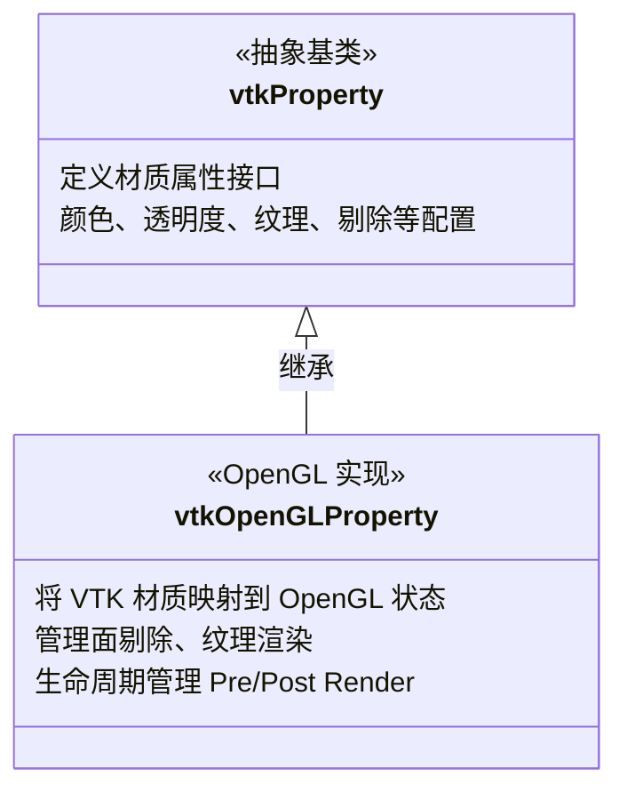
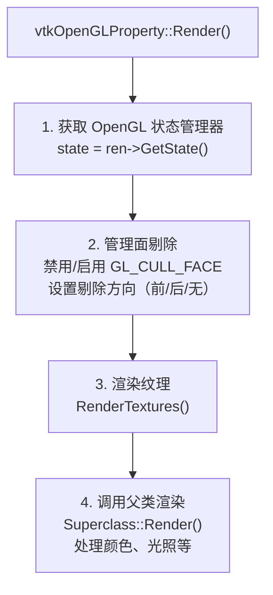
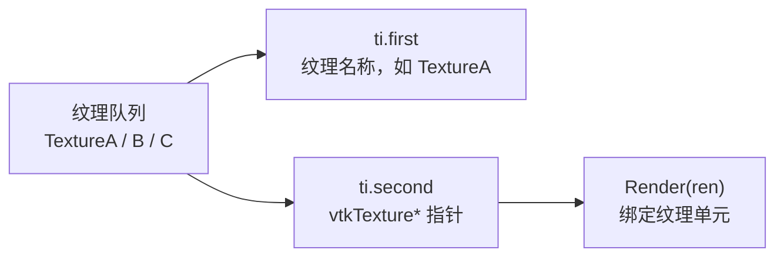
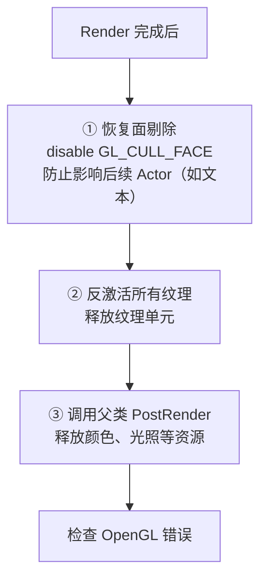
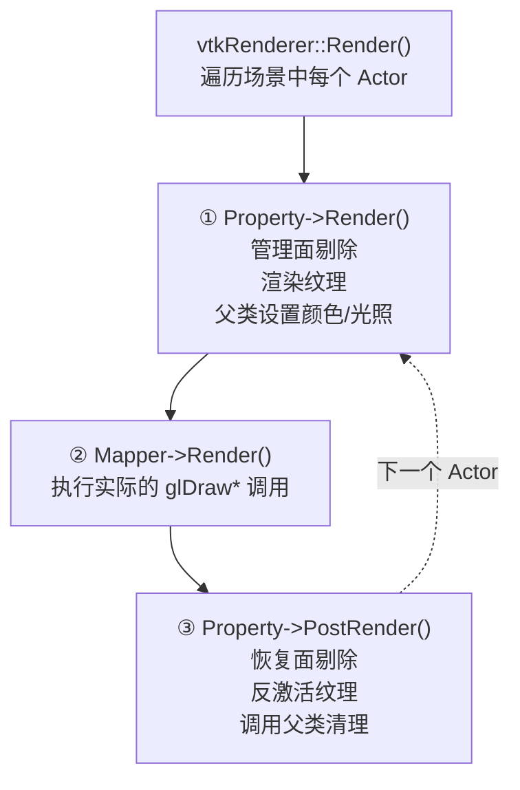
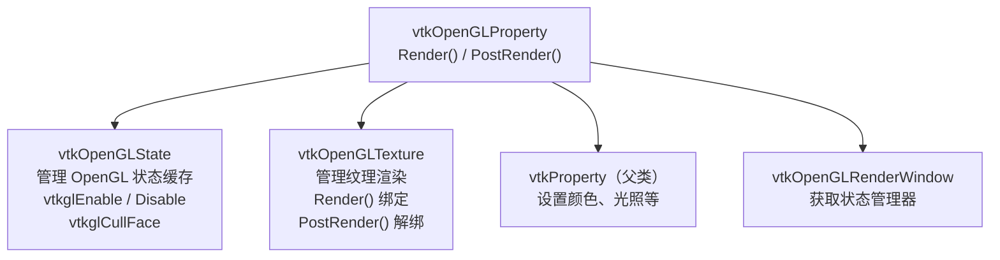
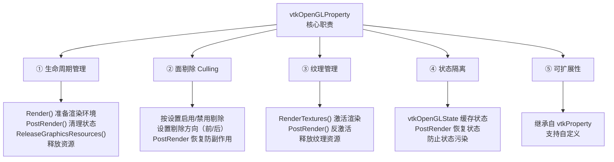
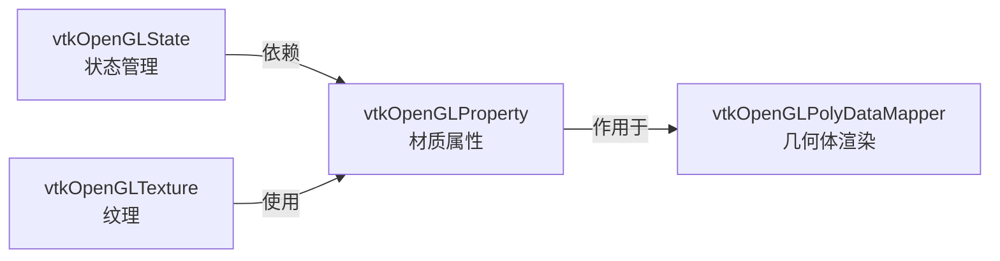

---
title: vtkOpenGLProperty 详细解析
description: 源码来源：[vtkOpenGLProperty.cxx](https://github.com/Kitware/VTK/blob/4b354e85521dd027f2e4637e32aed48c7904500a/Rendering/OpenGL2/vtkOpenGLProperty.cxx)  现在
---

# vtkOpenGLProperty 详细解析

源码来源：[vtkOpenGLProperty.cxx](https://github.com/Kitware/VTK/blob/4b354e85521dd027f2e4637e32aed48c7904500a/Rendering/OpenGL2/vtkOpenGLProperty.cxx)
 现在让我获取基类 `vtkProperty` 的相关信息：
 现在我有足够的信息来详细解释 `vtkOpenGLProperty` 类。让我创建一个全面的分析：

---

## vtkOpenGLProperty 详细解析

### 类的定位与继承体系



---

### 核心功能详解

#### **构造与析构**

```
vtkOpenGLProperty::vtkOpenGLProperty() = default;
vtkOpenGLProperty::~vtkOpenGLProperty() = default;

```

**特点：**

- 使用默认构造/析构（`= default`）
- VTK 对象的典型模式，简洁高效
- 不在构造时分配资源（资源管理由父类和渲染流程管理）

---

#### **核心渲染方法：Render()**

```
void vtkOpenGLProperty::Render(vtkActor* anActor, vtkRenderer* ren)
{
  // 获取 OpenGL 状态管理器
  vtkOpenGLState* ostate = static_cast<vtkOpenGLRenderer*>(ren)->GetState();

  // ===== 步骤1：面剔除（Culling）管理 =====
  if (!this->BackfaceCulling && !this->FrontfaceCulling)
  {
    // 都不剔除 → 禁用剔除
    ostate->vtkglDisable(GL_CULL_FACE);
  }
  else if (this->BackfaceCulling)
  {
    // 剔除背面
    ostate->vtkglCullFace(GL_BACK);
    ostate->vtkglEnable(GL_CULL_FACE);
  }
  else  // FrontfaceCulling 为 true
  {
    // 剔除正面
    ostate->vtkglCullFace(GL_FRONT);
    ostate->vtkglEnable(GL_CULL_FACE);
  }

  // ===== 步骤2：纹理渲染 =====
  this->RenderTextures(anActor, ren);

  // ===== 步骤3：调用父类渲染（颜色、光照等） =====
  this->Superclass::Render(anActor, ren);
}

```

**执行流程图：**



**关键概念：**

| 操作 | 含义 | 应用场景  |
| **禁用剔除** | 渲染两面 | 薄片、窗口、透明物体  |
| **背面剔除** | 只显示正面 | 大多数不透明物体（默认）  |
| **正面剔除** | 只显示背面 | 内部渲染、特殊效果  |

---

#### **纹理渲染方法：RenderTextures()**

```
bool vtkOpenGLProperty::RenderTextures(vtkActor*, vtkRenderer* ren)
{
  // 获取该材质上所有的纹理
  auto textures = this->GetAllTextures();

  // 逐个渲染纹理
  for (auto ti : textures)
  {
    ti.second->Render(ren);  // ti.second 是纹理对象
  }

  vtkOpenGLCheckErrorMacro("failed after Render");

  // 返回是否有纹理
  return (!textures.empty());
}

```

**数据结构：**

```
auto textures = this->GetAllTextures();
// 返回 std::map<std::string, vtkTexture*>
//      ↑ 纹理名称    ↑ 纹理对象指针

```

**工作流程：**



---

#### **渲染后清理：PostRender()**

```
void vtkOpenGLProperty::PostRender(vtkActor* actor, vtkRenderer* renderer)
{
  vtkOpenGLClearErrorMacro();

  // ===== 步骤1：恢复面剔除状态 =====
  if (this->BackfaceCulling || this->FrontfaceCulling)
  {
    // 禁用剔除，避免影响后续渲染（如文本）
    static_cast<vtkOpenGLRenderer*>(renderer)->GetState()->vtkglDisable(GL_CULL_FACE);
  }

  // ===== 步骤2：反激活纹理 =====
  auto textures = this->GetAllTextures();
  for (auto ti : textures)
  {
    ti.second->PostRender(renderer);  // 解绑纹理单元
  }

  // ===== 步骤3：调用父类清理 =====
  this->Superclass::PostRender(actor, renderer);

  vtkOpenGLCheckErrorMacro("failed after PostRender");
}

```

**清理流程图：**



**为什么要恢复面剔除？**

```
场景：先渲染 3D 模型，再渲染文本 HUD

 不恢复
  1. 模型设置 GL_CULL_FACE = GL_BACK
  2. 模型渲染完成
  3. 文本对象不知道需要禁用 GL_CULL_FACE
  4. 文本可能被错误地剔除！

 恢复
  1. 模型设置 GL_CULL_FACE = GL_BACK
  2. 模型渲染完成
  3. PostRender 禁用 GL_CULL_FACE
  4. 文本正常渲染

```

---

#### **反向渲染：BackfaceRender()**

```
void vtkOpenGLProperty::BackfaceRender(
  vtkActor* vtkNotUsed(anActor),
  vtkRenderer* vtkNotUsed(ren))
{
  // 空实现！
}

```

**说明：**

- 用于特殊渲染模式（如体积渲染）
- 当前 OpenGL2 实现中未使用
- `vtkNotUsed()` 宏消除编译警告

---

#### **资源释放：ReleaseGraphicsResources()**

```
void vtkOpenGLProperty::ReleaseGraphicsResources(vtkWindow* win)
{
  // 释放所有纹理资源
  auto textures = this->GetAllTextures();
  for (auto ti : textures)
  {
    ti.second->ReleaseGraphicsResources(win);
    //                                  ↑
    //                    指定在哪个窗口释放
  }

  // 释放父类资源
  this->Superclass::ReleaseGraphicsResources(win);
}

```

**释放时机：**

- 窗口关闭时
- 属性对象被销毁时
- 显式调用时（如窗口大小改变）

---

### 完整的渲染生命周期



---

### 应用场景

#### 场景 1：不透明实心物体

```
actor->GetProperty()->SetBackfaceCulling(true);  // 只显示正面
actor->GetProperty()->SetOpacity(1.0);           // 完全不透明
// vtkOpenGLProperty::Render() 会自动处理

```

**结果：**

- 背面被剔除，性能最优
- 正面显示，视觉清晰

#### 场景 2：透明薄片（如纸张）

```
actor->GetProperty()->SetBackfaceCulling(false);  // 显示两面
actor->GetProperty()->SetOpacity(0.5);            // 半透明

```

**结果：**

- 两面都渲染，可看到边缘
- 透视可见，符合物理

#### 场景 3：纹理映射的建筑

```
vtkImageData* image = /* load texture */;
vtkTexture* texture = vtkTexture::New();
texture->SetInputData(image);
actor->GetProperty()->SetTexture("diffuse", texture);

```

**vtkOpenGLProperty 的作用：**

- `RenderTextures()` 自动绑定纹理单元
- `PostRender()` 自动解绑纹理

#### 场景 4：复杂场景（多个 Actor 并存）

```
// 第一个 Actor：3D 模型
actor1->GetProperty()->SetBackfaceCulling(true);

// 第二个 Actor：HUD 文本
actor2->GetProperty()->SetBackfaceCulling(false);

// vtkOpenGLProperty::PostRender() 确保
// actor1 的剔除设置不会影响 actor2

```

---

### 与其他组件的交互



---

### ️ 关键细节与陷阱

#### 1. 面剔除的三种状态

```
// 状态1：都不剔除
BackfaceCulling = false
FrontfaceCulling = false
  → glDisable(GL_CULL_FACE)

// 状态2：剔除背面（默认）
BackfaceCulling = true
FrontfaceCulling = false
  → glCullFace(GL_BACK)
  → glEnable(GL_CULL_FACE)

// 状态3：剔除正面
BackfaceCulling = false
FrontfaceCulling = true
  → glCullFace(GL_FRONT)
  → glEnable(GL_CULL_FACE)

// 注意：不支持同时剔除正面和背面
// 如果都为 true，会按 BackfaceCulling 处理

```

#### 2. 必须使用 vtkOpenGLState

```
//  直接调用 OpenGL 函数
glCullFace(GL_BACK);

//  通过 vtkOpenGLState
ostate->vtkglCullFace(GL_BACK);
//     ↑
//   有缓存机制，避免冗余调用

```

#### 3. PostRender 的重要性

```
// 错误示例：没有 PostRender
void BadProperty::Render(...) {
  state->vtkglEnable(GL_CULL_FACE);
  // ... 渲染 ...
  // 不恢复！导致后续 Actor 受影响
}

// 正确示例
void GoodProperty::Render(...) {
  state->vtkglEnable(GL_CULL_FACE);
  // ... 渲染 ...
}

void GoodProperty::PostRender(...) {
  state->vtkglDisable(GL_CULL_FACE);
  // 恢复状态
}

```

---

### 性能优化点

| 优化点 | 机制 | 收益  |
| **状态缓存** | vtkOpenGLState 检查是否变化 | 减少 GPU 状态切换  |
| **面剔除** | 背面剔除减少 50% 三角形处理 | 2-3 倍性能提升  |
| **纹理复用** | PostRender 及时释放单元 | 支持多纹理并行  |
| **延迟父类调用** | Superclass::Render() 最后调用 | 充分利用缓存  |

---

### 功能要点总结



---

### 使用示例

```
#include "vtkActor.h"
#include "vtkPolyDataMapper.h"
#include "vtkRenderer.h"
#include "vtkRenderWindow.h"

// 创建 Actor
vtkActor* actor = vtkActor::New();

// 获取 OpenGL 属性（自动创建 vtkOpenGLProperty）
vtkProperty* prop = actor->GetProperty();

// 配置外观
prop->SetColor(1.0, 0.0, 0.0);          // 红色
prop->SetOpacity(0.8);                   // 80% 透明
prop->SetBackfaceCulling(true);          // 剔除背面

// 添加纹理
vtkTexture* texture = vtkTexture::New();
texture->SetInputData(imageData);
prop->SetTexture("diffuse", texture);

// 渲染时，vtkOpenGLProperty 自动处理：
// 1. 启用面剔除
// 2. 绑定纹理
// 3. 渲染几何体
// 4. PostRender：恢复状态、解绑纹理

renderer->AddViewProp(actor);
renWin->Render();

```

---

### 与其他 OpenGL 类的关系



> 完整渲染链：Property（外观）→ State（状态）→ Mapper（几何）→ OpenGL（硬件）

这就是 `vtkOpenGLProperty` 作为 VTK-OpenGL 集成中的**关键材质属性管理类**的完整图景！
