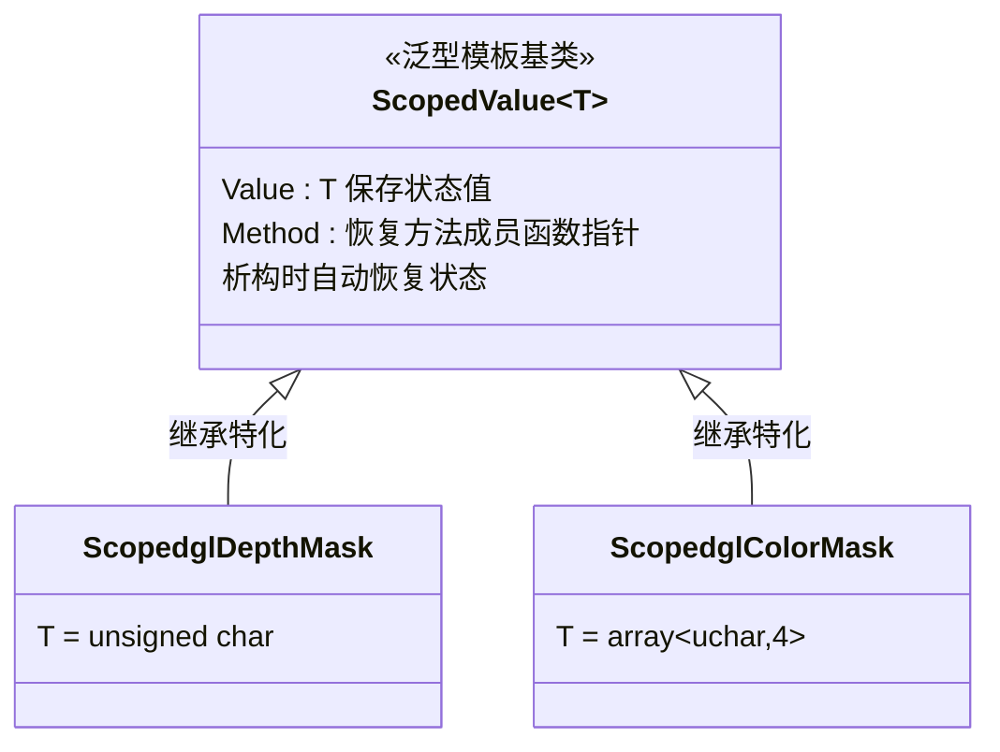
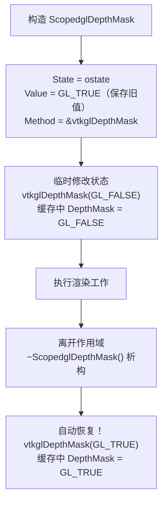
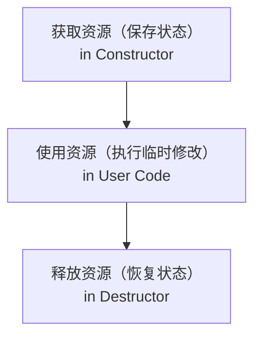

# ScopedValue 泛型模板类和 ScopedglDepthMask的 RAII 实现

代码来源：[vtkOpenGLState.cxx](https://github.com/Kitware/VTK/blob/4b354e85521dd027f2e4637e32aed48c7904500a/Rendering/OpenGL2/vtkOpenGLState.cxx)

---

## 整体设计图



> 其余特化（`ScopedglBlendFuncSeparate`、`ScopedglViewport`、`ScopedglClearColor` 等）同理。

---

### 泛型基类 `ScopedValue&lt;T&gt;` 详解

#### 完整代码分析

```
template <typename T>
class VTKRENDERINGOPENGL2_EXPORT ScopedValue
{
public:
  ~ScopedValue()  // 析构时自动恢复
  {
    ((*this->State).*(this->Method))(this->Value);
    //  ↑                  ↑              ↑
    // 取引用      调用成员函数指针   传入保存的值
  }

protected:
  vtkOpenGLState* State;      // OpenGL 状态管理器指针
  T Value;                    // 保存的旧状态值（模板参数）
  void (vtkOpenGLState::*Method)(T);  // 指向恢复方法的成员函数指针
};

```

#### 核心机制分解

**成员函数指针语法讲解：**

```
void (vtkOpenGLState::*Method)(T);
//   ↑                      ↑    ↑
//  返回类型          类名+方法指针  参数类型

```

这表示：

- 一个指向 `vtkOpenGLState` 类成员函数的指针
- 该函数接收类型为 `T` 的参数
- 该函数返回 `void`

**析构函数的调用方式：**

```
((*this->State).*(this->Method))(this->Value);
//  ↑              ↑              ↑
//  解指针     解成员函数指针     调用并传入值

// 等价于（更易读的写法）：
auto pObj = this->State;           // 获取对象指针
auto pMethod = this->Method;        // 获取方法指针
(*pObj.*pMethod)(this->Value);      // 调用方法并传入值

// 更直观的理解：
this->State->*Method(this->Value);  // 伪代码表示

```

---

### `ScopedglDepthMask` 具体实现

#### 头文件声明

```
class VTKRENDERINGOPENGL2_EXPORT ScopedglDepthMask
  : public ScopedValue<unsigned char>  // ← 特化为 unsigned char
{
public:
  ScopedglDepthMask(vtkOpenGLState* state);  // 构造函数在.cxx实现
};

```

#### 实现文件（.cxx）

```
vtkOpenGLState::ScopedglDepthMask::ScopedglDepthMask(vtkOpenGLState* s)
{
  this->State = s;                           // 保存 state 指针
  this->Value = this->State->Stack.top().DepthMask;  // 保存当前深度掩码值
  this->Method = &vtkOpenGLState::vtkglDepthMask;    // 保存恢复方法指针
}

```

---

### 完整工作流程

#### 使用示例

```
void vtkOpenGLActor::Render(vtkRenderer* ren, vtkMapper* mapper)
{
  vtkOpenGLState* ostate = static_cast<vtkOpenGLRenderer*>(ren)->GetState();

  // ① 构造：保存当前深度掩码值
  vtkOpenGLState::ScopedglDepthMask dmsaver(ostate);
  //   ↑ 进入作用域
  //   • Value = 旧深度掩码值（可能是 GL_TRUE）
  //   • Method = vtkglDepthMask 方法指针
  //   • State = ostate 指针

  bool opaque = !this->IsRenderingTranslucentPolygonalGeometry();

  if (opaque) {
    // ② 临时修改状态（不保存）
    ostate->vtkglDepthMask(GL_TRUE);
  } else {
    ostate->vtkglDepthMask(GL_FALSE);
  }

  mapper->Render(ren, this);  // 执行实际渲染

  if (!opaque) {
    ostate->vtkglDepthMask(GL_TRUE);
  }

} // ③ 析构：自动恢复
  //   执行：ostate->vtkglDepthMask(旧值)

```

#### 执行时间线



---

### 泛化设计的威力

#### 多种特化实现

```
// 特化1：单值状态（unsigned char）
class ScopedglDepthMask : public ScopedValue<unsigned char>
{ /* ... */ };

// 特化2：颜色掩码（4个unsigned char）
class ScopedglColorMask : public ScopedValue<std::array<unsigned char, 4>>
{ /* ... */ };

// 特化3：混合函数（4个unsigned int）
class ScopedglBlendFuncSeparate : public ScopedValue<std::array<unsigned int, 4>>
{ /* ... */ };

// 特化4：视口（4个int）
class ScopedglViewport : public ScopedValue<std::array<int, 4>>
{ /* ... */ };

// 特化5：清屏颜色（4个float）
class ScopedglClearColor : public ScopedValue<std::array<float, 4>>
{ /* ... */ };

```

#### 代码重用对比

**没有模板（代码重复）：**

```
//  为每个状态都写一遍
class ScopedglDepthMask {
  ~ScopedglDepthMask() {
    state->vtkglDepthMask(value);
  }
  vtkOpenGLState* state;
  unsigned char value;
};

class ScopedglColorMask {
  ~ScopedglColorMask() {
    state->vtkglColorMask(...);
  }
  vtkOpenGLState* state;
  std::array<unsigned char, 4> value;
};

// ... 更多重复

```

**使用模板（代码统一）：**

```
//  一个模板，所有特化都自动继承
template <typename T>
class ScopedValue {
  ~ScopedValue() {
    ((*this->State).*(this->Method))(this->Value);
  }
  vtkOpenGLState* State;
  T Value;
  void (vtkOpenGLState::*Method)(T);
};

```

---

### 成员函数指针的核心原理

#### 为什么需要函数指针？

每个 Scoped 类的恢复方法都不同：

```
// 深度掩码用：vtkglDepthMask(unsigned char)
ScopedglDepthMask → 调用 state->vtkglDepthMask(value)

// 颜色掩码用：vtkglColorMask(4个unsigned char)
ScopedglColorMask → 调用 state->vtkglColorMask(r, g, b, a)
                            // 但数据存在数组里！

// 混合函数用：vtkglBlendFuncSeparate(4个unsigned int)
ScopedglBlendFuncSeparate → 调用 state->vtkglBlendFuncSeparate(...)

```

**解决方案：用模板 + 函数指针**

```
template <typename T>
class ScopedValue {
  // 通过构造函数注入方法指针
  // 不同的特化可以指向不同的恢复方法
  void (vtkOpenGLState::*Method)(T);  // ← 灵活！
};

// 具体特化在构造函数中决定指向哪个方法
ScopedglDepthMask::ScopedglDepthMask(vtkOpenGLState* s) {
  this->Method = &vtkOpenGLState::vtkglDepthMask;  // 指向深度掩码方法
}

ScopedglColorMask::ScopedglColorMask(vtkOpenGLState* s) {
  this->Method = &vtkOpenGLState::vtkglColorMask;  // 指向颜色掩码方法
}

```

---

### 调用语法详解

#### 成员函数指针的调用方式

```
// 假设我们有：
vtkOpenGLState* state = ...;
void (vtkOpenGLState::*method)(unsigned char) = &vtkOpenGLState::vtkglDepthMask;
unsigned char value = GL_TRUE;

// 方式1：最复杂（但标准）
((*state).*(method))(value);
//  ↑      ↑        ↑
//  指针   解成员    调用

// 方式2：简化（指针版）
(state->*(method))(value);

// 方式3：等价的宏定义
#define CALL_METHOD(obj, method, value) \
  ((obj).*(method))(value)

// 方式4：在VTK代码中实际使用的
((*this->State).*(this->Method))(this->Value);

```

#### 为什么这么复杂？

```
// 对比普通函数指针调用
void (*funcPtr)(int) = &someFunction;
funcPtr(42);  // 简单！

// vs 成员函数指针调用
void (MyClass::*methodPtr)(int) = &MyClass::someMethod;
MyClass obj;
(obj.*(methodPtr))(42);  // 复杂，因为需要对象上下文

```

---

### RAII 设计优势总结



> RAII（资源获取即初始化）三大优势：
> - 异常安全（即使抛异常也恢复）
> - 自动化（不需要手动 restore）
> - 作用域绑定（清晰的生命周期）

---

### 实战示例对比

#### 传统做法（容易出错）

```
void MyRenderFunction() {
  GLboolean oldMask;
  glGetBooleanv(GL_DEPTH_WRITEMASK, &oldMask);  // 查询状态（慢！）

  glDepthMask(GL_FALSE);  // 临时修改

  DoSomeRendering();

  glDepthMask(oldMask);  // 手动恢复（容易忘记！）

  if (error) {
    return;  //  如果这里返回，就没法恢复了！
  }
}

```

#### VTK 做法（安全可靠）

```
void vtkOpenGLActor::Render(vtkRenderer* ren, vtkMapper* mapper) {
  vtkOpenGLState* ostate = static_cast<vtkOpenGLRenderer*>(ren)->GetState();

  // 构造时保存，析构时自动恢复
  vtkOpenGLState::ScopedglDepthMask dmsaver(ostate);
  //   ↑ 进入作用域

  ostate->vtkglDepthMask(GL_FALSE);  // 临时修改

  mapper->Render(ren, this);

  if (error) {
    return;  //  自动调用 dmsaver 析构，恢复状态！
  }

} //  即使正常返回，也会自动恢复

```

---

### 总结

| 特性 | 说明  |
| **泛型基类** | `ScopedValue<T>` 统一管理所有状态  |
| **特化类** | `ScopedglDepthMask`、`ScopedglColorMask` 等继承并特化  |
| **成员函数指针** | 动态指向不同的恢复方法，实现灵活的 RAII  |
| **模板参数** | `T` 可以是 `unsigned char`、`std::array<T, 4>` 等  |
| **异常安全** | 无论如何离开作用域都自动恢复  |
| **零开销** | 编译时展开，运行时无额外代价  |

这就是 VTK OpenGL 状态管理中最优雅的设计模式！
