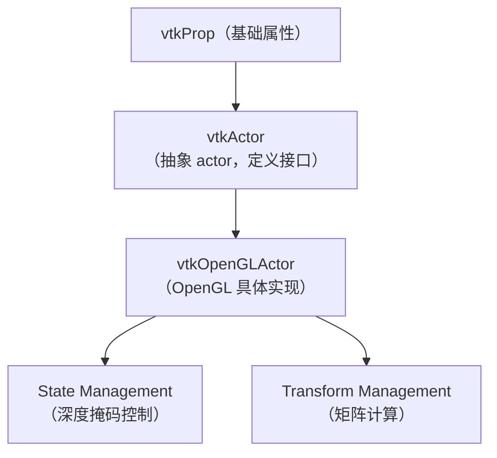
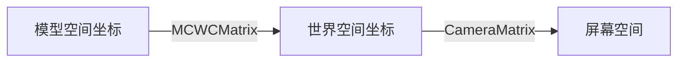
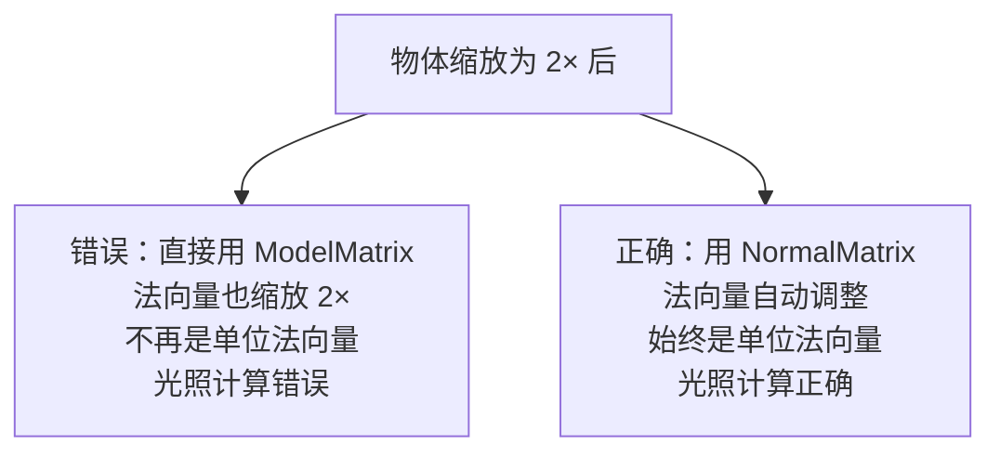
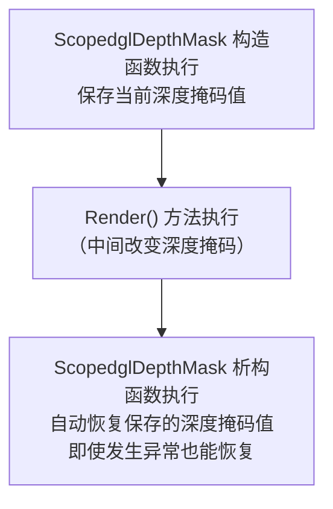
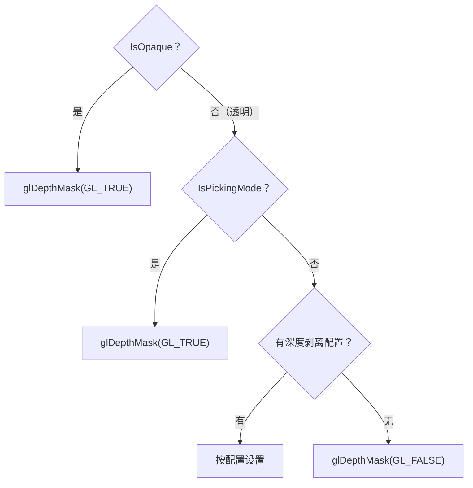
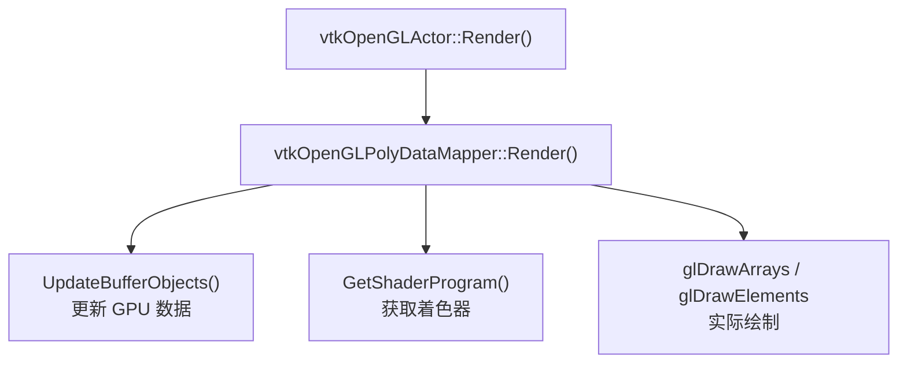
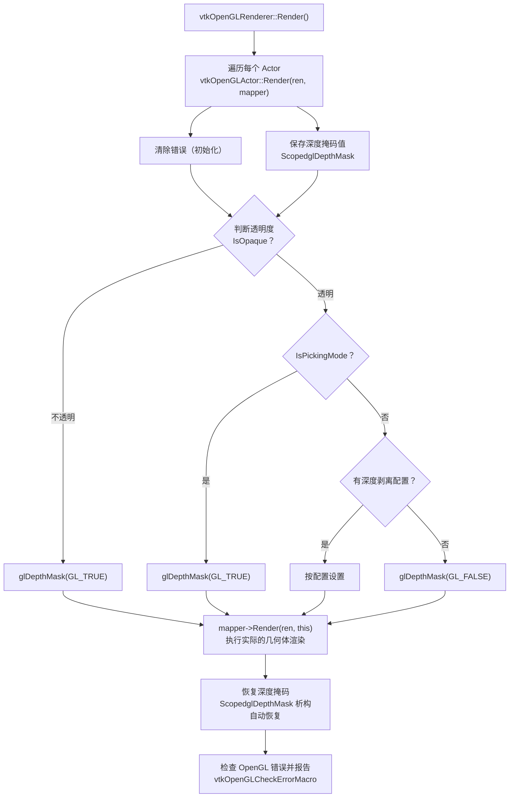
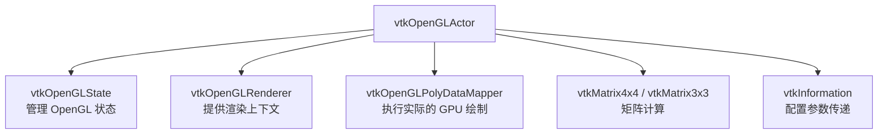
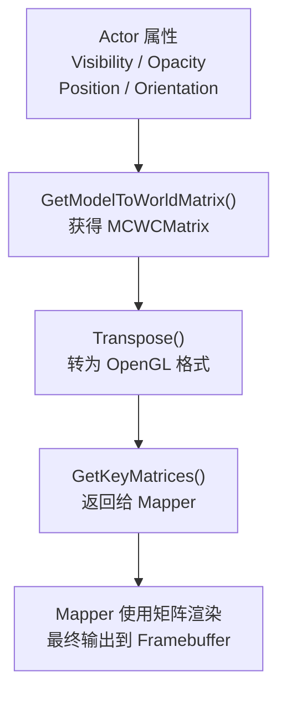

---
title: vtkOpenGLActor详解
description: 代码来源： [vtkOpenGLActor.cxx](https://github.com/Kitware/VTK/blob/4b354e85521dd027f2e4637e32aed48c7904500a/Rendering/OpenGL2/vtkOpenGLActor.cxx)  其他相关文章：
---

# vtkOpenGLActor详解

代码来源： [vtkOpenGLActor.cxx](https://github.com/Kitware/VTK/blob/4b354e85521dd027f2e4637e32aed48c7904500a/Rendering/OpenGL2/vtkOpenGLActor.cxx)
 其他相关文章：[基于深度剥离的OIT](https://zhuanlan.zhihu.com/p/1937923107194114688)

## vtkOpenGLActor - 详细解析

• 这是一个连接 **VTK 抽象渲染模型** 和 **OpenGL 硬件渲染** 的关键桥接类。
 • 主要负责：管理自身的变换矩阵、法线矩阵、渲染状态，并驱动底层 OpenGL 绘制流程。

### 类的继承关系和角色



---

### 数据成员详解

#### **MCWCMatrix - 模型坐标到世界坐标矩阵**

```
vtkMatrix4x4* MCWCMatrix;  // Model-to-World Coordinate transformation

```

**作用流程：**



```
例如：
ModelPoint = (1, 2, 3)
MCWCMatrix = [平移，旋转，缩放组合]
WorldPoint = MCWCMatrix × ModelPoint = (x', y', z')

```

**为什么需要转置？**

```
this->MCWCMatrix->Transpose();  // ← 注意这里

```

这是因为：

- VTK 内部用行向量（Vector × Matrix）
- OpenGL 着色器用列向量（Matrix × Vector）
- 需要转置以适配 OpenGL

#### **NormalMatrix - 法向量变换矩阵**

```
vtkMatrix3x3* NormalMatrix;  // 用于变换法向量

```

**关键概念：为什么不能直接用 MCWCMatrix 变换法向量？**

```
//  错误做法
NormalVector' = MCWCMatrix × NormalVector;  // 不对！

//  正确做法
NormalMatrix = Inverse(Transpose(MCWCMatrix的左上3×3))
NormalVector' = NormalMatrix × NormalVector;

```

**图示：**



#### **NormalTransform - 辅助对象**

```
vtkTransform* NormalTransform;  // 用于计算法向量矩阵

```

这是一个临时计算工具，用于：

- 从 Actor 的 4×4 变换矩阵提取左上 3×3
- 计算其逆矩阵

#### **KeyMatrixTime - 缓存时间戳**

```
vtkTimeStamp KeyMatrixTime;  // 上次更新矩阵的时间

```

**缓存策略：**

```
if (this->GetMTime() > this->KeyMatrixTime || /* 其他条件 */) {
  // 重新计算矩阵（很昂贵的操作）
} else {
  // 使用缓存的矩阵（免费）
}

```

---

### 核心方法详解

#### 方法 : **构造函数 vtkOpenGLActor()**

```
vtkOpenGLActor::vtkOpenGLActor()
{
  // 分配内存给矩阵对象
  this->MCWCMatrix = vtkMatrix4x4::New();      // 4×4 模型-世界矩阵
  this->NormalMatrix = vtkMatrix3x3::New();    // 3×3 法向量矩阵
  this->NormalTransform = vtkTransform::New(); // 变换计算工具
}

```

**内存管理注意：**

- 使用 `New()` 分配（VTK 对象模式）
- 在析构函数中用 `Delete()` 释放

---

#### 方法 : **Render() - 核心渲染方法**

这是最复杂的部分，让我分段讲解：

##### **第一步：初始化错误检查**

```
vtkOpenGLClearErrorMacro();  // 清除之前的 OpenGL 错误

```

##### **第二步：获取 OpenGL 状态管理器**

```
vtkOpenGLState* ostate = static_cast<vtkOpenGLRenderer*>(ren)->GetState();
vtkOpenGLState::ScopedglDepthMask dmsaver(ostate);  // RAII 自动保存/恢复

```

**流程图：**



##### **第三步：判断对象是否透明**

```
bool opaque = !this->IsRenderingTranslucentPolygonalGeometry();

```

这决定了后续的深度掩码处理策略。

##### **第四步：深度掩码逻辑（关键！）**

```
if (opaque)
{
  //  不透明对象：启用深度写入
  ostate->vtkglDepthMask(GL_TRUE);
  //   ↑ 物体的像素深度值会写入深度缓冲
  //     这样遮挡关系才能正确
}
else
{
  // 透明对象：需要更复杂的处理
  vtkHardwareSelector* selector = ren->GetSelector();
  bool picking = (selector != nullptr);

  if (picking)
  {
    // 选择模式：启用深度写入（便于选择）
    ostate->vtkglDepthMask(GL_TRUE);
  }
  else
  {
    // 普通渲染模式：检查深度剥离配置
    vtkInformation* info = this->GetPropertyKeys();
    if (info && info->Has(vtkOpenGLActor::GLDepthMaskOverride()))
    {
      // 被显式配置：遵循配置
      int maskoverride = info->Get(vtkOpenGLActor::GLDepthMaskOverride());
      switch (maskoverride)
      {
        case 0:
          ostate->vtkglDepthMask(GL_FALSE);  // 禁用深度写入
          break;
        case 1:
          ostate->vtkglDepthMask(GL_TRUE);   // 启用深度写入
          break;
      }
    }
    else
    {
      // 默认：禁用深度写入（透明度混合）
      ostate->vtkglDepthMask(GL_FALSE);
      //   ↑ 透明像素不更新深度缓冲
      //     避免后面的物体被错误遮挡
    }
  }
}

```

**深度掩码决策树：**



##### **第五步：委托 Mapper 进行实际渲染**

```
mapper->Render(ren, this);
// 这里 Mapper 负责：
// 1. 更新 Vertex Buffer Objects (VBO)
// 2. 绑定着色器程序
// 3. 发送 OpenGL 绘制命令

```

**调用链：**



##### **第六步：恢复深度掩码（重要！）**

```
if (!opaque)
{
  ostate->vtkglDepthMask(GL_TRUE);  // 恢复深度写入
}

```

---

#### 方法 : **GetKeyMatrices() - 矩阵计算**

这个方法计算并缓存渲染所需的两个关键矩阵：

```
void vtkOpenGLActor::GetKeyMatrices(
  vtkMatrix4x4*& mcwc,      // 输出：模型→世界矩阵
  vtkMatrix3x3*& normMat)   // 输出：法向量变换矩阵
{
  // 步骤 1: 检查是否需要重新计算
  vtkMTimeType rwTime = 0;
  if (this->CoordinateSystem != WORLD && this->CoordinateSystemRenderer)
  {
    rwTime = this->CoordinateSystemRenderer->GetVTKWindow()->GetMTime();
  }

  // has the actor changed or is in device coords?
  if (this->GetMTime() > this->KeyMatrixTime ||      // Actor 被修改
      rwTime > this->KeyMatrixTime ||                // 窗口被修改
      this->CoordinateSystem == DEVICE)              // 设备坐标模式
  {
    // ===== 重新计算矩阵 =====

    // 步骤 2: 获取模型→世界矩阵
    this->GetModelToWorldMatrix(this->MCWCMatrix);

    // 步骤 3: 转置（VTK → OpenGL 格式转换）
    this->MCWCMatrix->Transpose();

    // 步骤 4: 计算法向量矩阵
    if (this->GetIsIdentity())
    {
      // 优化：恒等变换 → 恒等法向量矩阵
      this->NormalMatrix->Identity();
    }
    else
    {
      // 一般情况：计算 (M^-1)^T

      // 4a. 获取 Actor 的变换矩阵
      this->NormalTransform->SetMatrix(this->Matrix);
      vtkMatrix4x4* mat4 = this->NormalTransform->GetMatrix();

      // 4b. 提取左上 3×3 部分
      for (int i = 0; i < 3; ++i)
      {
        for (int j = 0; j < 3; ++j)
        {
          this->NormalMatrix->SetElement(i, j, mat4->GetElement(i, j));
        }
      }

      // 4c. 计算逆矩阵（隐含包含转置）
      this->NormalMatrix->Invert();
    }

    // 步骤 5: 标记缓存为最新
    this->KeyMatrixTime.Modified();
  }

  // 步骤 6: 返回矩阵
  mcwc = this->MCWCMatrix;
  normMat = this->NormalMatrix;
}

```

**矩阵变换的具体例子：**

```
// 假设 Actor 进行了这些变换：
// 1. 平移 (1, 2, 3)
// 2. 旋转 45° 绕 Z 轴
// 3. 缩放 2×

ModelMatrix = Translate(1,2,3) × Rotate(45°, Z) × Scale(2)
           = [4×4 矩阵]

// 在着色器中：
// 顶点变换
vec4 worldPos = MCWCMatrix × vec4(modelPos, 1.0);

// 法向量变换
vec3 worldNormal = normalize(NormalMatrix × modelNormal);
//                            ↑ 自动处理缩放和旋转的影响

```

---

### GLDepthMaskOverride - 深度剥离配置键

```
static vtkInformationIntegerKey* GLDepthMaskOverride();

```

这是一个 **信息键**，用于深度剥离（Depth Peeling）算法的配置：

```
// 使用示例（深度剥离 Pass 中）
vtkInformation* info = actor->GetPropertyKeys();
if (!info)
{
  info = vtkInformation::New();
  actor->SetPropertyKeys(info);
}

// 设置配置值
info->Set(vtkOpenGLActor::GLDepthMaskOverride(), 0);  // 禁用深度写入
// 或
info->Set(vtkOpenGLActor::GLDepthMaskOverride(), 1);  // 启用深度写入

```

---

### 完整的渲染流程图



---

### 与其他类的关系





---

### 核心设计原则

| 原则 | 实现 | 好处  |
| **状态隔离** | ScopedglDepthMask RAII | 自动恢复，异常安全  |
| **矩阵缓存** | KeyMatrixTime | 避免重复计算昂贵操作  |
| **正确的法向量** | NormalMatrix = (M-1)T | 光照计算准确  |
| **灵活的透明处理** | GLDepthMaskOverride 键 | 支持多种透明算法  |
| **责任分离** | 委托 Mapper | Actor 只管理状态，Mapper 负责绘制  |

---

### 渲染优化要点

```
//  低效：每帧都重新计算矩阵
MCWCMatrix = GetModelToWorldMatrix();

//  高效：缓存矩阵，只在需要时更新
if (MTime > KeyMatrixTime) {
  MCWCMatrix = GetModelToWorldMatrix();
  KeyMatrixTime.Modified();
}

```
